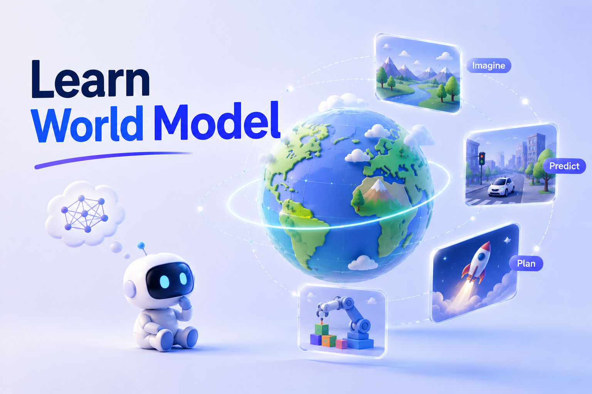
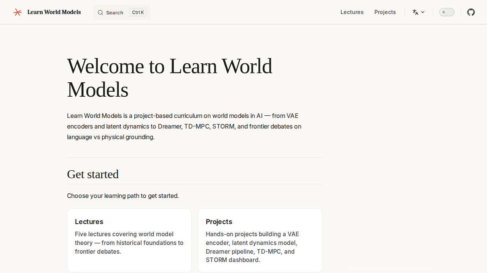
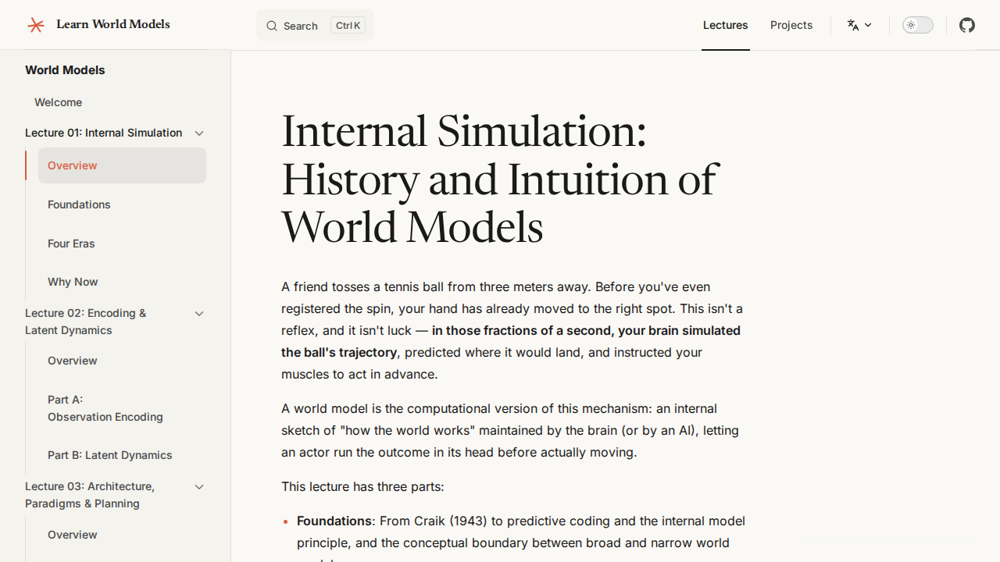
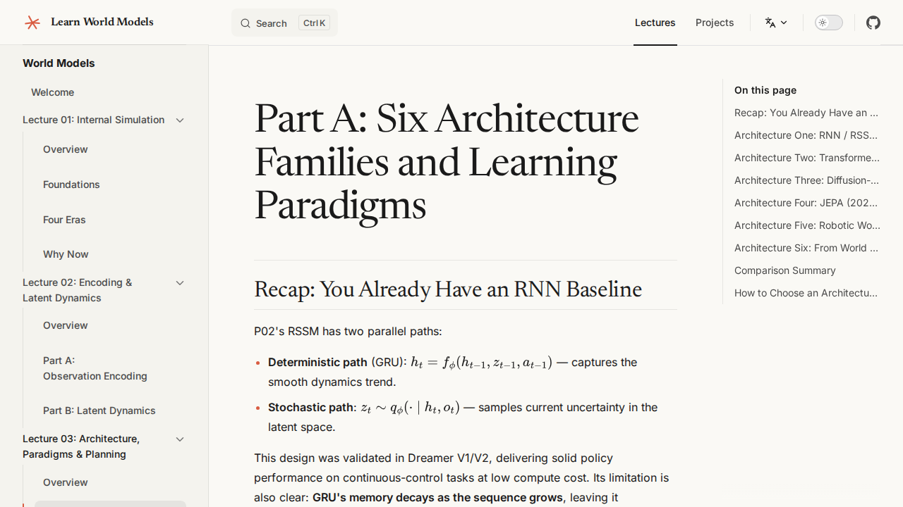
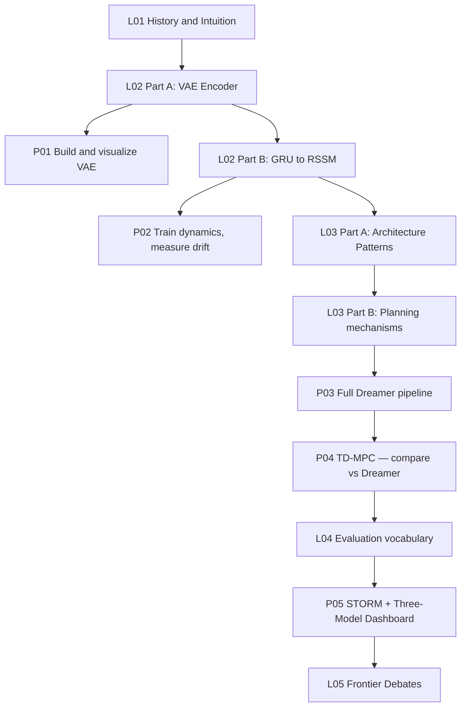

<div align="center">
  
  <br>

[English](./README.md) · [中文](./README-CN.md)

# Learn World Models（⚠️ Alpha Preview）

> **Learn world models by building them: from the intuition behind latent dynamics to a working simulation, planning, and evaluation system.**

</div>

> [!CAUTION]
> ⚠️ **Alpha Preview**: This is an early build. Content is still being completed and revised — sections, examples, and wording may continue to change. Feedback via Issues is welcome.

---

## ✨ Preview

### 🏠 Course Home
> Structured learning path with lecture and project cards.



### 📖 Lecture Pages
> Concept-first explanations with mermaid diagrams and background callouts for deep-learning readers.



### 🗂️ Architecture Deep Dive
> Six architecture families, three planning mechanisms, side-by-side comparison tables.



---

## What this course covers

Five lectures and five projects that take you from the intuition behind world models to a working three-model evaluation dashboard.

| # | Type | Title | Core Topics |
|---|------|-------|-------------|
| L01 | Lecture | Internal Simulation & Historical Context | Craik's mental models, predictive coding, four eras of world model evolution |
| L02 | Lecture | Observation Encoding & Latent Dynamics | VAE, CNN encoder, ELBO, GRU → MDN-RNN → RSSM |
| L03 | Lecture | Architecture Patterns, Learning Paradigms & Planning | Six architecture families, CEM-MPC, latent Actor-Critic, TD-MPC |
| L04 | Lecture | Evaluation Metrics by World Model | FID, reward correlation, consistency loss, PSNR, horizon drift |
| L05 | Lecture | Frontier Debates | Language vs physical grounding, Bitter Lesson, AGI as a research target |
| P01 | Project | Train a VAE Encoder | Compress 64×64 pixels to latent z; reconstruction loss curve |
| P02 | Project | Build a Latent Dynamics Model | GRU → RSSM; 1-step vs 5-step prediction error |
| P03 | Project | Full Dreamer Pipeline | Encode → RSSM → latent Actor-Critic → act |
| P04 | Project | Implement TD-MPC Planning | CEM-MPC + latent consistency loss; compare vs Dreamer |
| P05 | Project | STORM + Three-Model Evaluation Dashboard | Swap GRU for Transformer; side-by-side Dreamer/TD-MPC/STORM dashboard |

---

## Curriculum flow



Suggested path: **L01 → L02 → P01 → P02 → L03 → P03 → P04 → L04 → P05 → L05**

You do not need to finish all theory before starting a project. Build, then come back with questions.

---

## Quick start

```sh
npm install
npm run docs:dev        # dev server with hot reload
npm run docs:build      # production build
npm run docs:preview    # preview built site
```

To refresh the README screenshots after a build:

```sh
npm run docs:build
npm run screenshots:readme
```

---

## Repo structure

```
learn-world-model/
├── docs/                                  # VitePress documentation site
│   ├── .vitepress/config.mts             # nav and sidebar (EN + ZH)
│   ├── en/lectures/                       # 5 English lecture pages
│   ├── zh/lectures/                       # 5 Chinese lecture pages
│   ├── en/projects/                       # 5 English project pages
│   └── zh/projects/                       # 5 Chinese project pages
├── external/world-model-tutorial/         # PyTorch source referenced by projects
│   └── references.md                      # four-era history and architecture survey
├── scripts/                               # build utilities (screenshots, PDF)
└── package.json
```
