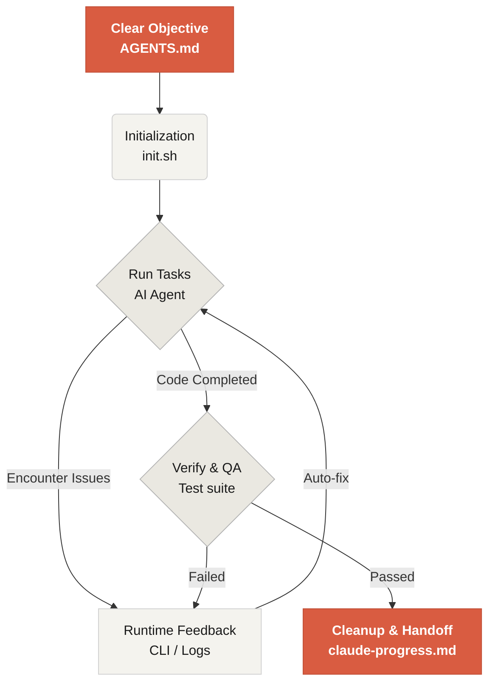

# Welcome to Learn Harness Engineering

Learn Harness Engineering is a course dedicated to the engineering of AI coding agents. We have deeply studied and synthesized the most advanced Harness Engineering theories and practices in the industry. Our core references include:
- [OpenAI: Harness engineering: leveraging Codex in an agent-first world](https://openai.com/index/harness-engineering/)
- [Anthropic: Effective harnesses for long-running agents](https://www.anthropic.com/engineering/effective-harnesses-for-long-running-agents)
- [Anthropic: Harness design for long-running application development](https://www.anthropic.com/engineering/harness-design-long-running-apps)
- [Awesome Harness Engineering](https://github.com/walkinglabs/awesome-harness-engineering)

Through systematic environment design, state management, verification, and control systems, this course teaches you how to make agentic coding tools like Codex and Claude Code truly reliable. It helps you build features, fix bugs, and automate development tasks by constraining your AI coding assistant with explicit rules and boundaries.

## Get started

Choose your learning path to get started.

  <a href="./lectures/lecture-01-why-capable-agents-still-fail/" class="card">
    <h3>Harness Engineering</h3>
    
Understand why strong models still fail and learn the theory behind effective harnesses.

  </a>
  <a href="./world-model/" class="card">
    <h3>World Models</h3>
    
Learn how agents build internal models of the world for prediction, planning, and control.

  </a>
  <a href="./projects/" class="card">
    <h3>Projects</h3>
    
Hands-on practice building a reliable agentic environment from scratch.

  </a>
  <a href="./resources/" class="card">
    <h3>Resource Library</h3>
    
Copy-ready templates (AGENTS.md, feature_list.json) to use in your own repositories.

  </a>

## The Core Mechanism of a Harness

A harness doesn't "make the model smarter"; rather, it establishes a closed-loop **working system** for the model. You can understand its core workflow through this simple diagram:

## What you will learn

Here are some of the key concepts you will master:

<ul class="index-list">
  <li><strong>Constrain agent behavior</strong> with explicit rules and boundaries.</li>
  <li><strong>Maintain context</strong> across long-running, multi-session tasks.</li>
  <li><strong>Stop agents</strong> from declaring victory too early.</li>
  <li><strong>Verify work</strong> using full-pipeline tests and self-reflection.</li>
  <li><strong>Make runtime observable</strong> and debuggable.</li>
</ul>

## Next steps

Once you understand the core concepts, these guides help you go deeper:

<ul class="index-list">
  <li><a href="./lectures/lecture-01-why-capable-agents-still-fail/">Lecture 01: Why Capable Agents Still Fail</a>: Start with the theory behind harness engineering.</li>
  <li><a href="./projects/project-01-baseline-vs-minimal-harness/">Project 01: Baseline vs Minimal Harness</a>: Walk through your first real task.</li>
  <li><a href="./resources/templates/">Templates</a>: Grab the minimal harness pack (AGENTS.md, feature_list.json, claude-progress.md) for your own projects.</li>
</ul>
