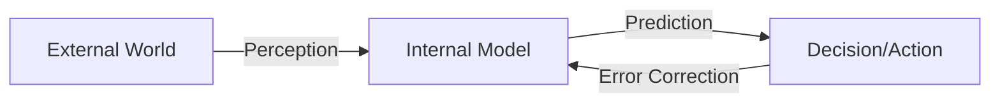

# Foundations

## First Foundation: Craik's Miniature Models (1943)

British psychologist **Kenneth Craik** wrote a slim book during WWII, *The Nature of Explanation*. He proposed an idea ahead of its time:

> *"If the organism carries a 'small-scale model' of external reality and of its own possible actions within its head, it is able to try out various alternatives, conclude which is the best of them, react to future situations before they arise..."*

Craik argued the brain is not a black box that passively receives stimuli and emits responses, but actively maintains an **internal simulator**. This simulator can "fast-forward" the future and "replay" the past, letting an organism filter out the best action before paying the real cost.

Tragically, Craik died in a bicycle accident in 1945 at age 31. His ideas lay dormant for decades, only resurfacing with the rise of cognitive science and neuroscience.

---

## The Brain's Prediction Mechanism: Predictive Coding (1990s)

In the 1990s, neuroscientists began using **predictive coding** to explain how the brain works.

The core idea is surprisingly simple:

The brain isn't "seeing" the world, it is **predicting** the world and only processing "the part the prediction got wrong."

The visual cortex doesn't dutifully forward every pixel from the eye to the brain — that would cost too much energy. Instead, higher cortical layers continuously send predictions down to lower layers, and the lower layers only send back **the error between prediction and actual sensory input**.

When you walk into a familiar room, your brain barely processes anything, because everything matches expectations. But if a chair has been moved, that "misplacement" signal is immediately amplified and grabs your attention.

This mechanism explains why we are so sensitive to change and so forgetful of familiar backgrounds — **the parts predicted correctly are compressed away; only the errors are worth attention**.

---

## A Control Theory Insight: The Internal Model Principle (1960s)

In nearly the same period, control engineering independently arrived at a similar idea. In the 1960s, the **Internal Model Principle** was formally stated:

> *To perfectly control a system, the controller must contain a model of that system internally.*

This sounds like engineering jargon, but the intuition is sharp: for a self-driving car to hold its lane on a curve, its control algorithm must "know" the vehicle's dynamics on that curve — not react, but **anticipate**.

The principle appears throughout robotics, aerospace, and economic models, and became the theoretical foundation of model-based reinforcement learning. To control something, you must first understand it — the internal model principle turns this common sense into a mathematical necessity.

---

## A Confusing Distinction: Broad vs. Narrow World Models

Before entering the historical narrative, one conceptual boundary must be clear, because every example that follows touches it: **the term "world model" means different things in different contexts.**

### Broad World Model: Anything That Predicts

Broadly speaking, any model that predicts "what happens next" can be called a world model.

- A language model predicting the next **token** (the basic unit a language model processes — could be a word, character, or sub-word fragment) — broad WM
- A video generation model predicting the next frame — broad WM
- A weather model predicting tomorrow's temperature — broad WM

By this definition, Veo, Genie, and Cosmos all sit under the "world model" umbrella. They have in some sense learned statistical regularities of the world: how light and shadow change, how objects move, how scenes evolve.

### Narrow World Model: Must Be Action-Conditioned

But in robotics and reinforcement learning (RL), "world model" has a stricter meaning: **it must be conditioned on actions**.

Not just "what does the next frame look like," but "**what does the world look like after I take this action**." Formally:

$$p(o_{t+1} \mid o_t, a_t)$$

Here `a_t` is the action the agent takes at time `t`. This single condition transforms a world model from "bystander" to "participant" — it can tell you not only what the world will do, but what your choices will produce.

A broad WM is a fortune teller, telling you "what will happen"; a narrow WM is an advisor, telling you "what will happen if you do this." A robot needs an advisor, not just a fortune teller.

### Three Practical Classification Questions

Given a concrete model, three questions quickly classify which kind of world model it is:

| Dimension | Option | Representative systems |
|-----------|--------|----------------------|
| **What does it predict?** | Pixels / raw frames | Video diffusion models |
| | Latent vectors (internal low-dimensional compressed representation) | Dreamer, RSSM |
| | Structured state (no pixels, only decision-relevant information) | MuZero, TD-MPC |
| | Actions themselves (latent action signals inferred from video) | Genie |
| **Does it consume actions?** | No → passive video prediction | Veo |
| | Yes, given actions → controllable simulator | Dreamer, world-model robots |
| | Learns actions itself → latent action | Genie |
| **What purpose does it serve?** | Generate content (video, images) | Veo |
| | Evaluate policy / counterfactual simulation | Autonomous driving testing |
| | Train policy inside dreams | Dreamer, Ha & Schmidhuber |
| | Understand physics, transfer knowledge | JEPA, foundation world models |

A broad WM is a fortune teller, telling you "what will happen"; a narrow WM is an advisor, telling you "what will happen if you do this." A robot needs an advisor, not just a fortune teller.

This course focuses on **narrow world models** — action-conditioned dynamics models usable for planning and policy learning.
