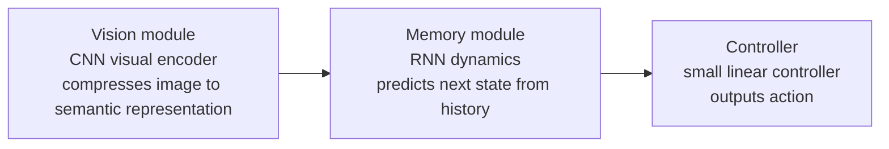
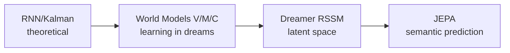

# The Four Eras

### Era One: Theoretical Foundations (1950s–2017)

Recurrent neural networks (RNNs), Kalman filters, hidden Markov models… Over these seventy years researchers built tools for "predicting future states" in different fields, but the work was scattered across control theory, speech recognition, and robotics, never unified under the name "world models."

Then one paper arrived.

### Era Two: Ha & Schmidhuber's "Learning in Dreams" (2018)

In 2018, David Ha and Jürgen Schmidhuber published the now widely cited paper *World Models*.

They unified these scattered threads with an elegant three-module framework:

The most striking experiment: they placed the Controller inside the **virtual environment** hallucinated by M, never interacting with the real game during training — then transferred the trained policy back to the real game, where it still performed well.

**Learn to drive in a dream; wake up and hit the road.** This metaphor brought world models into mainstream attention for the first time.

### Era Three: Dreamer and the Latent Space (2019)

In 2019, Danijar Hafner and colleagues released Dreamer V1, introducing the **RSSM** (Recurrent State Space Model — a dynamics architecture that separately models "deterministic memory" and "stochastic uncertainty"; details in L02).

Unlike Ha & Schmidhuber, Dreamer no longer needs to reconstruct images in pixel space — it works directly in **latent space**: prediction, planning, reward learning all happen there.

Dreamer significantly outperformed prior model-free methods on Atari games and continuous control tasks, proving latent-space learning to be an efficient route.

### Era Four: Video as World (2023+)

Around 2023, two parallel paths converged on the same question: **can we use video itself to learn the physical laws of the world?**

- **JEPA** (Joint Embedding Predictive Architecture, LeCun's group): drop pixel reconstruction, predict only in a semantic embedding space. "I don't need to paint your face; I only need to know who you are."

