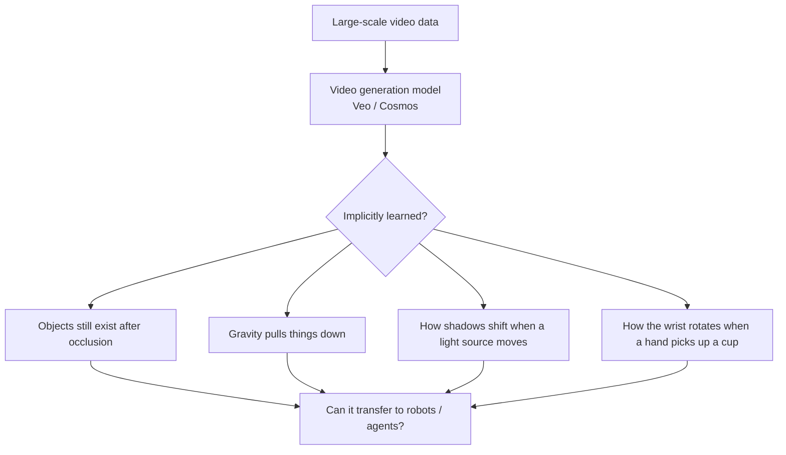
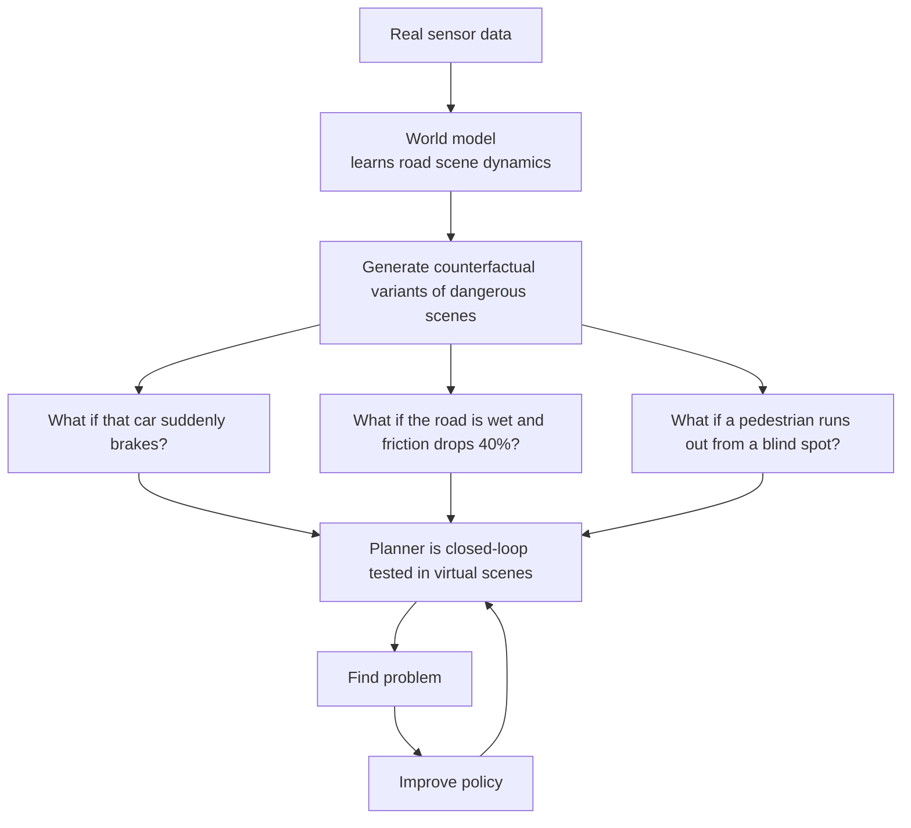
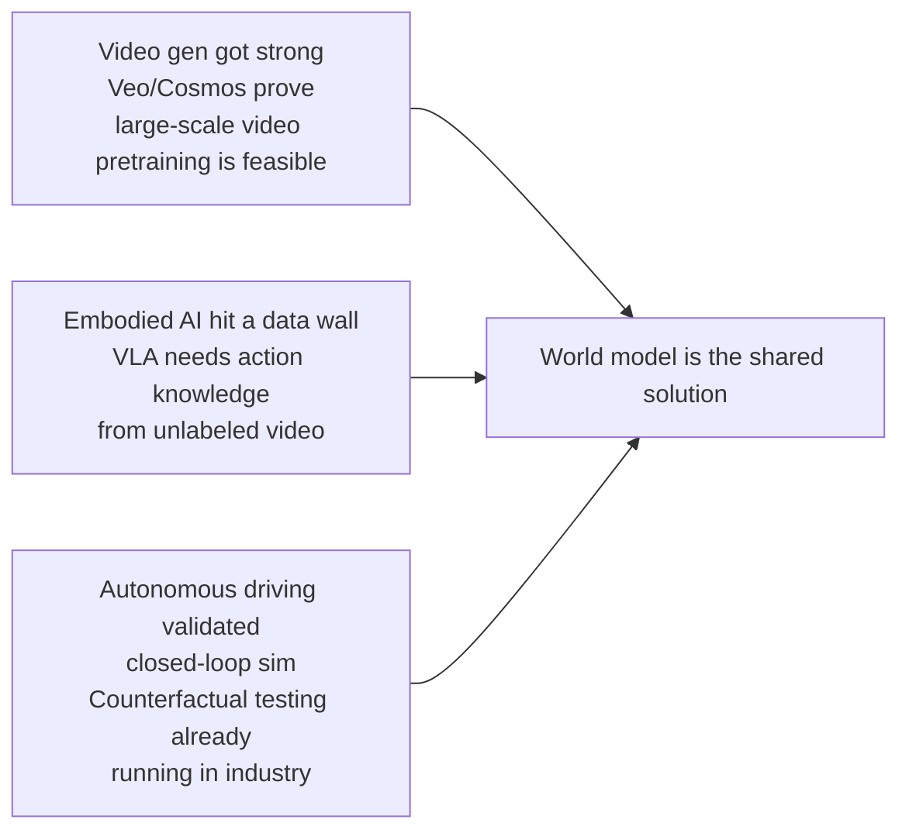
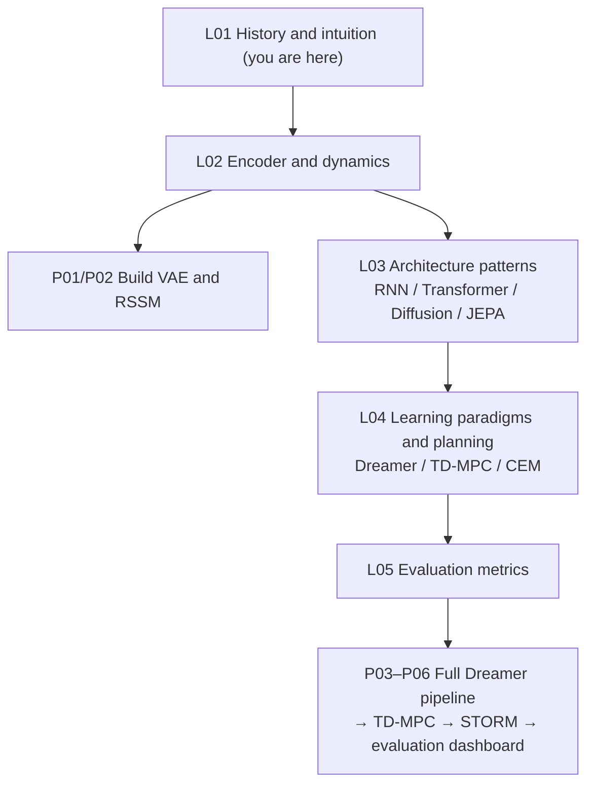

# What World Models Solve, and Why Now

## What problems do world models solve?

**1. Sample complexity**

> **📖 Background: Reinforcement Learning (RL)**
> RL is a framework where an **agent** learns by interacting with an environment. At each time step the agent picks an **action**, the environment returns a new **observation** and a **reward** signal — a scalar where higher means better. The agent's goal is a **policy**: which action to take in each state to maximize long-term cumulative reward.
>
> **Model-free RL**: the agent learns the policy directly from trial-and-error in the environment, without building any internal model of how the world works. Simple, but needs enormous amounts of real interaction to learn anything.
>
> **Model-based RL**: first learn a world model (predicting the consequences of actions), then use it to simulate many trajectories in imagination, reducing the number of real interactions.

Model-free RL needs millions of real interactions to learn a simple task. A world model lets the agent "virtually experience" tens of thousands of **trajectories (rollouts — a complete sequence starting from an initial state and following a policy)** inside its simulator, cutting real-environment interactions by orders of magnitude.

**2. Planning**
With a world model, the agent can mentally run several possible plans before acting and pick the one with the best expected return — rather than blindly bumping into walls in the real environment.

**3. Safety**
In robotics, autonomous driving, and industrial control, the cost of mistakes can be catastrophic. World models make it possible to "push a policy until it breaks, then fix it" inside a sandbox, rather than experimenting on real hardware.

---

## Why are world models hot again now?

World models are not new. Ha & Schmidhuber's paper appeared in 2018, and earlier model-based RL (MBRL) work in the 2000s already learned environment dynamics. Dreamer is now in its third iteration. So why, between 2024 and 2026, has the field suddenly become the star of every AI conference?

The answer isn't a single paper. It's **three technical threads converging in the same time window**, producing a resonance.

### Thread One: Video Generation Models Suddenly Got Strong

Veo (Google DeepMind), Genie (Google DeepMind), Cosmos (NVIDIA) — this cluster of video generation models emerged in 2024, showing the surprising power of large-scale video pretraining.

They forced researchers to take a question seriously: while these models generate realistic video, are they also implicitly learning **spatial structure, object permanence, and coarse-grained physical laws**? If so, could they serve as the underlying world model for robots or agents?

The question has no settled answer, but it brought video generation and robotics to the same table.

### Thread Two: Embodied Intelligence Hit a Data Wall

Vision-language-action models (VLA, e.g. RT-2, OpenVLA) have shown the promise of general robot skills, but they share one fatal dependency: **massive amounts of teleoperation demonstration data**.

Collecting a robot manipulation trajectory requires specialized hardware, a skilled operator, and a real physical setup. By contrast, the internet has billions of videos of humans performing tasks, but these have no action labels, no joint angles, no torque signals.

World models offer a detour: if a WM can learn "how humans interact with objects" from unlabeled video, and then convert that understanding into a controllable dynamics model via latent actions, robots could "indirectly learn" from internet video — without needing every action hand-labeled.

The problem is far from solved, but the prize is large enough that nearly every top robotics group is betting on this path.

### Thread Three: Autonomous Driving Has Already Validated Counterfactual Simulation

Autonomous driving is one of the earliest industrial applications of world models, and it has delivered clear commercial validation.

Corner cases on real roads are extremely rare: a pedestrian darting out in a blizzard, a heavy truck overturning at an intersection, a wheelchair user crossing illegally. These occur once every millions of kilometers, and yet they are exactly where autonomous driving most often fails.

The world model solution:

Wayve's GAIA-1, Tesla's world-model simulator, Waabi's counterfactual training — these industrial deployments have shown that WM-driven data augmentation can raise the coverage of safety-critical testing by orders of magnitude, at one-thousandth the cost of real road testing.

### Three threads converge

Put the three together and today's world-model wave becomes clear:

This isn't a one-paper hype cycle. It's three independent tracks — **large models, robot learning, autonomous-driving simulation** — independently discovering, between 2024 and 2026, that the world model is a key piece of their respective puzzles. Together they pushed the field to center stage.

The last world-model wave (2018–2020) was academia-led: researchers proved feasibility in game environments, but deployment was distant. This time (2024+) academia and industry are entering at once, because the field is now touching real cost ceilings and safety requirements. The temperature of the two waves is not the same.

---

## Course Roadmap

Each step has a matching code project. You don't need to read all the theory before starting — **learn and build at the same time; come back to the next lecture with questions, and it goes faster**.

---

## Next Lecture

L02 starts from a concrete problem: **how do we compress a 64×64 pixel image into a compact latent vector z?** That is the job of the variational autoencoder (VAE), and the first brick of the entire Dreamer pipeline.

Once compressed, we feed z into a dynamics model and teach it to predict "what is z at the next timestep" — that is the RSSM. After L02 you will have hand-written the two most critical modules of a world model, and seen them learn from real loss curves.

---

*This lecture requires no math or code background. The original papers — Craik, Ha & Schmidhuber, Dreamer — see Further Reading in L05.*
