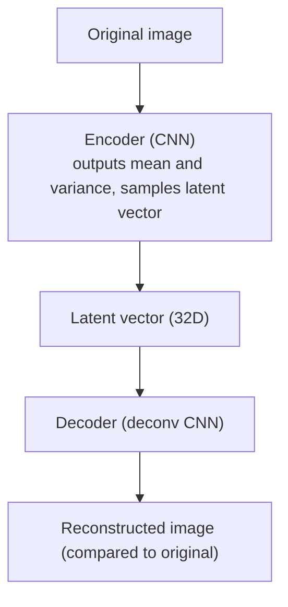

# Part A: Observation Encoding

## Why compress?

Picture a 64×64 RGB game screenshot. It contains 64 × 64 × 3 = **12,288 pixel values**. Using these directly to train a policy network or dynamics model brings three problems:

1. **Curse of dimensionality**: high-dimensional input makes learning extremely sample-inefficient.
2. **Redundant information**: most pixels (background, texture detail) are irrelevant to the decision.
3. **Compute cost**: processing tens of thousands of dimensions per step is slow.

The fix: compress the raw observation $\mathbf{o}_t$ (the pixel image) into a **low-dimensional latent vector** $\mathbf{z}_t$ (e.g. 32 or 64 dimensions). The latent should keep the semantic information useful for decisions while throwing away irrelevant detail.

The high-dimensional pixel space (12,288D) — redundant and hard to learn — is compressed into a compact, easy-to-manipulate latent space (32D).

---

## VAE Intuition: Learn to Compress and Reconstruct

The **Variational Autoencoder (VAE)** is the core tool for this compression. It has two parts:

- **Encoder**: maps an image $\mathbf{o}$ into the latent space, outputting the mean $\mu$ and standard deviation $\sigma$ of a distribution, then sampling $\mathbf{z}$.
- **Decoder**: reconstructs the image $\hat{\mathbf{o}}$ from the latent vector $\mathbf{z}$.

Key property: the latent space is **continuous**. Neighboring $\mathbf{z}$ map to similar images; you can smoothly interpolate in latent space.

---

## ELBO Loss: Balancing Two Objectives

VAE training maximizes the **ELBO (Evidence Lower Bound)**, which has two terms:

> **📖 What is ELBO?** What we truly want to maximize is the probability that the model generates a real image, $\log p(\mathbf{o})$, but this is hard to compute directly (it requires integrating over all possible $\mathbf{z}$). ELBO is a **tractable lower bound** — maximizing it under constraints is equivalent to getting as close to the true objective as possible. That's exactly what "lower bound" means: $\text{ELBO} \leq \log p(\mathbf{o})$.

$$
\mathcal{L}_{\text{ELBO}} = \underbrace{\mathbb{E}_{q(\mathbf{z}|\mathbf{o})}\left[\log p(\mathbf{o}|\mathbf{z})\right]}_{\text{reconstruction loss}} - \underbrace{D_{\text{KL}}\left(q(\mathbf{z}|\mathbf{o}) \| p(\mathbf{z})\right)}_{\text{KL divergence}}
$$

> **📖 What is KL divergence?** $D_{\text{KL}}(q \| p)$ measures the "gap" between two probability distributions: the more similar $q$ and $p$ are, the closer the KL is to 0; the larger the gap, the larger the KL (always ≥ 0). Here it constrains the encoder's output distribution $q(\mathbf{z}|\mathbf{o})$ not to stray too far from the standard normal prior $p(\mathbf{z}) = \mathcal{N}(0, I)$, so that different regions of the latent space can be smoothly interpolated, without "holes" (interpolated points that decode into garbage).

| Loss term | Goal | Intuition |
|--------|------|------|
| **Reconstruction loss** | The decoded image should look like the original | "Still recoverable after compression" |
| **KL divergence** | The latent distribution should stay close to $\mathcal{N}(0, I)$ | "Latent space should be tidy and continuous" |

In training we maximize ELBO (equivalently minimize negative ELBO). The two terms work together: reconstruction loss keeps $\mathbf{z}$ informative, KL keeps the latent space well-structured, avoiding "holes" (disconnected regions).

---

## CNN Encoder Structure

In practice, the encoder uses a **convolutional neural network (CNN)** to process images, because CNNs are naturally good at capturing local spatial features:

- **Multiple convolution layers**: each layer extracts higher-level features (edges → textures → shapes → semantics)
- **Strided convolutions**: progressively lower the spatial resolution, compressing information
- **Fully connected layers**: flatten the final feature map and output the $\mu$ and $\sigma$ vectors

A typical structure: 64×64×3 → Conv(4×4, s=2) → Conv(4×4, s=2) → Conv(4×4, s=2) → Flatten → Linear → ($\mu$, $\sigma$).

---

## Hands-on: VAE Visualization

Open `demos/vae-visualizer.html` in the project. You can:

1. Load a pretrained VAE
2. Use sliders to adjust each dimension of the latent vector $\mathbf{z}$
3. Watch the decoder output change in real time

**What to look for**: some dimensions control color, some control position, some control shape — this is the **semantic disentanglement** the latent space has learned.
