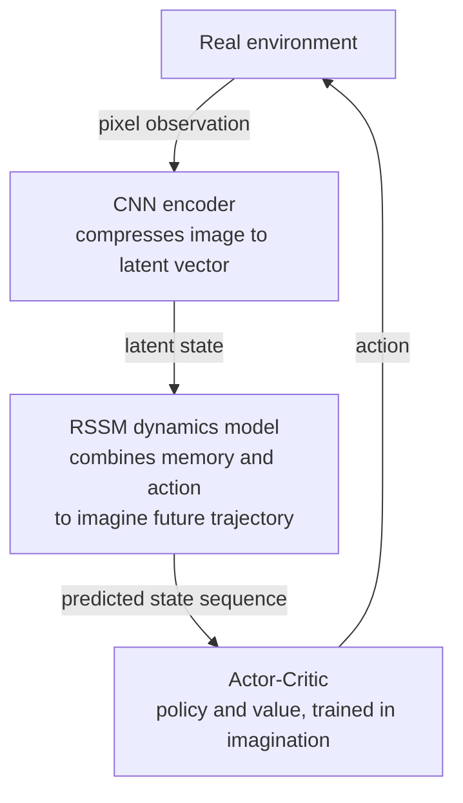

# Part B: Latent Dynamics

## The Encoder Alone Is Not Enough — We Need to Predict the Future

With a VAE encoder we can compress the current frame $\mathbf{o}_t$ into $\mathbf{z}_t$. But the core job of a world model is to **predict the future**:

> Given the current state $\mathbf{z}_t$ and action $\mathbf{a}_t$ in latent space, predict the next state $\mathbf{z}_{t+1}$.

This ability lets the agent "simulate" the future in its head, planning without actually executing actions — exactly where world models save samples.

---

## The Simplest Dynamics: GRU

The **Gated Recurrent Unit (GRU)** is a standard sequence-modeling tool. As a dynamics model, the GRU takes $(\mathbf{z}_t, \mathbf{a}_t)$ and predicts the next latent state:

$$
\mathbf{z}_{t+1} = \text{GRU}(\mathbf{z}_t, \mathbf{a}_t; \theta)
$$

> **📖 GRU internals (briefly)**: A GRU uses two "gates" to control information flow. The **reset gate** decides "how much of the past to forget," and the **update gate** decides "how much old state to keep vs. how much new information to write in." The gate values lie between 0–1, jointly determined by the current input and previous hidden state. This lets the GRU remember long-term dependencies selectively while forgetting irrelevant detail — it handles longer sequences better than a vanilla RNN. Compared to LSTM, GRU has one fewer gate (no separate memory cell), fewer parameters, and trains faster.

GRU is simple and trains stably; the downside is it outputs a deterministic prediction and cannot express **uncertainty**. In real environments the same action may lead to multiple outcomes (e.g. pushing a box may succeed, or it may jam).

---

## MDN-RNN: Modeling Uncertainty

**MDN-RNN (Mixture Density Network + RNN)** was introduced in the Ha & Schmidhuber (2018) World Models paper. It models the uncertainty over the next state with a **mixture of Gaussians**:

$$
p(\mathbf{z}_{t+1} | \mathbf{z}_t, \mathbf{a}_t) = \sum_{k=1}^{K} \pi_k \cdot \mathcal{N}(\mathbf{z}_{t+1}; \mu_k, \sigma_k^2)
$$

- $K$ Gaussian components, each with its own mean $\mu_k$ (center of the distribution) and variance $\sigma_k^2$ (width).
- **Mixture weights** $\pi_k$: the probability mass of the $k$-th Gaussian, satisfying $\sum_{k=1}^K \pi_k = 1$, $\pi_k \geq 0$. Think of $\pi_k$ as "the probability of the $k$-th type of future." The network outputs $\pi_k$ through a softmax to ensure they sum to 1.

MDN-RNN can capture **multimodal distributions**: the environment may jump to several different next states, all of which the model can express.

---

## RSSM: Separating Determinism from Stochasticity

**RSSM (Recurrent State Space Model)** is the core innovation of the Dreamer series of papers. It splits the state into two parts:

- **Deterministic hidden state** $\mathbf{h}_t$: maintained by an RNN, aggregating historical trajectory information, with no randomness.
- **Stochastic latent state** $\mathbf{z}_t$: sampled from a distribution conditioned on $\mathbf{h}_t$, expressing current uncertainty.

**RSSM's core equations**:

$$
\mathbf{h}_t = f_\phi(\mathbf{h}_{t-1},\ \mathbf{z}_{t-1},\ \mathbf{a}_{t-1})
\quad \text{(deterministic update, GRU/RNN)}
$$

$$
\mathbf{z}_t \sim p_\phi(\mathbf{z}_t \mid \mathbf{h}_t)
\quad \text{(prior: without the real observation, guess the current state from history } h_t \text{ only; used during pure imagination/prediction)}
$$

$$
\mathbf{z}_t \sim q_\phi(\mathbf{z}_t \mid \mathbf{h}_t,\ \mathbf{o}_t)
\quad \text{(posterior: correct the prior using the real observation } o_t \text{; used during training)}
$$

> **📖 Prior vs posterior**: A basic Bayesian distinction. The **prior** is "belief before seeing data" — RSSM's guess of the current state $z_t$ from history $h_t$. The **posterior** is "belief updated after seeing data" — corrected with the real observation $o_t$. During training, the posterior produces $z_t$ and the KL loss measures the gap between prior and posterior; during inference/imagination, only the prior is available (no real $o_t$), and RSSM rolls forward on the prior alone.

**Why split them?**

| State | Role | Property |
|------|------|------|
| $\mathbf{h}_t$ | Memory | Deterministic, aggregates history |
| $\mathbf{z}_t$ | Perception | Stochastic, expresses uncertainty |

With the split, the model can roll forward using only the prior $p(\mathbf{z}_t | \mathbf{h}_t)$ when no real observation is available, doing **pure imagination-based planning**. This is the fundamental reason Dreamer is so efficient.

---

## The Encoder as a Bridge in Dreamer

The encoder is not just a compression tool. It is the **bridge** between the pixel world and the latent dynamics world:

The full Dreamer flow:

1. **Encode**: $\mathbf{o}_t \xrightarrow{\text{encoder}} \mathbf{z}_t$
2. **Dynamics**: $(\mathbf{z}_t, \mathbf{a}_t) \xrightarrow{\text{RSSM}} \mathbf{z}_{t+1}, \mathbf{z}_{t+2}, \ldots$ (pure imagination)
3. **Policy learning**: train Actor-Critic on imagined trajectories, no real-environment interaction needed
4. **Execution**: deploy the policy in the real environment, collect a small batch of new samples, iterate

The quality of the encoder sets the ceiling for RSSM: the more semantically clean the latent space, the easier the dynamics model can learn meaningful transitions.

---

## Summary

| Concept | Role | Key Equation/Structure |
|------|------|--------------|
| VAE encoder | Compress pixels into $\mathbf{z}$ | ELBO = reconstruction − KL |
| GRU dynamics | Deterministic next-state prediction | $\mathbf{z}_{t+1} = \text{GRU}(\mathbf{z}_t, \mathbf{a}_t)$ |
| MDN-RNN | Model multimodal uncertainty | Mixture-of-Gaussians output |
| RSSM | Separate deterministic/stochastic state | $\mathbf{h}_t$ (memory) + $\mathbf{z}_t$ (perception) |

**Take-away**: a good world model = a good encoder (perceptual compression) + a good dynamics model (temporal prediction). RSSM, by separating the two kinds of state, strikes a careful balance between expressiveness and computational efficiency.

---

## Next Lecture

After finishing P01 and P02 you have a working RSSM baseline in hand. L03 uses it as an anchor and compares four architecture families side by side: Transformer dynamics (STORM / IRIS), diffusion models (Diamond), and JEPA.

Each has its own design trade-offs — not "which is best," but "which fits which task constraint." Reading the comparison with your own RSSM in hand is far sharper than just reading papers.
