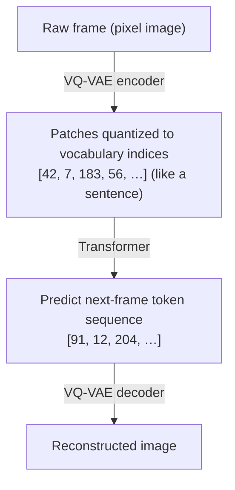
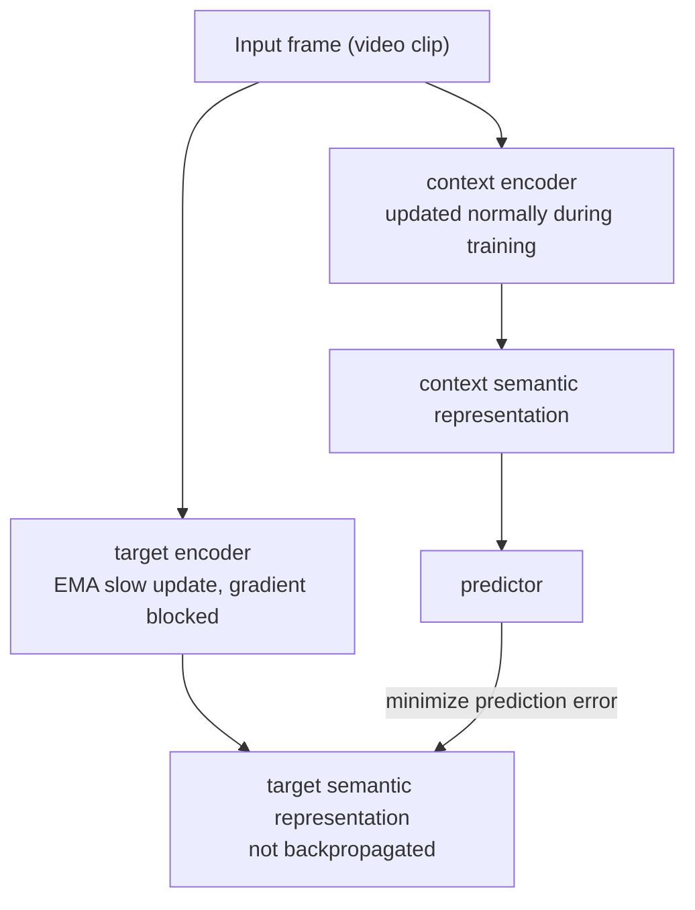

# Part A: Six Architecture Families and Learning Paradigms

## Recap: You Already Have an RNN Baseline

P02's RSSM has two parallel paths:

- **Deterministic path** (GRU): $h_t = f_\phi(h_{t-1}, z_{t-1}, a_{t-1})$ — captures the smooth dynamics trend.
- **Stochastic path**: $z_t \sim q_\phi(\cdot \mid h_t, o_t)$ — samples current uncertainty in the latent space.

This design was validated in Dreamer V1/V2, delivering solid policy performance on continuous-control tasks at low compute cost. Its limitation is also clear: **GRU's memory decays as the sequence grows**, leaving it underpowered for tasks requiring reasoning over hundreds of steps.

The next five architecture families each try to break through this limit — in different directions.

---

## Architecture One: RNN / RSSM (your baseline)

**Representative systems**: Ha & Schmidhuber World Models (2018), Dreamer V1 (2019), Dreamer V2 (2020).

### Core Mechanism

GRU (or LSTM) updates the hidden state step by step, with per-step cost **O(1)** — single-step inference time is constant regardless of sequence length.

RSSM adds a stochastic latent $z_t$ on top of the GRU. This dual-path design is anything but arbitrary:

- The **deterministic path (GRU)** captures the "main melody" of the world — object trajectories, velocity inertia, the overall scene trend. These regularities are smooth and predictable; GRU's linear recursion fits them well.
- The **stochastic path (stochastic latent z)** expresses "surprise" — the same action may produce different outcomes; the world is intrinsically stochastic. $z_t$ is sampled from a distribution conditioned on $h_t$, letting the model express uncertainty rather than forcing a single "most likely" prediction.

The two paths are concatenated and fed to the decoder, jointly capturing regularity and stochasticity.

### Why did Ha & Schmidhuber use MDN-RNN?

A vanilla RNN outputs a single-point prediction — it can only say "the next latent is $z^*$." But the real-world future often has **multiple branches**. MDN-RNN (Mixed Density Network + RNN) outputs the parameters of a **mixture of Gaussians**, describing a multimodal distribution:

A vanilla RNN outputs a single-point prediction $z^*$; MDN-RNN instead outputs parameters for a mixture of $K$ Gaussians $[\pi_1, \mu_1, \sigma_1,\ \ldots,\ \pi_K, \mu_K, \sigma_K]$, representing a multimodal distribution over futures.

RSSM systematizes the idea: rather than outputting distribution parameters at each step, it maintains a stochastic path directly in the computation graph, making uncertainty a first-class citizen.

### The Intuition of Dream Training

Dreamer's training breaks into three stages:

Dreamer trains in three stages: **① Train the World Model** — real trajectories go through encoder V to get latent $z$, then RSSM (M) predicts next-frame $z'$, minimizing ELBO; **② Train the Controller in the dream** — RSSM generates pure-latent imagined trajectories, the Controller learns policy in latent space with no real environment calls; **③ Transfer to the real environment** and fine-tune with a small amount of real interaction.

**Learn the world first, then learn to act.** Once the world model has captured the physics, the Controller can explore at extremely low cost inside the virtual dream — a single real sample can spawn hundreds of imagined trajectories for training. This is the root cause of Dreamer's sample efficiency over model-free RL.

**Learning paradigm**: interactive. Collect $(o_t, a_t, r_t, o_{t+1})$ tuples through real trial-and-error, learning the action-to-outcome mapping. The model learns an action-conditioned transition distribution $p(s_{t+1} \mid s_t, a_t)$. The interactive paradigm can answer "if I take a different action, what changes?" — a question the observational paradigm (video only) cannot answer.

**Applicable scenarios**: simple to medium-complexity continuous control (DMControl, Atari), latency-sensitive online RL.

**Limitations**: weak long-term memory; lower generative quality than diffusion; real-robot data is still expensive.

---

## Architecture Two: Transformer-based (2021–2022)

**Representative systems**: STORM (2023), IRIS (2022).

### Core Mechanism

Replace the GRU with a **Transformer**. The history sequence $o_{1:t}$ is tokenized into discrete tokens, and **self-attention** computes weights across the entire sequence:

$$\text{Attention}(Q, K, V) = \text{softmax}\!\left(\frac{QK^\top}{\sqrt{d_k}}\right)V$$

> **📖 Q, K, V in self-attention**: each position's vector is linearly transformed into three roles — **Query (Q)**: what this position wants to "ask"; **Key (K)**: what each other position "offers"; **Value (V)**: the actual content carried. $QK^\top$ scores each pair of positions, divided by $\sqrt{d_k}$ (to keep dot products from blowing up softmax gradients), then softmaxed to get attention weights and finally combined with $V$. Every position "asks" (Q) every other position which "answers" (K) are relevant, then extracts their content (V) weighted by relevance.

Each position can directly "see" any other historical timestep — no longer bottlenecked by a GRU hidden state.

### VQ Discretization: Turn Images into "Sentences"

IRIS's key trick is **VQ-VAE quantization** — turn continuous image frames into a discrete token sequence. GPT can predict "the next word" because words are discrete and finite, and the probability distribution can be modeled exactly with softmax. If images are turned into similar discrete "words," a GPT-style autoregressive Transformer can directly predict "the next visual word."

> **📖 How VQ (vector quantization) works**: ① the encoder maps an image patch to a continuous vector $z$; ② find the nearest vector $e_k$ in the codebook ($k = \arg\min_j \|z - e_j\|_2$); ③ replace the continuous vector with $e_k$'s index $k$ and feed it to the Transformer. Backprop uses the **straight-through estimator**: forward pass uses the quantized discrete vector, backward pass pretends quantization didn't happen and lets gradients flow through.



### STORM's Key Improvement

STORM (Stochastic Transformer-based wORld Models) does not simply swap GRU for Transformer — it makes a more refined fusion:

- Keep the RSSM stochastic latent $z_t$ (uncertainty expression)
- Replace GRU with Transformer (long-range dependencies)
- Add a stochastic token prediction objective (the Transformer learns to model uncertainty, not just deterministic prediction)

STORM is not a pure autoregressive video model but a **stochastic, action-conditioned world model** — action $a_t$ is concatenated as an extra token, and the prediction is the action-conditioned future latent distribution.

**Learning paradigm**: mostly interactive (action-conditioned). It can also be pretrained on large-scale unlabeled video (observational) and then fine-tuned with a small amount of interaction data.

**Applicable scenarios**: complex games (long Atari playthroughs, strategy games), tasks needing multi-step planning. The default choice when compute and data are ample.

**Limitations**: quadratic compute cost in sequence length ($O(T^2)$); higher inference latency than RNN; needs more data to converge.

---

## Architecture Three: Diffusion-based (2023–2024)

**Representative systems**: Diamond (2024), GameNGen (Google, 2024)

### Core Mechanism

Diffusion models generate output by **progressive denoising**: add Gaussian noise to a real frame, then train a network to predict the noise:

$$p_\theta(x_{t-1} \mid x_t) = \mathcal{N}(x_{t-1};\, \mu_\theta(x_t, t),\, \sigma_t^2 I)$$

In the world-model setting, conditioned on history frames and actions, the diffusion model denoises into the next frame step by step. Each denoising step is a full network forward pass, with the network deciding "where to remove noise" guided by the action condition.

GameNGen (2024) is the first system to run a complete game engine via a neural network **in real time** — simulating *DOOM* at 20fps. **The model is the game engine.** Generating each frame takes 10–100 denoising iterations, each a full U-Net forward pass — making diffusion world models very expensive inside an **online RL training loop**.

**Learning paradigm**: observational or interactive (Diamond). Observational diffusion models are trained on massive internet video and learn visual regularities without action conditioning. The observational paradigm can "watch" the future but not "control" it — passive video prediction learns "how the world evolves naturally," not "what changes if I take a different action."

**Applicable scenarios**: offline video prediction, high-fidelity simulators, film/game content generation. Not suitable for real-time closed-loop control in RL.

**Limitations**: slow inference (10–100 denoising steps); hard to plug into policy optimization (the sampling process is non-differentiable); huge training and inference costs.

---

## Architecture Four: JEPA (2023, non-generative)

**Representative systems**: I-JEPA (2023), V-JEPA (2024), V-JEPA 2 (2025), led by Yann LeCun.

### Core Mechanism

The core idea of JEPA (Joint Embedding Predictive Architecture): **don't predict pixels — predict in a semantic latent space**.

Given the current observation $x$, the encoder maps it to a semantic representation $s_x$; the predictor predicts the target region's representation $s_y$ from context, instead of reconstructing pixels $y$:

$$\hat{s}_y = f_\theta(s_x,\, \text{context})$$

Pixel space is full of task-irrelevant information: lighting changes, texture details, shadow directions, sensor noise. A pixel-level reconstruction model has to spend capacity learning "what color this patch of skin should be at this lighting angle" — useless for understanding "is this hand holding the cup?" Worse, MSE drives the model to output blurry "average images"; GANs generate sharp images but introduce training instability. JEPA's answer: **don't enter pixel space at all — predict at the semantic level directly**.

### Context encoder + predictor + target encoder



The training objective minimizes the L2 distance between the predictor's output and the target representation:

$$\mathcal{L}_{\text{JEPA}} = \|\text{predictor}(s_x) - s_y\|^2$$

> **📖 stop-gradient and EMA**: `stop_gradient(s_y)` means the computation of $s_y$ does not backprop — the gradient is cut here. The EMA rule is $\xi \leftarrow \tau \xi + (1-\tau) \theta$ with $\tau \approx 0.996$, making the target encoder "follow" the context encoder very slowly. Without these constraints, the model can find a shortcut: map every input to a single vector — minimizing the loss trivially (**representation collapse**). The EMA + stop-gradient combination breaks the symmetry that produces collapse by updating the two encoders asynchronously.

When Meta released V-JEPA 2 in 2025, they explicitly positioned it as a "**world-model component on the path to AGI**," not a video generator. V-JEPA 2 can, given a sequence of actions, predict future visual representations in semantic space — not generate realistic video, but understand "if I move my arm this way, where will the object be?"

**Learning paradigm**: mostly observational. Training data is video sequences without action labels. JEPA does not compete in "who generates the most realistic video"; it aims at "who best understands the physical world."

**Applicable scenarios**: visual representation pretraining, semantic similarity tasks, data-efficient downstream classification/retrieval; a candidate for the next general world-model backbone.

**Limitations**: no visual output; non-intuitive metrics; MPC or actor-critic on top of JEPA representations is still an open question.

---

## Architecture Five: Robotic World Model (RWM) — the hard problems of robot control

**Representative systems**: Self-Forcing (2024), RWM-U (2025).

The first four families fight mostly over "generation quality" or "game-playing intelligence." Robot control has a class of harder problems whose core isn't "can we generate a realistic image?" but "can we train a real-world-deployable policy?"

### Two Core Problems

**Problem 1: long-horizon rollout drift**

At training time, the model sees the **real state** as input every step (teacher forcing); at inference time, it must feed its **own prediction** back in (autoregressive rollout) — errors begin to accumulate and the trajectory diverges. The training/inference distribution gap produces physically impossible states over long rollouts.

**Problem 2: policy exploitation**

The policy actively searches for and exploits model errors — it finds action sequences that earn fake high rewards inside the world model but are meaningless or harmful in reality.

**Self-Forcing** "simulates" the inference-time error accumulation during training: instead of always feeding the real state, sometimes feed the model's own previous prediction, and compute losses against the real state over **multiple steps**. Experiments show Self-Forcing reduces accumulated 50-step rollout error to roughly 1/3 of teacher forcing.

**RWM-U** (Uncertainty-Aware Robotic World Model) trains an **ensemble**: N independently initialized world models in parallel, using the **variance** of their predictions as an uncertainty estimate. Policy optimization penalizes high-uncertainty regions:

$$\text{policy reward} = \text{task reward} - \lambda \times \text{uncertainty}$$

This penalizes high-uncertainty regions, keeping the policy within states the model knows well.

> **📖 Epistemic uncertainty**: comes from "the model hasn't seen enough data" — in well-covered regions of training data, multiple independent models produce similar predictions (low variance); in undertrained regions, they disagree (high variance). Different from aleatoric uncertainty, which comes from intrinsic environment randomness; epistemic uncertainty can be reduced with more data, aleatoric cannot.

**Learning paradigm**: interactive, but focused on solving the long-horizon drift and policy-exploitation problems intrinsic to the interactive paradigm.

**Applicable scenarios**: high-frequency robot control (joint-space MPC, dexterous manipulation), tasks with strict sim-to-real requirements.

---

## Architecture Six: From World Model to World Action Model (WAM)

**Representative systems**: Motus (2025), DreamDojo (2025), DreamZero / WAM (2025–2026).

This is the most active frontier in 2025–2026. Researchers begin asking a more fundamental question: do the world model and the policy model really need to be two separate modules?

| Paradigm | Input | Output |
|----------|-------|--------|
| World Model | observation + action | future observation / state |
| VLA | observation + language | action |
| WAM | observation + language | future observation + action |

A traditional World Model takes actions in and predicts future state — a simulator alongside the policy. A VLA bypasses the world model and predicts actions directly from vision and language — an end-to-end reactive policy. WAM does both: predict the world's future state, and predict the action to take. The world's visual evolution becomes dense supervision for action learning, not just an auxiliary task.

**Motus** introduces **latent actions**: action representations automatically extracted from heterogeneous video data (including large amounts of human video without action labels). Large-scale unlabeled-video pretraining → alignment with a small amount of robot-action-labeled data.

**DreamDojo** focuses on contact-rich dexterous tasks, using **continuous latent actions** to learn "effective action representations" from pure video, then fine-tuning on a small batch of robot demonstrations.

**DreamZero / WAM series** use a pretrained **video diffusion backbone** to jointly predict future world states and robot actions, with the video sequence as dense supervision:

| Paradigm | Supervision signal | Loss |
|----------|-------------------|------|
| VLA | observation → [action₁, …, actionT] | action loss only |
| WAM | observation → [future_frame₁, …] + [action₁, …] | video loss + action loss, mutually reinforcing |

**Learning paradigm**: a fourth paradigm — joint learning. Video and actions are two sides of the same physical process. WAM exploits video's dense physical supervision so the policy learns physical motion and action consequences, not just action regression.

**What these papers reveal**: world model is no longer a simulator next to the policy — it is part of the policy itself. In the traditional model-based RL setup, world model and policy are two separate modules. The WAM series breaks this separation and trains a **unified model** of world dynamics and decision logic.

---

## Comparison Summary

| Family | Paradigm | Core advantage | Main drawback | Typical use |
|--------|----------|----------|----------|--------------|
| **RNN / RSSM** | Interactive | Low compute, low latency | Weak long-term memory, limited generation quality | Online RL, real-time control |
| **Transformer** | Interactive/observational | Strong long-range deps, parallel training | Quadratic compute in sequence length | Complex games, multi-step planning |
| **Diffusion** | Observational/interactive | Very high visual fidelity | Slow inference, hard for real-time control | Offline simulation, video generation |
| **JEPA** | Observational | Robust and efficient, ignores irrelevant noise | No pixel output, control applications immature | Semantic representation pretraining |
| **RWM** | Interactive | Stable long-horizon rollouts, no policy drift | Higher compute (ensemble) | High-frequency robot control, sim-to-real |
| **WAM** | Joint learning | Jointly optimizes world prediction and action planning | Complex architecture, hungry for data | Embodied intelligence, dexterous manipulation |

## How to Choose an Architecture?

```mermaid
flowchart TD
    Q1{Real-time\nclosed-loop control?}
    Q1 -->|Yes| Q2{High-frequency\nrobot control?}
    Q1 -->|No| Q3{End goal?}
    Q2 -->|Yes, needs sim-to-real| R1["RWM\nSelf-Forcing / RWM-U"]
    Q2 -->|No (game/sim)| Q4{Sequence length?}
    Q4 -->|Short < 100 steps| R2["RNN / RSSM\nyour P02 baseline"]
    Q4 -->|Long, needs planning| R3["Transformer\nSTORM / IRIS"]
    Q3 -->|Visual fidelity| R4["Diffusion\nDiamond / GameNGen"]
    Q3 -->|Semantic reasoning| R5["JEPA\nI-JEPA / V-JEPA"]
    Q3 -->|Embodied intelligence| R6["WAM\nMotus / DreamZero"]
```

**Practical advice**: start with RNN/RSSM — P02 already takes you through it. Upgrade only when you hit a bottleneck: if long-horizon prediction accuracy keeps dropping or the task requires multi-step causal reasoning, switch to Transformer. Leave Diffusion to offline scenarios. JEPA's control interface isn't ready yet, but it has real results in representation learning and is worth tracking. For real robots, engineering tricks like Self-Forcing and ensemble uncertainty matter more than picking a different architecture — solve the long-horizon stability problem first.
