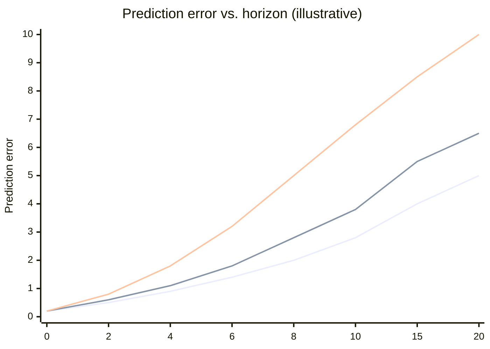

# STORM, Diffusion World Models, and Universal Failure Modes

## STORM (Transformer Dynamics)

*In P05 you replaced P03 Dreamer's GRU dynamics head with a Transformer and ran ablations.*

STORM models the world model as a sequence prediction problem, with a Transformer autoregressively predicting the next discrete token (a quantized latent representation).

### The Teacher-Forcing / Free-Running Gap

This is the fundamental challenge of STORM (and any autoregressive sequence model used as a world model) and must be understood before discussing specific metrics.

**Teacher forcing (training)**: feed the true historical token at every step and predict the next token. Errors do not accumulate, because the input at every step is the "correct answer."

**Free-running (test)**: no real tokens are available; you must feed your own previous prediction as the next step's input. Once a step is wrong, the error propagates and amplifies — the root cause of STORM's long-horizon collapse.

The error distributions of the two are fundamentally different: teacher-forcing errors are `i.i.d.` (independent per step); free-running errors are autocorrelated (snowball effect). This means a model trained only on teacher-forcing loss will systematically underestimate its own long-horizon free-running error.

**Mitigations**: Scheduled Sampling (during training, with increasing probability replace true tokens with the model's own predictions) or DAGGER-style dataset aggregation can shrink the gap but cannot fully eliminate it.

### Token Prediction Loss

The standard cross-entropy loss, measuring the gap between the Transformer's predicted next-token distribution and the true token:

$$\mathcal{L}_{\text{token}} = -\sum_t \log P(\text{token}_{t+1} \mid \text{token}_{1:t},\, \text{action}_{1:t})$$

This is STORM's main training objective and the most direct quality metric of the dynamics.

**Diagnostic rule**: Token loss converges too slowly → the sequence length is too long for the attention mechanism to capture key dependencies; try shortening the context window or introducing relative position encoding (RoPE or ALiBi).

### Long-horizon PSNR and FVD

**PSNR (Peak Signal-to-Noise Ratio)** measures pixel-level reconstruction quality between predicted and true frames:

$$\text{PSNR} = 10 \cdot \log_{10}\!\left(\frac{\text{MAX}^2}{\text{MSE}}\right)$$

> **📖 PSNR breakdown**: **MAX** is the maximum possible pixel value — 1 for $[0,1]$-normalized images, 255 for 8-bit images. **MSE** (Mean Squared Error) is the mean of squared per-pixel differences; lower is better. The $\log_{10} \times 10$ converts to decibels (dB): PSNR > 30 dB usually means good reconstruction, < 20 dB means visibly poor. Higher is better.

**Key point**: compute PSNR at 5, 10, and 20 prediction steps and plot a "PSNR vs prediction step" curve. The rate of decay directly reflects the model's long-horizon ability.

**Diagnostic rule**: PSNR drops sharply after 5 steps (e.g. 28dB → 18dB) → horizon drift (next section); autoregressive error accumulation is significant for the Transformer over long sequences.

**PSNR vs FVD**: they measure different things; the choice depends on your downstream task:

- **PSNR**: per-pixel accuracy, emphasizing "how accurate each predicted frame is." Suitable for prediction-algorithm debugging and ablations — sensitive to local errors, quickly reveals small differences from model changes.
- **FVD (Fréchet Video Distance)**: video-equivalent of FID, uses an I3D network to extract spatiotemporal features and computes the feature-distribution distance between generated and real video. Focuses on the overall dynamic quality of a sequence — whether motion is smooth, whether temporal relations are reasonable — not single-frame accuracy. Suitable for policy evaluation (judging whether STORM's imagined trajectories can provide a useful training signal).

**Recommendation**: report both metrics. PSNR drops while FVD remains stable → per-frame detail worsens but overall dynamics remain reasonable; PSNR stable but FVD rises → frame quality is fine but sequence-level temporal consistency has broken.

---

## Diffusion World Models (Diamond)

Diffusion world models generate video frames directly in pixel space with extreme visual fidelity. But they have unique failure modes: the intrinsic laws of the physical world are hard to emerge from generation probability alone.

### FVD (Fréchet Video Distance)

FVD is the standard metric for evaluating diffusion world models' generation quality:

$$\text{FVD} = \|\mu_{\text{real}} - \mu_{\text{gen}}\|^2 + \text{Tr}\!\left(\Sigma_{\text{real}} + \Sigma_{\text{gen}} - 2(\Sigma_{\text{real}} \Sigma_{\text{gen}})^{1/2}\right)$$

Same form as FID, with a different feature extractor:
- FID uses Inception-v3, extracting single-frame spatial features.
- FVD uses **I3D** (Inflated 3D ConvNet): standard 2D convolution kernels are "inflated" into 3D (also convolving along the time axis), capturing both spatial textures and temporal motion. I3D is pretrained on action-recognition datasets (e.g. Kinetics); its features distinguish "a still cat" from "a running cat" — exactly what's needed to evaluate video quality.

This means FVD is very sensitive to "whether the sequence actually moves." Even if each static frame is high-quality, unnatural motion (object jitter, dropped frames, inconsistent speed) yields a high (bad) FVD. **Lower is better.**

### Physics Consistency

Two sub-dimensions:

- **3D spatial coherence**: when the camera moves, do objects in the scene maintain correct depth relationships? A table should not "pass through" a chair just because the viewpoint shifted.
- **Object permanence**: after an object is occluded, does it reappear in a reasonable location? Babies acquire this around 8 months — diffusion models often fail here.

**Automated evaluation pipeline (concrete implementation)**:

You can build an evaluation pipeline on top of off-the-shelf vision models:

1. Estimate a depth map for each frame with **DepthAnything** (or MiDaS).
2. Track key object patch positions with **DINO** (or SAM).
3. Before and after camera motion, check whether the depth ordering of the same object pair is preserved (e.g. "ball is in front of table" should hold across frames).
4. Compute the Depth Violation Rate: among randomly sampled object pairs, the fraction whose depth ordering flipped after camera motion.

**Diagnostic rule**: high depth violation rate → the model has not built a 3D understanding of the scene, only doing texture interpolation. The fundamental fix is to introduce a 3D representation (NeRF, 3DGS) or a training loss with geometric constraints.

### Action Fidelity

Given an action sequence (e.g. "move 2 m to the right"), does the pixel motion in the generated video match expectation?

> **📖 Optical flow**: describes the motion vector field of every pixel between adjacent frames — "where does this pixel move from frame $t$ to $t+1$ ($\Delta x, \Delta y$)?" It can be computed automatically with RAFT, FlowFormer, etc. In world model evaluation, optical flow replaces per-pixel comparison and abstracts away texture detail, focusing on "is the motion correct?"

$$\text{ActionFidelity} = 1 - \frac{\|\text{flow}_{\text{generated}} - \text{flow}_{\text{expected}}\|_1}{\|\text{flow}_{\text{expected}}\|_1}$$

where `flow` is the optical flow vector field (per-pixel $(\Delta x, \Delta y)$) and `||·||₁` is the L1 norm (sum of absolute values). Higher is better (ideal 1.0).

**Diagnostic rule**: objects vanish or jump → loss of object permanence; generated motion direction does not match the action → action conditioning is weak; increase action-embedding dimension or inject action information at every layer of the denoising network (not just the first).

---

## Universal Failure Mode: Horizon Drift

Whatever architecture you use, **every world model shares one enemy: horizon drift.**

### What is Horizon Drift?

The world model performs well at 1-step prediction, but as you ask for 10-step, 20-step rollouts, tiny per-step errors **accumulate**, and the prediction trajectory diverges from reality completely.

### Error-vs-Horizon Curve

Drift rates per architecture:
- **STORM (Transformer)**: high short-term accuracy, but the fastest autoregressive error accumulation; usually worst quality after 20 steps.
- **TD-MPC (latent MPC)**: consistency loss suppresses some drift, medium.
- **Dreamer (RSSM)**: stochastic state provides some regularization; drift is relatively mild but present.

### Mitigations

1. **Short-horizon training**: train on prediction losses of only 1–5 steps to avoid gradient explosion/vanishing over long sequences.
2. **Target network**: like in DQN, use a slow-updating target network to provide stable supervision, preventing the dynamics function from chasing a moving target.
3. **Data refresh**: regularly collect new data from the real environment to reset the latent space, avoiding the model amplifying its own bias from "dream data."
