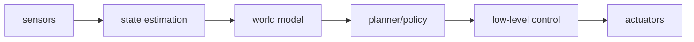

# Real-Deployment Evaluation and Course Summary

## Real-Deployment Evaluation: Beyond Paper Metrics

The metric frameworks for the five models above were designed in controlled lab settings — you have clean datasets, reproducible simulators, and enough compute to run controlled experiments. In real deployment, everything gets messier.

### Why Paper Metrics Are Not Enough

FID/FVD/PSNR tell you whether the model "predicts accurately," but they don't answer:
- Can the actions learned inside the world model actually be executed on the real robot's hardware?
- Will sensor latency and asynchrony break the world model's temporal assumptions?
- When the world model is uncertain about a state, can the system recognize it and safely request human takeover?

In real deployment, the world model is one link in a long chain:

Failure at any link causes system failure, but paper metrics only measure the input-output quality of the "world model" box, not the reliability of the whole chain.

### What to Record and Evaluate in Real Deployment

**Dynamics quality**

- **one-step prediction error**: is short-term dynamics correct?
- **multi-step rollout error**: long-horizon drift (5/10/20 steps)
- **contact event accuracy**: predicts contact, slip, fall, jam correctly?

**Uncertainty and reliability**

- **uncertainty calibration**: does high uncertainty really correlate with high error? Measured by Expected Calibration Error (ECE).

> **📖 Calibration**: when the model predicts "I am 80% confident," is the true accuracy also ~80%? Well-calibrated models match confidence to accuracy. ECE = weighted average of |confidence − accuracy| within confidence bins; lower is better.

**Policy transfer**

- **policy transfer gap**: how much does the in-model policy drop on real hardware? (sim-to-real gap in cumulative reward)

**Human collaboration**

- **intervention rate**: how many manual takeovers per hour?
- **failure recovery rate**: can the system recover from intermediate failures?

**System performance**

- **latency**: observation-to-action latency meeting control frequency? (real-time factor: sim_speed / real_speed ≥ 1)

---

## Seven Most Common Pitfalls in Real Deployment

### Inconsistent Action Semantics

In simulation, an `action` may be an idealized joint target (directly assigned to a joint angle). In reality, it must pass through a PD controller, hardware limits, velocity constraints, and motor response latency. If the world model is trained on "ideal actions," it describes a non-existent "perfect robot" — the action sequences the policy learns may not be executable on real hardware.

### Time Delay and Asynchronous Sensors

Cameras (often 30 or 60 Hz), force sensors (often 1 kHz), joint states (250 Hz or higher), and control commands (variable frequency) are rarely synchronized. The world model assumes `o_t` and `a_t` were sampled at the same instant, when actually they may differ by tens or hundreds of milliseconds. For high-speed locomotion or contact manipulation, that delta is enough to invalidate predictions — by the time "the foot just touched down" is predicted, the foot has already lifted.

### Contact State Is Invisible

Touching in the camera does not mean force has transferred; visually still does not mean the object isn't micro-slipping. This is the largest blind spot of visual world models in manipulation: grasping, peg-in-hole, twisting a cap, pulling a drawer — these all depend on invisible contact variables (normal force, tangential force, contact area). World models with only RGB input have a hard ceiling on these tasks, far below human expectations.

### Long-horizon Drift

Video world models look great over short rollouts (1–5 steps), but as the horizon grows, object identity (a red ball becomes a blue ball), geometric relations (two objects' relative positions flip), and contact state ("object in hand" becomes "object floating") quietly deform. Representation-space prediction (TD-MPC style), self-forcing training (STORM style), and explicit 3D representations (NeRF/3DGS) all mitigate this, but as of now there is no complete fix.

### Policy Exploits Model Holes (Model Exploitation)

The policy is an optimizer — it finds actions with high reward in the world model but invalid in reality. Not the policy's fault, but the nature of optimization. Classic case: in a learned simulator, the policy discovers that "rapid small joint oscillation gets high reward" — a pattern that sidesteps every physical constraint inside the model but only damages motors or triggers emergency stops in reality.

Detection: periodically execute the policy's high-reward action sequences in the real environment and check for "valid in model, invalid in reality." If that fraction exceeds 20%, you need adversarial training or systematic patching of the world model's holes.

### Uncertainty Does Not Enter Control Decisions

Many world models output a plausible future prediction but do not warn the downstream policy: "I haven't seen states like this." This silent failure is more dangerous than a visible prediction error — the policy thinks it's on familiar ground but is actually in an out-of-distribution region.

Real deployment must let uncertainty participate in planning: when uncertain, slow down, switch to a more conservative action, or request human intervention. A simple implementation: maintain a density estimator (kernel density estimation, normalizing flow) over training data in the world model's latent space; when a new observation's density falls below threshold, flag it as "high uncertainty."

### Safety Is Not Solved by Reward Shaping Alone

Home and factory robots need a **hard safety layer**: joint speed limits, end-effector force limits, workspace collision detection, emergency stop, human-takeover protocol. You cannot rely on the world model's learned "safety sense," because the world model itself can be wrong.

The world model can play a **risk prediction** role ("If you execute this action, there is a 40% chance of collision within 3 steps"), but the final hard safety guarantee must come from an independent, non-learned control layer. Safety constraints are a software-engineering problem, not just an ML training problem.

---

## Three Pragmatic Deployment Strategies

Depending on risk tolerance and system maturity, real deployment of a world model has three escalating strategies:

**1. Shadow Evaluator**

The real policy runs normally; the world model independently predicts the future in parallel and compares with what actually happens, but does not control anything. This systematically reveals "in which object types, action ranges, and contact states the model is unreliable," producing a reliability map. Lowest risk; suitable for the early stage of deployment.

**2. Action Candidate Filter**

The policy proposes multiple candidate actions (e.g. N trajectories from MPC or K actions sampled by the Actor). The world model predicts each candidate's outcome and filters two categories: (a) predicted-dangerous (collisions or object falls predicted), (b) uncertainty above threshold (the model is unsure of the outcome). Among the remaining candidates, execute the one with highest reward.

**3. Closed-Loop Planner / Imagined Training**

The world model enters the MPC rollout or imagined rollout, used directly for online planning or offline policy training. This is Dreamer and TD-MPC's standard usage. Highest payoff (explore vast amounts of states in imagination without real interaction), highest risk (model exploitation, safety holes, distribution shift all directly impact policy quality). Recommended only after the world model is fully validated (passes the shadow-evaluator stage).

---

## Summary Table

| Model | Main metrics | Added diagnostics | Common failures | Diagnosis |
|------|---------|------------|------------|---------|
| **Dreamer** (RSSM) | Reconstruction FID, reward correlation `ρ` | Imagined trajectory entropy (KL collapse warning) | Encoder degeneration, imagined reward distortion, KL collapse | FID up → lower encoder LR; `ρ` down → larger latent dim; entropy → 0 → KL annealing / free bits |
| **MuZero** (implicit) | Value accuracy, MCTS visit entropy | Representation stability (cosine sim > 0.95) | Biased value estimate, pseudo-confidence, unstable representation | Low accuracy → retrain reward model; entropy needs task context; low stability → wider network or contrastive loss |
| **TD-MPC** (latent MPC) | Latent consistency loss, plan efficiency | Latent t-SNE visualization (local isomorphism) | Representation collapse, myopic planning | Lower loss without `sg` → collapse; low covariance rank → collapse; low efficiency → larger elite ratio |
| **STORM** (Transformer) | Token loss, long-horizon PSNR | FVD (I3D features, sequence dynamics) | Teacher-forcing gap, autoregressive drift | Sharp PSNR drop → shorter context; PSNR for debugging, FVD for policy eval |
| **Diffusion WM** (Diamond) | FVD, physics consistency, action fidelity | Depth violation rate (DepthAnything + DINO automated eval) | Loss of object permanence, flipped 3D relations | High depth violation → add 3D constraint; low fidelity → inject action info at every layer |

---

## Course Summary

Four lectures, each solving a specific problem:

**L01: Internal Simulation and Historical Context**
From Craik's "mental models" (1943), through the 1950s RNN beginnings, Ha & Schmidhuber's World Models paper (2018), Dreamer's end-to-end maturity (2019), to JEPA as the modern paradigm (2023), building the historical intuition of how world models evolved.

**L02: Observation Encoding and Latent Dynamics**
Part A built the VAE encoder: a CNN compresses 64×64 images into a latent vector `z`, and the ELBO loss (reconstruction + KL) constrains the latent space. Part B moved from GRU through MDN-RNN to RSSM, the dual deterministic-state `h_t` + stochastic-state `z_t` architecture that is the foundation of Dreamer.

**L03: Architecture Patterns, Learning Paradigms, and Planning**
Using the RSSM you built in P02 as the RNN baseline, we compared six architecture families (RNN/RSSM, Transformer, Diffusion, JEPA, RWM, WAM), clarified three learning paradigms (observational, interactive, counterfactual), and walked the planning chain CEM-MPC → latent Actor-Critic → TD-MPC.

**L04: Evaluation by Model (this lecture)**
Evaluation isn't "scoring" but "diagnosing." Each architecture has its dedicated failure modes that require matching metrics. Horizon drift is the universal long-horizon enemy all world models face; mitigating it requires short-horizon training, target networks, and continued real-data refresh.

### From Theory to Deployment: Outlook

World models are becoming the **key infrastructure for embodied intelligence** — whether game AI (MuZero conquering Go), robot manipulation (Dreamer learning to grasp), or autonomous driving (Wayve's GAIA), the world model is taking the core role of "internalizing physical regularities, reducing real interaction needs."

But what this course has covered is mostly the lab version of world models. From the lab to real deployment, many engineering problems remain unsolved: how to safely degrade under out-of-distribution states? How to meaningfully pass uncertainty to the controller? How to keep updating the world model online without catastrophic forgetting?

These have no standard answers, but you now have the right tools to ask the right questions: understand the architecture, diagnose the failures, choose the metrics. This is the core capability this course wants to convey — **not to tell you what a correct world model is, but to teach you how to tell where a world model is wrong.**

---

## Next Lecture

L05 has no code, only debate. Is language an "opiate" for world models or a necessary tool? Is the LLM a victory or a betrayal of the Bitter Lesson? Is AGI a goal or a pseudo-problem? These questions have no standard answers — we will lay out the sharpest arguments and leave the judgment to you.

> **Finish P05**: build an evaluation dashboard that displays Dreamer / TD-MPC / STORM metrics side by side, turning this lecture's theory into interactive experimental evidence. The dashboard should cover reconstruction FID, reward correlation, consistency loss, token loss, long-horizon PSNR, FVD, and visualized horizon drift curves.
