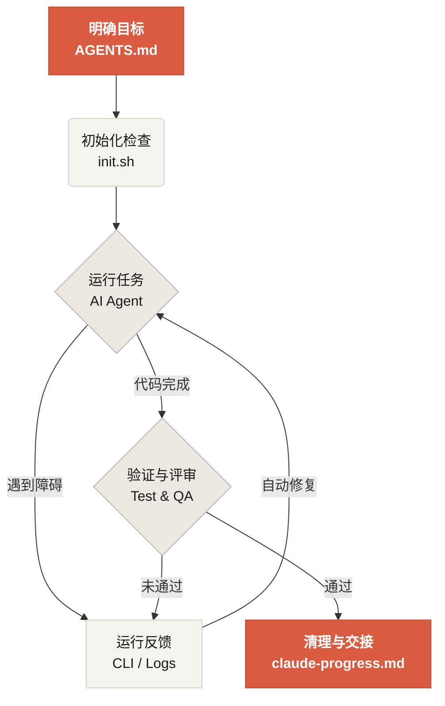

# 欢迎来到 Learn Harness Engineering

Learn Harness Engineering 是一门专注于 AI 编程智能体工程化落地的课程。本课程深度研究并总结了业内最前沿的 Harness Engineering（工具马具/脚手架工程）理论与实践，参考资料包括：
- [OpenAI: Harness engineering: leveraging Codex in an agent-first world](https://openai.com/index/harness-engineering/)
- [Anthropic: Effective harnesses for long-running agents](https://www.anthropic.com/engineering/effective-harnesses-for-long-running-agents)
- [Anthropic: Harness design for long-running application development](https://www.anthropic.com/engineering/harness-design-long-running-apps)
- [Awesome Harness Engineering](https://github.com/walkinglabs/awesome-harness-engineering)

通过系统的环境设计、状态管理、验证与控制机制，本课程旨在帮助你让 Codex 和 Claude Code 等 AI Agent 能够真正可靠地完成真实工程任务。它通过明确的规则和边界约束你的 AI 编程助手，帮助你更可靠地构建功能、修复 Bug 并自动化开发任务。

## 开始学习

选择适合你的学习路径。

  <a href="./lectures/lecture-01-why-capable-agents-still-fail/" class="card">
    <h3>Harness 工程</h3>
    
理解为什么强大的模型依然会失败，掌握构建有效 Harness 的理论基础。

  </a>
  <a href="./world-model/" class="card">
    <h3>世界模型</h3>
    
学习智能体如何构建世界的内部模型，用于预测、规划与控制。

  </a>
  <a href="./projects/" class="card">
    <h3>项目</h3>
    
动手实践，从零开始搭建一个可靠的 Agent 工作环境。

  </a>
  <a href="./resources/" class="card">
    <h3>资料库</h3>
    
开箱即用的模板（AGENTS.md、feature_list.json 等），可直接复制到你自己的代码仓库中。

  </a>

## Harness 的核心机制

Harness 的本质不是“让模型变聪明”，而是给模型建立一套闭环的**工作系统**。你可以通过下面的简单图示理解它的核心运作流：

## 你将学到什么

你将在本课程中掌握以下核心概念：

<ul class="index-list">
  <li>用明确的规则和边界<strong>约束 Agent 的行为</strong>。</li>
  <li>在跨会话的长时任务中<strong>保持上下文连续性</strong>。</li>
  <li><strong>防止 Agent 提前宣告</strong>任务完成。</li>
  <li>让 Agent 学会通过完整的流水线测试来<strong>验证自己的工作</strong>。</li>
  <li>让 Agent 的运行过程<strong>可观测、可调试</strong>。</li>
</ul>

## 下一步

了解核心概念后，可以通过以下内容深入学习：

<ul class="index-list">
  <li><a href="./lectures/lecture-01-why-capable-agents-still-fail/">L01. 模型能力强，不等于执行可靠</a>：从理论开始。</li>
  <li><a href="./projects/project-01-baseline-vs-minimal-harness/">P01. 提示词 vs 规则驱动</a>：完成你的第一个对比实战任务。</li>
  <li><a href="./resources/templates/">中文模板</a>：获取最小 Harness 模板包（AGENTS.md、feature_list.json 等），直接用于你的项目。</li>
</ul>
