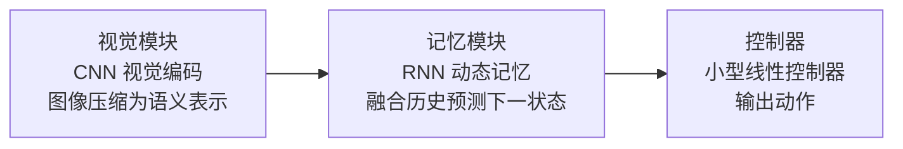
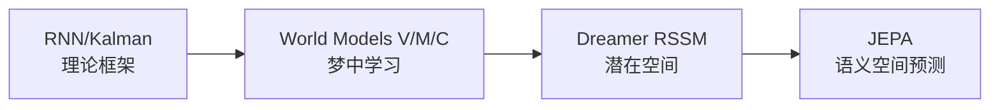

# 四个时代的故事

### 时代一：理论奠基（1950s–2017）

循环神经网络（RNN）、卡尔曼滤波器、隐马尔可夫模型……这七十年里，研究者们各自在不同的领域里构建"预测未来状态"的工具，但这些工作分散在控制论、语音识别、机器人学的不同角落，从未被统一冠以"世界模型"的名字。

直到一篇论文横空出世。

### 时代二：Ha & Schmidhuber 的"梦中学习"（2018）

2018 年，David Ha 与 Jürgen Schmidhuber 发表了那篇如今被广泛引用的论文《*World Models*》[2]。

他们用一个优雅的三模块框架统一了这些散落的思想：

最令人着迷的是他们的实验：把 Controller 放进 M 模型幻想出的**虚拟环境**里训练，完全不与真实游戏交互，然后把训练好的策略迁移到真实游戏，照样能玩得很好。

**在梦里学会开车，醒来就能上路。** 这个比喻让世界模型的思想第一次走进了大众视野。

### 时代三：Dreamer 与潜在空间（2019）

2019 年，Danijar Hafner 等人发布了 Dreamer V1[3]，引入了 **RSSM**（Recurrent State Space Model，循环状态空间模型，一种将"确定性历史记忆"和"随机不确定性"分开建模的动力学结构，详见 L02）。

与 Ha & Schmidhuber 的方法不同，Dreamer 不再需要在像素空间重建图像，它直接在**潜在空间**（latent space）里做一切：预测、规划、学习奖励。

Dreamer 在 Atari 游戏和连续控制任务上大幅超越了以往的无模型方法，证明潜在空间学习是可行的高效路径。

### 时代四：视频即世界（2023+）

2023 年前后，两条平行的路线汇聚在同一个问题上：**能不能用视频本身来学习世界的物理规律？**

- **JEPA**（Joint Embedding Predictive Architecture，LeCun 团队）[4]：抛弃像素重建，只在语义嵌入空间里做预测。"我不需要画出你的脸，我只需要知道你是谁。"

