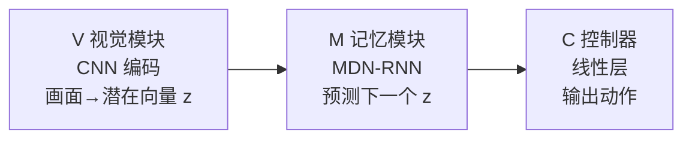
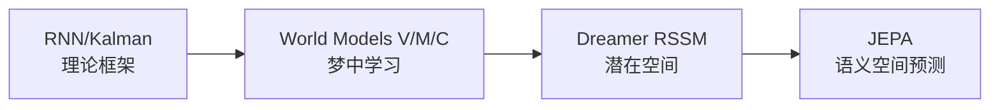

# 四个时代的故事

### 时代一：理论奠基（1950s–2017）

循环神经网络（RNN）、卡尔曼滤波器、隐马尔可夫模型……这七十年里，研究者们各自在不同的领域里构建"预测未来状态"的工具，但这些工作分散在控制论、语音识别、机器人学的不同角落，从未被统一冠以"世界模型"的名字。

直到一篇论文横空出世。

### 时代二：Ha & Schmidhuber 的"梦中学习"（2018）

2018 年，David Ha 与 Jürgen Schmidhuber 发表了那篇如今被广泛引用的论文《[World Models](https://arxiv.org/abs/1803.10122)》。

他们用一个优雅的三模块框架统一了这些散落的思想：

- **V（视觉模块）**：一个 CNN 编码器，把每帧游戏画面压缩成一个低维向量 $z$
- **M（记忆模块）**：一个 MDN-RNN，接收 $z$ 和上一步动作，预测下一个 $z$；它是整个系统的"世界模型"，负责对未来建模
- **C（控制器，Controller）**：一个极其简单的线性层，输入当前 $z$ 和 M 的隐状态，输出动作；它是策略网络，负责决策

最令人着迷的是他们的实验：把控制器 C 放进记忆模块 M 幻想出的**虚拟环境**里训练，然后把策略迁移到真实游戏。在赛车任务（Car Racing）上，纯梦境训练的策略能直接在真实环境中取得不错的成绩。VizDoom 任务则遇到了一个更本质的问题：控制器学会了利用世界模型的错误制造虚假高分（policy exploitation），在梦境里"作弊"而非学到真实技能，最终他们需要引入温度参数来增加梦境多样性，才使迁移勉强成立。这个"作弊"问题后来成为整个世界模型领域的核心挑战之一。

**在梦里学会开车，醒来就能上路。** 这个比喻让世界模型的思想第一次走进了大众视野。

### 时代三：Dreamer 与潜在空间（2019）

2019 年，Danijar Hafner 等人发布了 [Dreamer V1](https://arxiv.org/abs/1912.01603)，引入了 **RSSM**（Recurrent State Space Model，循环状态空间模型，一种将"确定性历史记忆"和"随机不确定性"分开建模的动力学结构，完整推导见 L02）。

> **📖 潜在空间（latent space）**：编码器将高维原始数据（如图像的数万个像素）压缩成一个低维向量后，这个向量所在的空间就叫潜在空间。"潜在"的意思是：这个表示不直接对应原始像素，而是捕捉了数据的语义结构。在潜在空间里操作比在像素空间里操作高效得多，因为维度更低，且无关信息已被过滤。

与 Ha & Schmidhuber 的方法不同，Dreamer 不再需要在像素空间重建图像，它直接在**潜在空间**里做一切：预测、规划、学习奖励。

Dreamer 在 Atari 游戏和连续控制任务上大幅超越了以往的无模型方法，证明潜在空间学习是可行的高效路径。

### 时代四：视频即世界（2023+）

2023 年前后，两条平行的路线汇聚在同一个问题上：**能不能用视频本身来学习世界的物理规律？**

- **JEPA**（Joint Embedding Predictive Architecture，LeCun 团队，[2022](https://openreview.net/forum?id=BZ5a1r-kVsf)）：抛弃像素重建，只在语义嵌入空间里做预测。"我不需要画出你的脸，我只需要知道你是谁。"

