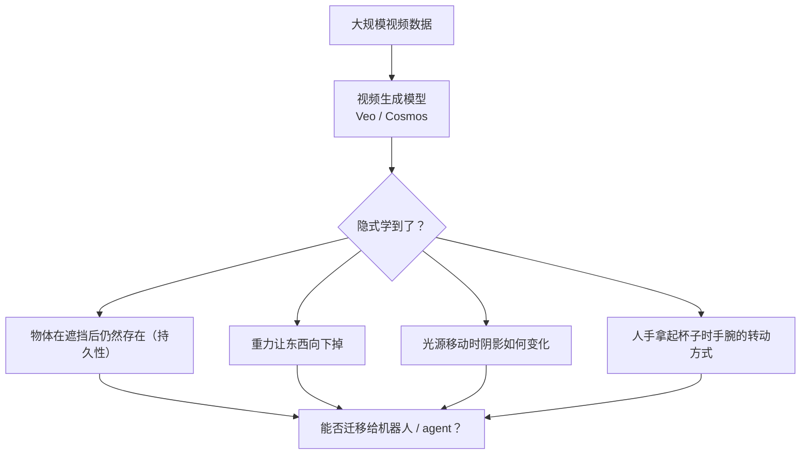
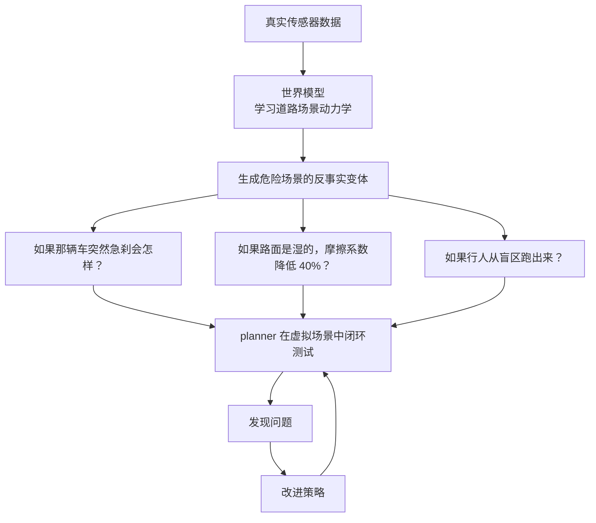
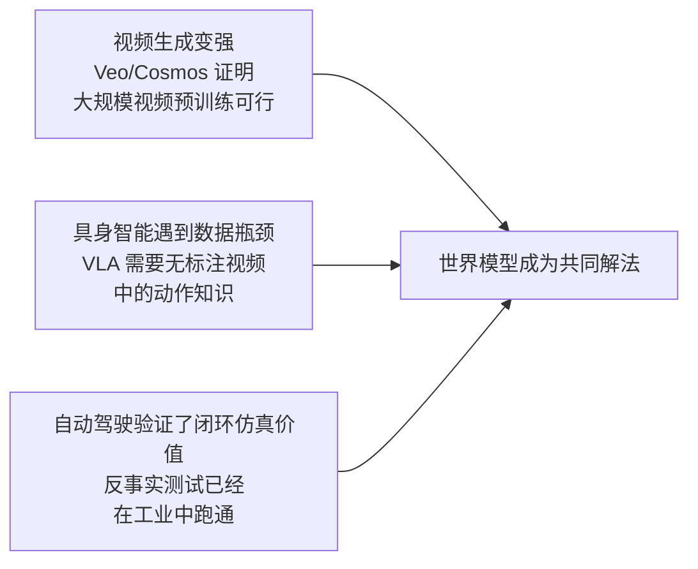
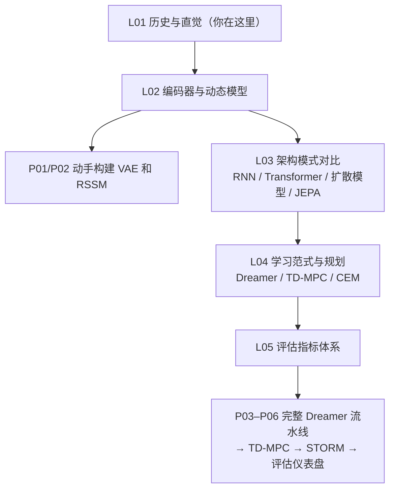

# 世界模型解决了什么，以及为什么是现在

## 世界模型解决了什么问题？

**1. 样本复杂度**

> **📖 背景知识：强化学习（Reinforcement Learning, RL）**
> 强化学习是一种让智能体（Agent）通过与环境交互来学习的框架。智能体在每个时间步选择一个**动作（action）**，环境返回一个新的**观测（observation）**和一个**奖励信号（reward）**，数值越高表示结果越好。智能体的目标是学会一套**策略（policy）**：在每种状态下应该执行哪个动作，以最大化长期累计奖励。
>
> **无模型 RL（model-free RL）**：智能体直接从与环境的反复试错中学习策略，不建立对"世界如何运作"的任何内部模型。优点是简单；缺点是需要极其大量的真实交互（"样本"）才能学会。
>
> **基于模型的 RL（model-based RL）**：先学习一个世界模型（预测动作的后果），再用这个模型在"想象"中模拟大量轨迹，减少与真实环境的交互次数。

无模型的强化学习需要数百万次真实交互才能学会一个简单任务。世界模型让 Agent 可以在内部模拟中"虚拟经历"数以万计的**轨迹（rollout，一条从初始状态出发、按策略执行动作的完整序列）**，把真实环境交互降低几个数量级。

**2. 规划能力**
有了世界模型，Agent 可以在行动之前先在头脑里把几条路都走一遍，选预期回报最高的那条，而不是到真实环境里盲目撞墙。

**3. 安全性**
在机器人、自动驾驶、工业控制这些场景里，试错的代价可能是灾难性的。世界模型让"在沙箱里把策略压垮再修好"成为可能，而不是拿真实系统当实验台。

---

## 为什么世界模型现在重新变热？

世界模型不是新概念。Ha & Schmidhuber 的论文发表于 2018 年，更早的基于模型的强化学习（MBRL）在 2000 年代就一直在学习环境动力学。Dreamer 也已经迭代到了第三版。那么，为什么 2024–2026 年间，这个领域突然又成了每个 AI 会议的主角？

答案不是某一篇论文，而是**三条技术线在同一时间窗口内交汇**，形成了一股共振。

### 第一条线：视频生成模型突然变强

Veo（Google DeepMind）、Genie（Google DeepMind）、Cosmos（NVIDIA），这一批视频生成模型在 2024 年集中涌现，展示了大规模视频预训练的惊人能力。

它们让研究者开始认真思考一个问题：这些模型在生成逼真视频的过程中，是不是顺带学到了某种**空间结构感、物体持久性和粗粒度物理规律**？如果是，那它们是不是可以作为机器人或 agent 的底层世界模型来使用？

这个问题至今没有确定的答案，但正是它把视频生成领域和机器人控制领域拉到了同一张讨论桌前。

### 第二条线：具身智能遇到数据瓶颈

视觉语言动作模型（VLA，如 RT-2、OpenVLA）已经展示了通用机器人技能的可能性，但它们有一个致命的依赖：**大量 teleoperation 示范数据**。

收集一条机器人操作数据，需要专业的硬件设备、熟练的操作员、真实的物理场景。相比之下，互联网上有数十亿条人类操作视频，但这些视频没有动作标注，没有关节角度，没有力矩信号。

世界模型提供了一条绕路的思路：如果 WM 能从无动作标注的视频里学到"人是怎么与物体交互的"，再用 latent action 把这种理解转化成可控的动力学模型，机器人就能从互联网视频里"间接学习"，不需要每个动作都有人亲手标注。

这不是已经解决的问题，但它的诱惑足够大，几乎所有顶级机器人团队都在这条路上押注。

### 第三条线：自动驾驶已经证明"反事实仿真"有巨大价值

自动驾驶是世界模型最早落地的工业场景之一，而且它已经给出了清晰的商业验证。

真实道路上的 corner case（极端情况）极其稀少：暴雪中的行人突然冲出，大货车在十字路口侧翻，轮椅用户违规穿行……这些场景每隔数百万公里才可能遇到一次，但它们恰恰是自动驾驶最容易出错的地方。

世界模型的解决方案是：

Wayve 的 GAIA-1、Tesla 的世界模型仿真、Waabi 的反事实训练，这些工业级部署已经证明，WM 驱动的数据增强可以把安全关键测试的覆盖率提高几个数量级，而成本只是真实道路测试的千分之一。

### 三线交汇

把三条线放在一起看，今天世界模型热潮的本质就清晰了：

这不是单篇论文带来的热点，而是三个独立赛道，**大模型、机器人学习、自动驾驶仿真**，同时在 2024–2026 年间发现世界模型是它们各自问题的关键拼图，于是共同把这个领域推向了中心舞台。

上一次世界模型热（2018–2020）是学术界主导的，研究者在游戏环境里证明了可行性，但落地场景还很遥远。这一次（2024+）工业界和学术界同时入场，因为它已经触碰到了真实的成本瓶颈和安全需求。两次热潮的温度完全不同。

---

## 本课程路线图

每一步都有配套的代码项目。不需要先把所有理论读完再动手，**边学边做，带着问题回来看下一讲，效果反而更好**。

---

## 下一讲

L02 从一个具体问题出发：**如何把 64×64 的像素图像压缩成一个紧凑的潜在向量 z？** 这是变分自编码器（VAE）的任务，也是整个 Dreamer 流水线的第一块砖。

压缩好之后，我们把 z 接入动态模型，让它学会预测"下一时刻的 z 会是什么"，这就是 RSSM。完成 L02，你会亲手写出世界模型最关键的两个模块，并从真实的损失曲线里看到它们是怎么学起来的。

---

*本讲无需任何数学或代码基础。如果你对 Craik、Ha & Schmidhuber 或 Dreamer 的原始论文感兴趣，参见 L05 延伸阅读。*
