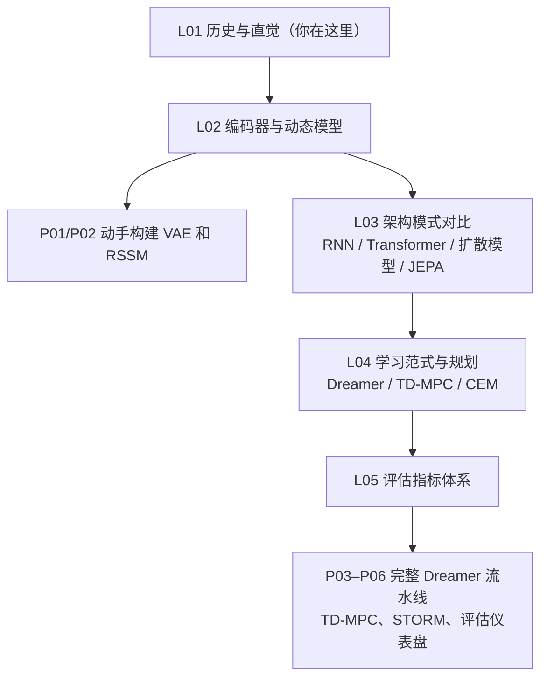

# 课程路线图

## 本课程路线图

每一步都有配套的代码项目。遇到问题时回来翻对应章节，比通读完再动手更有效。

---

## 下一讲

L02 从一个具体问题出发：**如何把 64×64 的像素图像压缩成一个紧凑的潜在向量 z？** 这是变分自编码器（VAE）的任务，也是整个 Dreamer 流水线的第一块砖。

压缩好之后，我们把 z 接入动态模型，让它学会预测"下一时刻的 z 会是什么"，这就是 RSSM。完成 L02，你会亲手写出世界模型最关键的两个模块，并从真实的损失曲线里看到它们是怎么学起来的。

---

*本讲无需任何数学或代码基础。如果你对 Craik、Ha & Schmidhuber 或 Dreamer 的原始论文感兴趣，参见 L05 延伸阅读。*

---

## 延伸阅读

- Craik, K.J.W. *The Nature of Explanation*. Cambridge University Press, 1943.
- [Ha & Schmidhuber (2018): World Models](https://arxiv.org/abs/1803.10122)：V/M/C 三模块框架，梦中训练的原始论文
- [Hafner et al. (2019): Dream to Control (Dreamer V1)](https://arxiv.org/abs/1912.01603)：RSSM 与潜在 Actor-Critic 的首个端到端实现
- [LeCun (2022): A Path Towards Autonomous Machine Intelligence](https://arxiv.org/abs/2306.15364)：JEPA 框架与世界模型作为认知核心的论点
