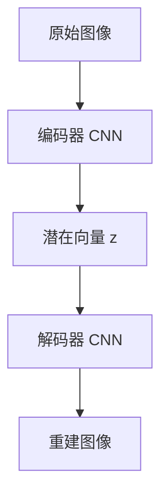

# Part A：观测编码

## 为什么要压缩？

想象一个 64×64 的 RGB 游戏截图，它包含 64 × 64 × 3 = **12,288 个像素值**。如果我们直接用这些像素来训练策略网络或动力学模型，会面临三个问题：

1. **维度灾难**：高维输入让学习变得极其低效，需要海量样本。
2. **冗余信息**：大多数像素（背景、纹理细节）对决策无关紧要。
3. **计算代价**：每一步都处理万级维度的输入，速度极慢。

解决方案：把原始观测 $\mathbf{o}_t$（像素图像）压缩成一个**低维潜在向量** $\mathbf{z}_t$（例如 32 或 64 维）。这个潜在向量应当保留对决策有用的语义信息，同时丢弃无关细节。

编码器把冗余的高维像素空间（12,288 维）压缩为紧凑、可操作的潜在空间（32 维），让后续的动力学模型只需要处理语义信息。

---

## VAE 直觉：学会压缩与重建

**变分自编码器（VAE，Variational Autoencoder）**[1] 是实现这种压缩的核心工具。它由两部分组成：

- **编码器（Encoder）**：将图像 $\mathbf{o}$ 映射到潜在空间，输出一个分布的均值 $\mu$（mu，分布的中心位置）和标准差 $\sigma$（sigma，分布的宽度），然后采样得到 $\mathbf{z}$。
- **解码器（Decoder）**：从潜在向量 $\mathbf{z}$ 重建原始图像 $\hat{\mathbf{o}}$（hat 符号表示"模型的估计值"，区别于真实值 $\mathbf{o}$）。

关键特性：潜在空间是**连续的**。这意味着相邻的 $\mathbf{z}$ 对应相似的图像，可以在潜在空间中平滑插值。

> **📖 转置卷积（Transposed Convolution，也称反卷积）**：普通卷积将大特征图压缩为小特征图（降低空间分辨率）；转置卷积做相反的操作，将小特征图放大为大特征图（提升空间分辨率）。解码器用转置卷积逐步将低维潜在向量"还原"回原始图像尺寸。

---

## ELBO 损失：两个目标的平衡

VAE 的训练目标是**ELBO（证据下界，Evidence Lower Bound）**，包含两项：

> **📖 什么是 ELBO？** 我们真正想最大化的是"模型生成真实图像的概率" $\log p(\mathbf{o})$，但这个量直接计算很困难（需要对所有可能的 $\mathbf{z}$ 积分）。ELBO 是它的一个**可计算下界**，最大化 ELBO 等价于在约束下尽量接近这个目标。名字里的"下界"正是这个意思：$\text{ELBO} \leq \log p(\mathbf{o})$。

$$
\mathcal{L}_{\text{ELBO}} = \underbrace{\mathbb{E}_{q(\mathbf{z}|\mathbf{o})}\left[\log p(\mathbf{o}|\mathbf{z})\right]}_{\text{重建损失}} - \underbrace{D_{\text{KL}}\left(q(\mathbf{z}|\mathbf{o}) \| p(\mathbf{z})\right)}_{\text{KL 散度}}
$$

> **📖 什么是 KL 散度？** $D_{\text{KL}}(q \| p)$ 衡量两个概率分布之间的"差距"：$q$ 与 $p$ 越相似，KL 值越接近 0；差距越大，KL 值越大（永远 ≥ 0）。这里用它来约束编码器输出的分布 $q(\mathbf{z}|\mathbf{o})$ 不要偏离标准正态分布 $p(\mathbf{z}) = \mathcal{N}(0, I)$ 太远，使得潜在空间的不同区域之间可以平滑插值，而不会出现"空洞"（插值出来的点解码后是乱码）。

| 损失项 | 目标 | 直觉 |
|--------|------|------|
| **重建损失** | 解码后的图像要像原图 | "压缩后还能还原" |
| **KL 散度** | 潜在分布要接近标准正态 $\mathcal{N}(0, I)$ | "潜在空间要整齐、连续" |

训练时最大化 ELBO（等价于最小化负 ELBO）。两项共同作用：重建损失让 $\mathbf{z}$ 保留有用信息，KL 散度让潜在空间结构规整，避免"打洞"（不连续区域）。

---

## CNN 编码器结构

实践中，编码器使用**卷积神经网络（CNN）** 来处理图像，原因是 CNN 天然擅长捕捉局部空间特征：

- **多层卷积**：每层提取更高级的特征（边缘 → 纹理 → 形状 → 语义）
- **步幅卷积**（stride convolution）：逐步降低空间分辨率，压缩信息
- **全连接层**：将最终特征图展平，输出 $\mu$ 和 $\sigma$ 两个向量

典型结构：64×64×3 → Conv(4×4, s=2) → Conv(4×4, s=2) → Conv(4×4, s=2) → Flatten → Linear → ($\mu$, $\sigma$)

---

## 动手感受：VAE 可视化

打开项目中的 `demos/vae-visualizer.html`，你可以：

1. 加载一张预训练好的 VAE
2. 用滑块调节潜在向量 $\mathbf{z}$ 的各个维度
3. 实时观察解码器输出的图像如何变化

**观察要点**：某些维度控制颜色，某些控制位置，某些控制形状，这就是潜在空间学到的**语义解耦**（disentanglement，指潜在向量的不同维度各自独立控制一个可解释的语义因素，调节一个维度只影响对应的属性而不影响其他属性）。
