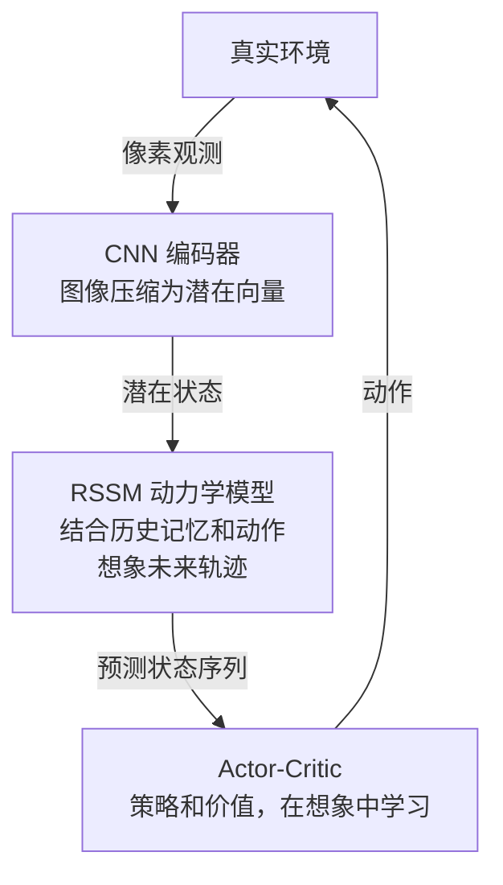

# Part B：潜在动力学

## 编码器不够用，我们需要预测未来

有了 VAE 编码器，我们能把当前帧 $\mathbf{o}_t$ 压缩为 $\mathbf{z}_t$。但世界模型的核心任务是**预测未来**：

> 在潜在空间中，给定当前状态 $\mathbf{z}_t$ 和动作 $\mathbf{a}_t$，预测下一时刻的状态 $\mathbf{z}_{t+1}$。

这个预测能力让智能体可以在脑海中"模拟"未来，从而在不真实执行动作的情况下规划决策，这正是世界模型节省样本的关键所在。

---

## 最简单的动力学：GRU

**门控循环单元（GRU，Gated Recurrent Unit）** 是序列建模的基础工具。作为动力学模型，GRU 接收 $(\mathbf{z}_t, \mathbf{a}_t)$ 并预测下一潜在状态：

$$
\mathbf{z}_{t+1} = \text{GRU}(\mathbf{z}_t, \mathbf{a}_t; \theta)
$$

> **📖 GRU 内部机制（简要）**：GRU 通过两个"门"控制信息流：**重置门（reset gate）**决定"遗忘多少过去"，**更新门（update gate）**决定"保留多少旧状态 vs 写入新信息"。门的值介于 0–1 之间，由当前输入和上一隐状态共同决定。这使 GRU 能够选择性地记住长期依赖，同时忘记无关信息，比普通 RNN 更擅长处理较长序列。相比 LSTM，GRU 少一个门（无单独的记忆细胞），参数更少，训练更快。

GRU 的优点是简单、训练稳定；缺点是输出确定性预测，无法表达**不确定性**。真实环境中，同一动作可能导致多种不同结果（例如：推箱子可能成功，也可能被卡住）。

---

## MDN-RNN：建模不确定性

**MDN-RNN（Mixture Density Network + RNN）** 在 Ha & Schmidhuber（2018）的 World Models 论文中提出，用**混合高斯分布**对下一状态的不确定性建模：

$$
p(\mathbf{z}_{t+1} | \mathbf{z}_t, \mathbf{a}_t) = \sum_{k=1}^{K} \pi_k \cdot \mathcal{N}(\mathbf{z}_{t+1}; \mu_k, \sigma_k^2)
$$

- $K$ 个高斯分量，每个有自己的均值 $\mu_k$（分布中心）、方差 $\sigma_k^2$（分布宽度）
- **混合权重** $\pi_k$：第 $k$ 个高斯分量的概率质量，满足 $\sum_{k=1}^K \pi_k = 1$，$\pi_k \geq 0$。可以理解为"第 $k$ 种未来发生的概率"。网络输出 $\pi_k$ 后通过 softmax 函数归一化，确保所有权重之和为 1。

MDN-RNN 能捕捉**多峰分布**：环境可能跳到多个不同的下一状态，模型都能表达。

---

## RSSM：分离确定性与随机性

**RSSM（Recurrent State Space Model，循环状态空间模型）** 是 Dreamer 系列论文的核心创新，它将状态分为两部分：

- **确定性隐藏状态** $\mathbf{h}_t$：由 RNN 维护，汇聚历史轨迹信息，没有随机性
- **随机潜在状态** $\mathbf{z}_t$：从以 $\mathbf{h}_t$ 为条件的分布中采样，表达当前的不确定性

**RSSM 的核心方程**：

$$
\mathbf{h}_t = f_\phi(\mathbf{h}_{t-1},\ \mathbf{z}_{t-1},\ \mathbf{a}_{t-1})
\quad \text{（确定性更新，GRU/RNN）}
$$

$$
\mathbf{z}_t \sim p_\phi(\mathbf{z}_t \mid \mathbf{h}_t)
\quad \text{（先验 prior：不看真实观测，仅凭历史记忆 } h_t \text{ 猜测当前状态；用于纯想象/预测）}
$$

$$
\mathbf{z}_t \sim q_\phi(\mathbf{z}_t \mid \mathbf{h}_t,\ \mathbf{o}_t)
\quad \text{（后验 posterior：在先验基础上，结合真实观测 } o_t \text{ 修正估计；训练时使用）}
$$

> **📖 先验 vs 后验**：这是贝叶斯统计的基本概念。**先验**（prior）是"看到数据之前的信念"，RSSM 依据历史记忆 $h_t$ 对当前状态 $z_t$ 的猜测。**后验**（posterior）是"看到数据之后更新的信念"，用真实观测 $o_t$ 修正先验，得到更准确的估计。训练时用后验产生 $z_t$ 并计算 KL 损失（衡量先验与后验的差距）；推理/想象时只有先验可用（没有真实 $o_t$），RSSM 纯靠先验向前滚动。

**为什么要分离？**

| 状态 | 角色 | 特性 |
|------|------|------|
| $\mathbf{h}_t$ | 记忆 | 确定性，汇聚历史 |
| $\mathbf{z}_t$ | 感知 | 随机性，表达不确定性 |

分离后，模型可以在没有真实观测的情况下，仅用先验 $p(\mathbf{z}_t | \mathbf{h}_t)$ 向前滚动，进行**纯想象中的规划**，这是 Dreamer 高效的根本原因。

---

## Dreamer 系列的架构迭代

RSSM 是 Dreamer V1 确立的基础架构，此后三个版本在其上逐步演进，每次迭代都针对前一版的具体瓶颈。

**Dreamer V1（2019）** 奠定了 RSSM + 潜在空间 Actor-Critic 的整体框架，即本讲前文所述的结构，是后续版本的起点。

**Dreamer V2（2020）** 的核心改动是将连续高斯 $\mathbf{z}_t$ 替换为**离散 Categorical 潜变量**，并使用直通梯度（straight-through gradient）传递梯度。离散潜变量带来了两个效果：训练曲线显著变稳定，潜在空间的语义结构也更清晰。动力学骨干仍是 GRU，策略仍在线学习。

**Dreamer V3（2023）** 不改架构，改的是训练配方。两个关键技术：symlog 变换压缩极端奖励值，百分位归一化使奖励缩放与量纲无关。结果是同一套超参数可以直接跑 Atari 全套、DMControl、Minecraft，无需按任务调参。Minecraft 中从零训练出能采集钻石的智能体，是这一版的标志性结果，也说明 GRU 骨干在足够稳健的训练配方下潜力并未耗尽。

**Dreamer V4（2025）** 是架构上的质变，而非配方调整。动力学核心从 GRU 换成 **Transformer**，世界模型获得了对更长上下文的建模能力，长程预测精度随之提升。策略学习方式也从在线 Actor-Critic 切换到**离线策略学习**：策略完全从存储的想象轨迹中训练，不再依赖在线 rollout。这一设计与 L03 将要介绍的 STORM 和 IRIS 在架构哲学上高度相近，Dreamer V4 在某种意义上是 GRU 阵营向 Transformer 阵营的正式靠拢。

| 版本 | 动力学核心 | 潜变量类型 | 策略学习 | 关键突破 |
|------|-----------|-----------|---------|---------|
| V1 | GRU | 连续高斯 | 在线 Actor-Critic | RSSM 架构确立 |
| V2 | GRU | 离散 Categorical | 在线 Actor-Critic | 离散潜变量，训练稳定 |
| V3 | GRU | 离散 Categorical | 在线 Actor-Critic | 跨域单一超参，Minecraft 基准 |
| V4 | Transformer | 离散 Categorical | 离线策略学习 | 架构质变，长程推理 |

---

## Dreamer 中编码器的桥梁作用

编码器不仅仅是压缩工具，它是连接像素世界与潜在动力学世界的**桥梁**：

完整的 Dreamer 流程：

1. **编码**：$\mathbf{o}_t \xrightarrow{\text{encoder}} \mathbf{z}_t$
2. **动力学**：$(\mathbf{z}_t, \mathbf{a}_t) \xrightarrow{\text{RSSM}} \mathbf{z}_{t+1}, \mathbf{z}_{t+2}, \ldots$（纯想象）
3. **策略学习**：在想象轨迹上训练 Actor-Critic，无需与真实环境交互
4. **执行**：将策略应用于真实环境，收集少量新样本，循环迭代

编码器的质量直接决定 RSSM 的上限：潜在空间越语义清晰，动力学模型越容易学到有意义的转移规律。

---

## 小结

| 概念 | 作用 | 关键方程/结构 |
|------|------|--------------|
| VAE 编码器 | 压缩像素到 $\mathbf{z}$ | ELBO = 重建损失 − KL 散度 |
| GRU 动力学 | 确定性预测下一状态 | $\mathbf{z}_{t+1} = \text{GRU}(\mathbf{z}_t, \mathbf{a}_t)$ |
| MDN-RNN | 建模多峰不确定性 | 混合高斯输出分布 |
| RSSM | 分离确定性/随机状态 | $\mathbf{h}_t$（记忆）+ $\mathbf{z}_t$（感知）|
| Dreamer 系列 | V1→V4 的逐步演进 | GRU→Transformer，连续→离散潜变量，在线→离线策略 |

**本讲核心结论**：好的世界模型 = 好的编码器（感知压缩）+ 好的动力学模型（时序预测）。RSSM 通过分离两类状态，在表达能力和计算效率之间取得了精妙的平衡。Dreamer 系列四个版本的演进轨迹说明，架构本身之外，潜变量类型与训练配方同样是决定性变量。

---

## 下一讲

L03 的问题是：RSSM 不是唯一的选择，Transformer 骨干的世界模型（STORM、IRIS）在长序列任务上表现如何，以及 Dreamer V4 切换到 Transformer 之后与它们的差距在哪里。

完成 P01 和 P02 之后，你手上有一个跑起来的 RSSM 基线。L03 以它为锚点，横向比较六类架构，包括 Transformer 动力学、扩散模型和 JEPA，同时说明 Dreamer V4 在这张地图上的位置。不同架构之间不是优劣排名，而是面对不同任务约束时各自的适用范围。
