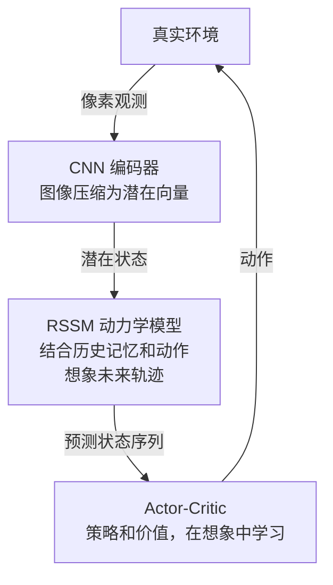

# Part B（续）：Dreamer 系列架构迭代

## Transformer 动力学：从 GRU 到序列建模

GRU 的核心限制来自它的信息瓶颈：所有历史信息必须压缩进一个固定维度的隐状态 $\mathbf{h}_t$。序列越长，早期信息越难保留，长程依赖越容易丢失。这在短视频游戏帧上问题不大，但在需要记住几十步前事件才能做出正确决策的任务中，GRU 的记忆容量成为硬限制。

Transformer 换了一种思路，不再用单一隐状态汇总历史，而是直接在整个历史潜在序列上做注意力：

$$
\mathbf{h}_t = \text{Attention}(\mathbf{z}_{1:t},\ \mathbf{a}_{1:t-1})
$$

每一步的预测可以"回看"任意时刻的历史状态，不存在信息压缩瓶颈。代价是计算量随上下文长度增长，推理时显存占用也更高。

> **📖 自注意力（Self-Attention）**：Transformer 的核心运算。对于序列中每个位置，计算它与所有其他位置的相关性权重（attention score），再用权重对所有位置的值做加权求和。结果是每个位置都能"直接读取"序列任意处的信息，而不像 RNN 那样只能通过隐状态间接传递。计算复杂度是 $O(T^2 \cdot d)$，其中 $T$ 是序列长度，$d$ 是特征维度。

这个差异直接影响世界模型的长程预测质量。STORM（2023）把 RSSM 中的 GRU 骨干替换为 Transformer，在 Atari 长序列任务上的预测精度和策略收益都有可测量的提升。Dreamer V4（2025）同样完成了这一替换，并配合离线策略学习，使长程想象轨迹更加连贯可信。两者在架构选择上殊途同归：在序列够长的任务上，Transformer 的全局注意力比 GRU 的固定隐状态提供了更坚实的动力学基础。L03 会以 RSSM 为基线，横向比较这两类骨干在不同任务约束下的适用范围。

---

## Dreamer 系列的架构迭代

RSSM 是 Dreamer V1 确立的基础架构，此后三个版本在其上逐步演进，每次迭代都针对前一版的具体瓶颈。

**[Dreamer V1（2019）](https://arxiv.org/abs/1912.01603)** 奠定了 RSSM + 潜在空间 Actor-Critic 的整体框架，即本讲前文所述的结构，是后续版本的起点。

**[Dreamer V2（2020）](https://arxiv.org/abs/2010.02193)** 的核心改动是将连续高斯 $\mathbf{z}_t$ 替换为**离散 Categorical 潜变量**，并使用直通梯度（straight-through gradient）传递梯度。离散潜变量带来了两个效果：训练曲线显著变稳定，潜在空间的语义结构也更清晰。动力学骨干仍是 GRU，策略仍在线学习。

**[Dreamer V3（2023）](https://arxiv.org/abs/2301.04104)** 不改架构，改的是训练配方。两个关键技术：symlog 变换压缩极端奖励值，百分位归一化使奖励缩放与量纲无关。结果是同一套超参数可以直接跑 Atari 全套、DMControl、Minecraft，无需按任务调参。Minecraft 中从零训练出能采集钻石的智能体，是这一版的标志性结果，也说明 GRU 骨干在足够稳健的训练配方下潜力并未耗尽。

**[Dreamer V4（2025）](https://arxiv.org/abs/2506.08605)** 是架构上的质变，而非配方调整。动力学核心从 GRU 换成 **Transformer**，世界模型获得了对更长上下文的建模能力，长程预测精度随之提升。策略学习方式也从在线 Actor-Critic 切换到**离线策略学习**：策略完全从存储的想象轨迹中训练，不再依赖在线 rollout。这一设计与 L03 将要介绍的 STORM 和 IRIS 在架构哲学上高度相近，Dreamer V4 在某种意义上是 GRU 阵营向 Transformer 阵营的正式靠拢。

| 版本 | 动力学核心 | 潜变量类型 | 策略学习 | 关键突破 |
|------|-----------|-----------|---------|---------|
| V1 | GRU | 连续高斯 | 在线 Actor-Critic | RSSM 架构确立 |
| V2 | GRU | 离散 Categorical | 在线 Actor-Critic | 离散潜变量，训练稳定 |
| V3 | GRU | 离散 Categorical | 在线 Actor-Critic | 跨域单一超参，Minecraft 基准 |
| V4 | Transformer | 离散 Categorical | 离线策略学习 | 架构质变，长程推理 |

---

## Dreamer 中编码器的桥梁作用

编码器不仅仅是压缩工具，它是连接像素世界与潜在动力学世界的**桥梁**：

完整的 Dreamer 流程：

1. **编码**：$\mathbf{o}_t \xrightarrow{\text{encoder}} \mathbf{z}_t$
2. **动力学**：$(\mathbf{z}_t, \mathbf{a}_t) \xrightarrow{\text{RSSM}} \mathbf{z}_{t+1}, \mathbf{z}_{t+2}, \ldots$（纯想象）
3. **策略学习**：在想象轨迹上训练 Actor-Critic，无需与真实环境交互
4. **执行**：将策略应用于真实环境，收集少量新样本，循环迭代

编码器的质量直接决定 RSSM 的上限：潜在空间越语义清晰，动力学模型越容易学到有意义的转移规律。

---

## 小结

| 概念 | 作用 | 关键方程/结构 |
|------|------|--------------|
| VAE 编码器 | 压缩像素到 $\mathbf{z}$ | ELBO = 重建损失 − KL 散度 |
| GRU 动力学 | 确定性预测下一状态 | $\mathbf{z}_{t+1} = \text{GRU}(\mathbf{z}_t, \mathbf{a}_t)$ |
| MDN-RNN | 建模多峰不确定性 | 混合高斯输出分布 |
| RSSM | 分离确定性/随机状态 | $\mathbf{h}_t$（记忆）+ $\mathbf{z}_t$（感知）|
| Transformer 动力学 | 全局注意力替代固定隐状态 | $\mathbf{h}_t = \text{Attention}(\mathbf{z}_{1:t}, \mathbf{a}_{1:t-1})$ |
| Dreamer 系列 | V1→V4 的逐步演进 | GRU→Transformer，连续→离散潜变量，在线→离线策略 |

好的世界模型 = 好的编码器（感知压缩）+ 好的动力学模型（时序预测）。RSSM 通过分离两类状态，在表达能力和计算效率之间取得了精妙的平衡。Dreamer 系列四个版本的演进轨迹说明，架构本身之外，潜变量类型与训练配方同样是决定性变量。

---

## 下一讲

L03 的问题是：RSSM 不是唯一的选择，Transformer 骨干的世界模型（STORM、IRIS）在长序列任务上表现如何，以及 Dreamer V4 切换到 Transformer 之后与它们的差距在哪里。

完成 P01 和 P02 之后，你手上有一个跑起来的 RSSM 基线。L03 以它为锚点，横向比较六类架构，包括 Transformer 动力学、扩散模型和 JEPA，同时说明 Dreamer V4 在这张地图上的位置。不同架构之间不是优劣排名，而是面对不同任务约束时各自的适用范围。

---

## 延伸阅读

- [Kingma & Welling (2014): Auto-Encoding Variational Bayes](https://arxiv.org/abs/1312.6114)：VAE 原始论文，ELBO 推导与重参数化技巧
- [Ha & Schmidhuber (2018): World Models](https://arxiv.org/abs/1803.10122)：MDN-RNN 动力学模型与梦中训练框架
- [Hafner et al. (2019): PlaNet / RSSM](https://arxiv.org/abs/1811.04551)：确定性+随机双路径潜在动力学，RSSM 首次提出
- [Hafner et al. (2019): Dream to Control (Dreamer V1)](https://arxiv.org/abs/1912.01603)：RSSM + 潜在 Actor-Critic，端到端 Dreamer 原始论文
- [Hafner et al. (2020): Mastering Atari with Discrete World Models (Dreamer V2)](https://arxiv.org/abs/2010.02193)：离散潜变量 + 直通梯度估计器
- [Hafner et al. (2023): Mastering Diverse Domains with World Models (Dreamer V3)](https://arxiv.org/abs/2301.04104)：跨任务统一超参数，symlog 变换稳定训练
- [Hafner et al. (2025): Dreamer V4 / DreamerZero](https://arxiv.org/abs/2506.08605)：Transformer 骨干替换 GRU，离线数据预训练
