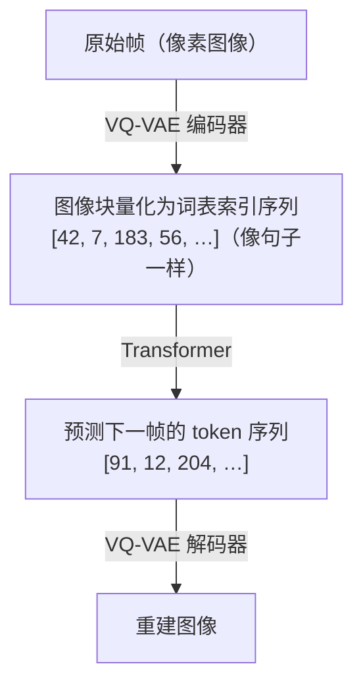

# Part A：RNN、Transformer 与 Diffusion 架构

## 回顾：你已经有了一个 RNN 基线

P02 的 RSSM 有两条并行路径：

- **确定性路径**（GRU）：$h_t = f_\phi(h_{t-1}, z_{t-1}, a_{t-1})$，捕捉平滑的动态趋势
- **随机路径**：$z_t \sim q_\phi(\cdot \mid h_t, o_t)$，在潜空间里采样当前时刻的不确定性

这个设计在 Dreamer V1/V2 中得到验证，能以很低的计算开销在连续控制任务上取得不错的策略性能。它的局限也很明确：**GRU 的记忆容量随序列变长而衰减**，对需要跨越数百步推理的任务力不从心。

接下来五个架构族，都是为了突破这一限制，只是各自选择了不同的方向。

---

## 架构一：RNN / RSSM（你的基线）

**代表系统**：Ha & Schmidhuber World Models (2018) [见 L01 参考文献 [2]]、Dreamer V1 (2019) [见 L01 参考文献 [3]]、Dreamer V2 (2020) [见 L02 参考文献 [4]]

GRU 逐步更新隐状态，单步计算开销 **O(1)**，与序列长度无关。RSSM 在此基础上拆出随机路径 $z_t$，让不确定性成为模型的一等公民（完整机制见 L02 Part B）。

**学习范式**：交互型。收集 $(o_t, a_t, r_t, o_{t+1})$ 四元组，学习带动作条件的转移分布 $p(s_{t+1} \mid s_t, a_t)$。交互型范式能回答"如果我换一个动作，世界会怎样"，这是观察型范式（纯视频）做不到的。

**适用场景**：简单到中等复杂度的连续控制任务（如 DMControl、Atari），对延迟敏感的在线强化学习。

**局限**：长时记忆弱，GRU 隐状态的有效记忆窗口通常在 50-100 步之间；生成质量不如 Diffusion；数据采集在真实机器人上仍然昂贵。

---

## 架构二：Transformer-based（2021—2022）

**代表系统**：STORM (2023)[1]、IRIS (2022)[2]

### 核心机制

用 **Transformer** 替换 GRU，将历史观测序列 $o_{1:t}$ 分词为离散 token，然后用**自注意力机制（self-attention）**在整个序列上计算权重：

$$\text{Attention}(Q, K, V) = \text{softmax}\!\left(\frac{QK^\top}{\sqrt{d_k}}\right)V$$

> **📖 自注意力中的 Q、K、V**：每个序列位置的向量被线性变换为三个角色，**Query**（查询，Q）：当前位置想"问什么"；**Key**（键，K）：其他位置"提供什么信息"；**Value**（值，V）：实际携带的信息内容。$QK^\top$ 计算每对位置之间的相关性得分，除以 $\sqrt{d_k}$（防止点积过大导致 softmax 梯度消失），再用 softmax 归一化为注意力权重，最后加权求和 $V$。每个位置都在"问"（Q）其他所有位置，哪些位置的答案（K）与我相关，然后按相关性加权提取它们的内容（V）。

每个位置都能直接"看到"序列里任意一个历史时刻，不再受限于 GRU 的隐状态瓶颈。

### VQ 离散化：把图像变成"句子"

IRIS 的关键操作是 **VQ-VAE 量化**，把连续的图像帧变成离散 token 序列。GPT 能预测"下一个词"，因为词是离散的、有限的，概率分布可以用 softmax 精确建模。把图像也变成类似"词"的离散单元，就可以直接用 GPT 风格的自回归 Transformer 预测"下一个视觉词"。

> **📖 VQ**（向量量化）的工作原理：①编码器将图像块映射为连续向量 $z$；②在 codebook 中找到与 $z$ 最近的向量 $e_k$（$k = \arg\min_j \|z - e_j\|_2$）；③用 $e_k$ 的索引 $k$ 代替连续向量，传入 Transformer。反向传播时用**直通估计器（straight-through estimator）**：前向传播用量化后的离散向量，反向传播时假装量化操作不存在，梯度直接流过。

### STORM 的核心改进

STORM（Stochastic Transformer-based wORld Models）并非简单地把 GRU 换成 Transformer，它做了一个更精细的融合：

- 保留 RSSM 的随机 latent $z_t$（不确定性表达）
- 用 Transformer 替换 GRU（长程依赖）
- 添加随机 token 预测目标（让 Transformer 学会建模不确定性，而不只是确定性预测）

STORM 不是纯粹的自回归视频模型，而是**带动作条件的随机世界模型**，动作 $a_t$ 作为额外 token 拼接进序列，预测的是动作条件下的未来 latent 分布。

**学习范式**：主要是交互型（带动作条件），也可以在大规模无标注视频上做观察型预训练，再用少量交互数据 fine-tune。

**适用场景**：复杂游戏（Atari 长游、策略游戏）、需要多步规划的任务；有充足算力和数据时的首选。

**局限**：计算量随序列长度二次增长（$O(T^2)$）；推理延迟比 RNN 高；需要更多数据才能收敛。

---

## 架构三：Diffusion-based（2023—2024）

**代表系统**：Diamond (2024)[6]、GameNGen (Google, 2024)

### 核心机制

扩散模型通过**逐步去噪**生成输出：先向真实帧添加高斯噪声，再训练网络预测噪声：

$$p_\theta(x_{t-1} \mid x_t) = \mathcal{N}(x_{t-1};\, \mu_\theta(x_t, t),\, \sigma_t^2 I)$$

在世界模型场景中，以历史帧和动作为条件，扩散模型逐步"去噪"出下一帧。每一步去噪都是一次完整的神经网络前向传播，网络在"动作条件"的引导下决定"把哪里的噪声去掉"。

GameNGen (2024) 是第一个用神经网络**实时**运行完整游戏引擎的系统，以 20fps 的速度模拟《毁灭战士》(DOOM)。**模型本身就是游戏引擎**。每生成一帧，扩散模型需要 10-100 步去噪迭代，每步都是一次完整的 U-Net 前向传播，这导致扩散世界模型在**在线 RL 训练循环**里非常昂贵。

**学习范式**：观察型或交互型（Diamond）。观察型扩散模型在海量互联网视频上训练，学到的是世界的视觉规律，不包含动作条件，无法回答"如果我换一个动作，世界会怎样"。

**适用场景**：离线视频预测、高保真仿真器、影视/游戏内容生成；不适合需要实时闭环控制的 RL 场景。

**局限**：推理慢（10-100 步去噪）；难与策略优化直接对接（采样过程不可微）；训练和推理开销巨大。
