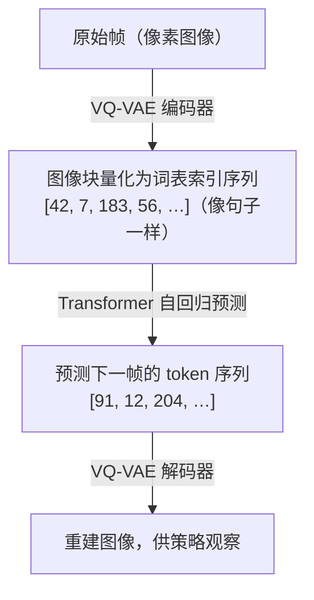

# Part A：RNN、Transformer 与 Diffusion 架构

## 回顾：你已经有了一个 RNN 基线

P02 的 RSSM 有两条并行路径：

- **确定性路径**（GRU）：$h_t = f_\phi(h_{t-1}, z_{t-1}, a_{t-1})$，捕捉平滑的动态趋势
- **随机路径**：$z_t \sim q_\phi(\cdot \mid h_t, o_t)$，在潜空间里采样当前时刻的不确定性

这个设计在 Dreamer V1/V2 中得到验证，能以很低的计算开销在连续控制任务上取得不错的策略性能。它的局限也很明确：**GRU 的记忆容量随序列变长而衰减**，对需要跨越数百步推理的任务力不从心。

接下来五个架构族，都是为了突破这一限制，只是各自选择了不同的方向。

---

## 架构一：RNN / RSSM（你的基线）

**代表系统**：[Ha & Schmidhuber World Models (2018)](https://arxiv.org/abs/1803.10122)、[Dreamer V1 (2019)](https://arxiv.org/abs/1912.01603)、[Dreamer V2 (2020)](https://arxiv.org/abs/2010.02193)

GRU 逐步更新隐状态，单步计算开销 **O(1)**，与序列长度无关。RSSM 在此基础上拆出随机路径 $z_t$，让不确定性成为模型的一等公民（完整机制见 L02 Part B）。

**学习范式**：交互型。收集 $(o_t, a_t, r_t, o_{t+1})$ 四元组，学习带动作条件的转移分布 $p(s_{t+1} \mid s_t, a_t)$。交互型范式能回答"如果我换一个动作，世界会怎样"，这是观察型范式（纯视频）做不到的。

**适用场景**：简单到中等复杂度的连续控制任务（如 **DMControl**，DeepMind Control Suite，一套基于 MuJoCo 物理引擎的标准连续控制基准，包含 Cheetah 奔跑、Cartpole 平衡、Reacher 到达目标等任务；**Atari**，一套经典电子游戏基准，包含 57 款游戏，用于评估通用决策能力），对延迟敏感的在线强化学习。

**局限**：长时记忆弱，GRU 隐状态的有效记忆窗口通常在 50-100 步之间；生成质量不如 Diffusion；数据采集在真实机器人上仍然昂贵。

---

## 架构二：Transformer-based（2022, 2023）

**代表系统**：[IRIS (2022)](https://arxiv.org/abs/2209.00588)、[STORM (2023)](https://arxiv.org/abs/2310.09615)

### 核心机制

用 **Transformer** 替换 GRU，将历史观测序列 $o_{1:t}$ 分词为离散 token，然后用**自注意力机制（self-attention）**在整个序列上计算权重：

$$\text{Attention}(Q, K, V) = \text{softmax}\!\left(\frac{QK^\top}{\sqrt{d_k}}\right)V$$

> **📖 softmax 函数**：将一个任意实数向量 $[x_1, x_2, \ldots, x_n]$ 转换为概率分布（所有元素非负且之和为 1）：$\text{softmax}(x_i) = \frac{e^{x_i}}{\sum_j e^{x_j}}$。较大的 $x_i$ 对应较大的输出概率，较小的 $x_i$ 对应接近零的概率。注意力机制用 softmax 将相关性得分转换为权重，使"最相关的位置"获得最大权重。

> **📖 自注意力中的 Q、K、V**：每个序列位置的向量被线性变换为三个角色，**Query**（查询，Q）：当前位置想"问什么"；**Key**（键，K）：其他位置"提供什么信息"；**Value**（值，V）：实际携带的信息内容。$QK^\top$ 计算每对位置之间的相关性得分，除以 $\sqrt{d_k}$（$d_k$ 是 Key 向量的维度，除以它防止点积随维度增大而过大，导致 softmax 输出过于尖锐、梯度消失），再用 softmax 归一化为注意力权重，最后加权求和 $V$。每个位置都在"问"（Q）其他所有位置，哪些位置的答案（K）与我相关，然后按相关性加权提取它们的内容（V）。

每个位置都能直接"看到"序列里任意一个历史时刻，不再受限于 GRU 的隐状态瓶颈。

### IRIS：把图像变成"句子"

IRIS（Imagination with auto-Regression over an Inner Speech，ICLR 2023）的核心是 **VQ-VAE 量化**，把连续的图像帧变成离散 token 序列。GPT 能预测"下一个词"，因为词是离散的、有限的，概率分布可以用 softmax 精确建模。把图像也变成类似"词"的离散单元，就可以直接用 GPT 风格的自回归 Transformer 预测"下一个视觉词"。

> **📖 VQ**（向量量化）的工作原理：①编码器将图像块映射为连续向量 $z$；②在 codebook 中找到与 $z$ 最近的向量 $e_k$（$k = \arg\min_j \|z - e_j\|_2$）；③用 $e_k$ 的索引 $k$ 代替连续向量，传入 Transformer。反向传播时用**直通估计器（straight-through estimator）**：前向传播用量化后的离散向量，反向传播时假装量化操作不存在，梯度直接流过。

IRIS 的 Transformer 接收的是**帧 token 与动作交错的序列**：每帧被 VQ-VAE 编码为 $K$ 个 token（如 $K=16$，codebook 大小 $N=1024$），动作 $a_t$ 作为单独 token 插入帧 token 之后。Transformer 同时预测三个目标：转移分布 $\hat{z}_{t+1}$（用交叉熵损失）、即时奖励 $\hat{r}_t$、以及 episode 终止标志 $\hat{d}_t$。策略则完全在想象轨迹中训练，不接触真实环境。Atari 100k 基准上（仅允许与环境交互 100,000 步，约等于 2 小时真实游戏时间，测试样本效率），IRIS 达到 1.046 的平均**HNS**（Human Normalized Score，人类标准化分数，将智能体得分归一化到"随机策略=0，人类=1"的区间，大于 1 表示超越人类），在 26 款游戏中有 10 款超越人类。

### STORM 的核心改进：单 token 随机潜变量

STORM（Stochastic Transformer-based wORld Models，NeurIPS 2023）与 IRIS 的主要区别在于潜变量设计。IRIS 用 VQ-VAE 把一帧图像表示为多个离散 token（$4 \times 4 = 16$ 个），STORM 改用**分类 VAE**，把整帧压缩为一个随机潜变量 $z_t$（32 个类别，每类 32 维，直通梯度估计），再将 $z_t$ 与动作 $a_t$ 融合为**单个 token** $e_t$ 送入 Transformer：

$$e_t = m_\phi(z_t, a_t), \quad h_{1:T} = f_\phi(e_{1:T})$$

Transformer 以因果掩码处理序列，$h_t$ 同时预测当前奖励 $\hat{r}_t$、继续标志 $\hat{c}_t$ 和下一步潜变量分布 $\hat{\mathcal{Z}}_{t+1}$。单 token 设计使序列长度比 IRIS 短 16 倍，训练速度快得多：在单块 RTX 3090 上，用 1.85 小时真实交互训练 4.3 小时，达到 Atari 100k 基准 126.7% 的平均人类标准化分数（无 lookahead 搜索的最高水平）。

与 DreamerV3 的 GRU-based RSSM 相比，STORM 的 Transformer 序列模型在长序列建模上更强，训练可并行；代价是去掉了 RSSM 的循环隐状态 $h_t$，重建图像时不使用历史隐状态信息，长程语境完全依赖 Transformer 上下文窗口。

**学习范式**：交互型（带动作条件）。动作 $a_t$ 作为 token 的一部分拼入序列，预测的是动作条件下的未来 latent 分布。

**适用场景**：复杂游戏（Atari 长游、策略游戏）、需要多步规划的任务；有充足算力和数据时的首选。

**局限**：计算量随序列长度二次增长（$O(T^2)$）；推理延迟比 RNN 高；需要更多数据才能收敛。

---

## 架构三：Diffusion-based（2023, 2024）

**代表系统**：[Diamond (2024)](https://arxiv.org/abs/2405.12399)、GameNGen (Google, 2024)

### 核心机制

扩散模型通过**逐步去噪**生成输出：先向真实帧添加高斯噪声，再训练网络预测噪声：

$$p_\theta(x_{t-1} \mid x_t) = \mathcal{N}(x_{t-1};\, \mu_\theta(x_t, t),\, \sigma_t^2 I)$$

在世界模型场景中，以历史帧和动作为条件，扩散模型逐步"去噪"出下一帧。每一步去噪都是一次完整的神经网络前向传播，网络在"动作条件"的引导下决定"把哪里的噪声去掉"。

> **📖 U-Net**：一种编码器-解码器结构的卷积神经网络，因形似字母"U"而得名。编码器逐步压缩空间分辨率（提取特征），解码器逐步恢复分辨率（还原细节），并通过跳跃连接（skip connections）将编码器各层的特征直接送入解码器对应层，保留高频细节。**Bottleneck**（瓶颈层）是 U 形结构最底部、分辨率最低的层，信息在此高度压缩后再逐步展开。扩散世界模型用 U-Net 在每一步去噪中处理图像，对逐渐清晰的帧进行预测。

GameNGen (2024) 是第一个用神经网络**实时**运行完整游戏引擎的系统，以 20fps 的速度模拟《毁灭战士》(DOOM)。**模型本身就是游戏引擎**。每生成一帧，扩散模型需要 10-100 步去噪迭代，每步都是一次完整的 U-Net 前向传播，这导致扩散世界模型在**在线 RL 训练循环**里非常昂贵。

### Diamond：将扩散过程与强化学习训练循环结合的世界模型

Diamond（NeurIPS 2024）将扩散过程与强化学习训练循环直接结合。它以过去若干帧和当前动作为条件，用 U-Net 去噪生成下一帧，整条生成链作为环境模拟器供策略训练。

Diamond 的关键设计决策：动作信息通过**交叉注意力**（cross-attention，自注意力的变体，Query 来自一个序列，Key 和 Value 来自另一个序列，使两个不同来源的信息相互对齐，这里用于让图像特征"查询"动作信息）注入 U-Net 的**每一个分辨率层**，而非只注入 bottleneck（瓶颈层，U-Net 最底部分辨率最低的层），这使生成帧与动作指令的对齐更紧密。在 Atari 100k 基准上，Diamond 以平均 HNS 1.46 超越了之前所有世界模型方法，同时维持了出色的视觉生成质量。

扩散世界模型的固有挑战是**物体持久性**（object persistence）：每帧独立去噪，模型不维护显式的物体状态，导致长序列中物体的身份、位置和遮挡关系会悄悄漂移。Diamond 通过限制展开步数和在损失中加入深度一致性惩罚来缓解这一问题（更多诊断方法见 L04）。

**学习范式**：交互型（Diamond 带动作条件）或观察型（纯视频扩散模型）。观察型扩散模型在海量互联网视频上训练，学到的是世界的视觉规律，不包含动作条件，无法回答"如果我换一个动作，世界会怎样"。

**适用场景**：离线视频预测、高保真仿真器、影视/游戏内容生成；不适合需要实时闭环控制的 RL 场景。

**局限**：推理慢（10-100 步去噪）；难与策略优化直接对接（采样过程不可微）；物体持久性维护困难；训练和推理开销巨大。
