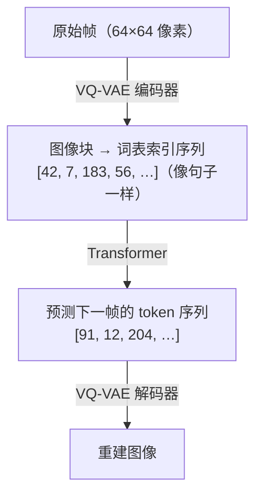
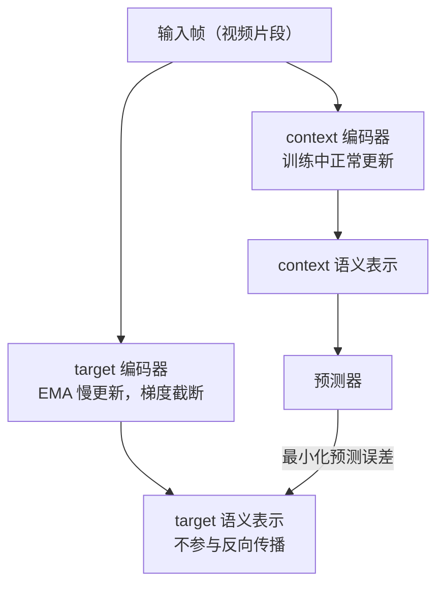
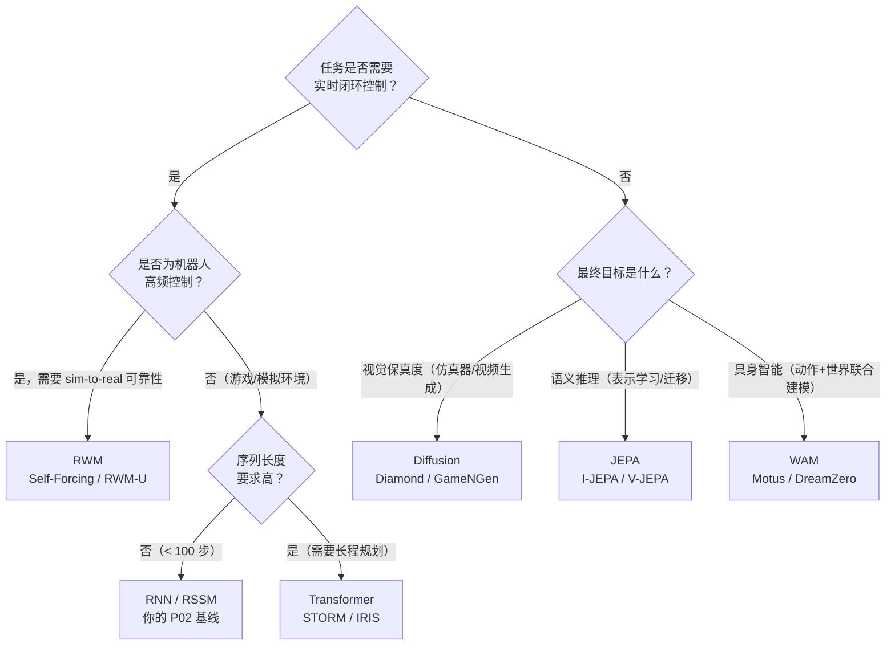

# Part A：六大架构族与学习范式

## 回顾：你已经有了一个 RNN 基线

P02 的 RSSM 有两条并行路径：

- **确定性路径**（GRU）：$h_t = f_\phi(h_{t-1}, z_{t-1}, a_{t-1})$，捕捉平滑的动态趋势
- **随机路径**：$z_t \sim q_\phi(\cdot \mid h_t, o_t)$，在潜空间里采样当前时刻的不确定性

这个设计在 Dreamer V1/V2 中得到验证，能以很低的计算开销在连续控制任务上取得不错的策略性能。它的局限也很明确：**GRU 的记忆容量随序列变长而衰减**，对需要跨越数百步推理的任务力不从心。

接下来五个架构族，都是为了突破这一限制，只是各自选择了不同的方向。

---

## 架构一：RNN / RSSM（你的基线）

**代表系统**：Ha & Schmidhuber World Models (2018)、Dreamer V1 (2019)、Dreamer V2 (2020)

### 核心机制

GRU（或 LSTM）逐步更新隐状态，每一步的计算开销是 **O(1)**，不管序列有多长，单步推理时间不变。

RSSM 在 GRU 之上增加了一个随机潜变量 $z_t$，这个双路径设计绝非随意：

- **确定性路径（GRU）** 负责捕捉世界的"主旋律"，物体的轨迹、速度的惯性、场景的整体趋势。这些规律是平滑的、可预测的，GRU 的线性递归结构非常适合建模它们。
- **随机路径（stochastic latent z）** 负责表达"意外"，同样的动作可能导致不同的结果，世界本身存在随机性。$z_t$ 从一个以 $h_t$ 为条件的分布中采样，让模型能够表示预测的不确定性，而不是强行给出一个单一的"最可能"预测。

两条路径拼接后送入解码器，才能同时捕捉规律与随机性。

### 为什么 Ha & Schmidhuber 用 MDN-RNN？

普通 RNN 的输出是一个单点预测，它只能说"下一帧潜向量是 $z^*$"。但真实世界的未来往往有**多个分支**。MDN-RNN（Mixed Density Network + RNN）的解决方案是让网络输出一个**混合高斯分布**的参数，从而描述多峰概率分布：

普通 RNN 只输出单点预测 $z^*$，MDN-RNN 则输出 $K$ 个高斯分量的混合参数 $[\pi_1, \mu_1, \sigma_1,\ \ldots,\ \pi_K, \mu_K, \sigma_K]$，可以表达多峰分布。

RSSM 进一步把这个想法系统化：不是每步输出一个分布参数，而是直接在计算图里维护一个随机路径，让不确定性成为模型的一等公民。

### 梦境训练（Dream Training）的直觉

Dreamer 的训练流程分三个阶段：

Dreamer 的训练分三个阶段。**① 训练 World Model**：真实轨迹经编码器 V 得到潜向量 $z$，再经 RSSM (M) 预测下一帧 $z'$，最小化 ELBO 损失。**② 在梦境里训练 Controller**：RSSM 生成纯 latent 想象轨迹，Controller 在 latent 空间里学习策略，完全不调用真实环境。**③ 迁移到真实环境**：用少量真实交互微调策略。

**先学世界，再学行动。** 世界模型学会物理规律后，Controller 可以在虚拟梦境里用极低的成本做大量探索，一次真实采样可以产生数百条想象轨迹用于训练。这是 Dreamer 在样本效率上远超无模型 RL 的根本原因。

**学习范式**：交互型。收集 $(o_t, a_t, r_t, o_{t+1})$ 四元组，通过真实试错学习动作-结果映射。模型学的是带动作条件的转移分布 $p(s_{t+1} \mid s_t, a_t)$。交互型范式能回答"如果我换一个动作，世界会怎样"，这是观察型范式（纯视频）做不到的。

**适用场景**：简单到中等复杂度的连续控制任务（如 DMControl、Atari），对延迟敏感的在线强化学习。

**局限**：长时记忆弱；生成质量不如 Diffusion；数据采集在真实机器人上仍然昂贵。

---

## 架构二：Transformer-based（2021—2022）

**代表系统**：STORM (2023)、IRIS (2022)

### 核心机制

用 **Transformer** 替换 GRU，将历史观测序列 $o_{1:t}$ 分词为离散 token，然后用**自注意力机制（self-attention）**在整个序列上计算权重：

$$\text{Attention}(Q, K, V) = \text{softmax}\!\left(\frac{QK^\top}{\sqrt{d_k}}\right)V$$

> **📖 自注意力中的 Q、K、V**：每个序列位置的向量被线性变换为三个角色，**Query（查询，Q）**：当前位置想"问什么"；**Key（键，K）**：其他位置"提供什么信息"；**Value（值，V）**：实际携带的信息内容。$QK^\top$ 计算每对位置之间的相关性得分，除以 $\sqrt{d_k}$（防止点积过大导致 softmax 梯度消失），再用 softmax 归一化为注意力权重，最后加权求和 $V$。每个位置都在"问"（Q）其他所有位置，哪些位置的答案（K）与我相关，然后按相关性加权提取它们的内容（V）。

每个位置都能直接"看到"序列里任意一个历史时刻，不再受限于 GRU 的隐状态瓶颈。

### VQ 离散化：把图像变成"句子"

IRIS 的关键操作是 **VQ-VAE 量化**，把连续的图像帧变成离散 token 序列。GPT 能预测"下一个词"，因为词是离散的、有限的，概率分布可以用 softmax 精确建模。把图像也变成类似"词"的离散单元，就可以直接用 GPT 风格的自回归 Transformer 预测"下一个视觉词"。

> **📖 VQ（向量量化）的工作原理**：①编码器将图像块映射为连续向量 $z$；②在 codebook 中找到与 $z$ 最近的向量 $e_k$（$k = \arg\min_j \|z - e_j\|_2$）；③用 $e_k$ 的索引 $k$ 代替连续向量，传入 Transformer。反向传播时用**直通估计器（straight-through estimator）**：前向传播用量化后的离散向量，反向传播时假装量化操作不存在，梯度直接流过。

### STORM 的核心改进

STORM（Stochastic Transformer-based wORld Models）并非简单地把 GRU 换成 Transformer，它做了一个更精细的融合：

- 保留 RSSM 的随机 latent $z_t$（不确定性表达）
- 用 Transformer 替换 GRU（长程依赖）
- 添加随机 token 预测目标（让 Transformer 学会建模不确定性，而不只是确定性预测）

STORM 不是纯粹的自回归视频模型，而是**带动作条件的随机世界模型**，动作 $a_t$ 作为额外 token 拼接进序列，预测的是动作条件下的未来 latent 分布。

**学习范式**：主要是交互型（带动作条件），也可以在大规模无标注视频上做观察型预训练，再用少量交互数据 fine-tune。

**适用场景**：复杂游戏（Atari 长游、策略游戏）、需要多步规划的任务；有充足算力和数据时的首选。

**局限**：计算量随序列长度二次增长（$O(T^2)$）；推理延迟比 RNN 高；需要更多数据才能收敛。

---

## 架构三：Diffusion-based（2023—2024）

**代表系统**：Diamond (2024)、GameNGen (Google, 2024)

### 核心机制

扩散模型通过**逐步去噪**生成输出：先向真实帧添加高斯噪声，再训练网络预测噪声：

$$p_\theta(x_{t-1} \mid x_t) = \mathcal{N}(x_{t-1};\, \mu_\theta(x_t, t),\, \sigma_t^2 I)$$

在世界模型场景中，以历史帧和动作为条件，扩散模型逐步"去噪"出下一帧。每一步去噪都是一次完整的神经网络前向传播，网络在"动作条件"的引导下决定"把哪里的噪声去掉"。

GameNGen (2024) 是第一个用神经网络**实时**运行完整游戏引擎的系统，以 20fps 的速度模拟《毁灭战士》(DOOM)。**模型本身就是游戏引擎**。每生成一帧，扩散模型需要 10–100 步去噪迭代，每步都是一次完整的 U-Net 前向传播，这导致扩散世界模型在**在线 RL 训练循环**里非常昂贵。

**学习范式**：观察型或交互型（Diamond）。观察型扩散模型在海量互联网视频上训练，学到的是世界的视觉规律，不包含动作条件。观察型范式能"看"未来，但不能"控制"未来，被动视频预测学的是"世界按自然规律如何演化"，无法回答"如果我换一个动作，世界会怎样"。

**适用场景**：离线视频预测、高保真仿真器、影视/游戏内容生成；不适合需要实时闭环控制的 RL 场景。

**局限**：推理慢（10–100 步去噪）；难与策略优化直接对接（采样过程不可微）；训练和推理开销巨大。

---

## 架构四：JEPA（2023，非生成式）

**代表系统**：I-JEPA (2023)、V-JEPA (2024)、V-JEPA 2 (2025)，由 Yann LeCun 主导提出

### 核心机制

JEPA（Joint Embedding Predictive Architecture）的核心理念是：**不预测像素，在语义潜空间里预测**。

给定当前观测 $x$，编码器将其映射到语义表示 $s_x$；预测器根据上下文预测目标区域的表示 $s_y$，而非重建像素 $y$：

$$\hat{s}_y = f_\theta(s_x,\, \text{context})$$

像素空间充满了与任务无关的信息：光照变化、纹理细节、阴影方向、传感器噪声。像素级重建模型必须把模型容量花在学习"在这个光照角度下这块皮肤的纹理应该是什么颜色"上，而这对理解"这只手是否握住了杯子"毫无帮助。更根本的问题是：均方误差会让模型输出模糊的"平均图像"；GAN 可以生成清晰图像，但引入了训练不稳定性。JEPA 的回答是：**根本不进入像素空间，直接在语义层面预测**。

### context encoder + predictor + target encoder 三件套

训练目标是最小化预测器输出与目标表示之间的 L2 距离：

$$\mathcal{L}_{\text{JEPA}} = \|\text{predictor}(s_x) - s_y\|^2$$

> **📖 stop-gradient 与 EMA**：`stop_gradient(s_y)` 表示对 $s_y$ 的计算不参与反向传播，梯度在此被截断。EMA 更新规则为 $\xi \leftarrow \tau \xi + (1-\tau) \theta$，其中 $\tau \approx 0.996$，使 target encoder 以极慢的速度"跟随"context encoder 更新。如果不加约束，模型可能发现"把所有输入都映射到同一个向量"是最小化损失的捷径（**表示坍缩**）。EMA + stop-gradient 的组合通过让两个编码器异步更新，破坏了产生坍缩的对称性。

Meta 在 2025 年发布 V-JEPA 2 时，明确把它定位为"**迈向 AGI 的世界模型组件**"，而不是视频生成器。V-JEPA 2 能在给定动作序列的情况下，在语义空间预测未来的视觉表示，不是生成逼真的视频，而是理解"如果我这样移动手臂，物体会在哪里"。

**学习范式**：观察型为主。训练数据是视频序列，不需要动作标签。JEPA 不参与"谁能生成更逼真的视频"的竞争，它的目标是"谁能更好地理解物理世界"。

**适用场景**：视觉表示预训练、语义相似性任务、数据高效的下游分类/检索；未来有望成为通用世界模型基础。

**局限**：不产生可视化输出；评估指标非直观；基于 JEPA 表示做 MPC 或 actor-critic 仍是开放问题。

---

## 架构五：Robotic World Model（RWM），机器人控制的硬问题

**代表系统**：Self-Forcing (2024)、RWM-U (2025)

前四个架构族的主要战场是"生成质量"或"游戏智能"。机器人控制领域有一类更"硬"的问题，核心不是"能不能生成逼真的图像"，而是"能不能训练出真实可部署的 policy"。

### 两个核心问题

**问题一：long-horizon rollout 不发散**

训练时，模型每步都以**真实状态**作为输入（teacher forcing）；推理时，模型必须以**自己的预测**作为输入（autoregressive rollout），误差开始积累，轨迹迅速偏离真实。这个训练与推理之间的分布差距导致长程 rollout 产生物理上不可能的状态。

**问题二：policy exploitation**

Policy 会主动寻找并利用模型的错误，发现某些动作序列在世界模型里能产生虚假的高奖励，但在真实环境里这些动作毫无意义甚至有害。

**Self-Forcing** 的思路是在训练时就"模拟"推理时的误差积累：不总是喂给模型真实状态，而是有时候喂给它自己上一步的预测，并在**多个步骤**上同时计算与真实状态的损失。实验结果表明，Self-Forcing 能将 50 步 rollout 的累积误差降低到 teacher forcing 的约 1/3。

**RWM-U**（Uncertainty-Aware Robotic World Model）训练一个**模型集成（ensemble）**：同时训练 N 个独立初始化的世界模型，用它们预测的**方差**作为不确定性的估计。Policy 优化时对高不确定性区域施加惩罚：

$$\text{policy 奖励} = \text{任务奖励} - \lambda \times \text{uncertainty}$$

通过惩罚高不确定性区域，引导 policy 保持在模型可靠的状态分布内。

> **📖 认知不确定性（epistemic uncertainty）**：来自模型"见过的数据不够多"，在训练数据覆盖充分的区域，多个独立模型会给出相近的预测（方差小）；在训练数据稀少的区域，各模型会给出分歧较大的预测（方差大）。这与来自环境本身随机性的偶然不确定性（aleatoric uncertainty）不同，前者可以通过更多数据减小，后者不能。

**学习范式**：交互型，但重点是解决交互型范式固有的长程漂移和 policy exploitation 问题。

**适用场景**：高频机器人控制（关节空间 MPC、灵巧操作）、对 sim-to-real 迁移要求严格的任务。

---

## 架构六：从 World Model 到 World Action Model（WAM）

**代表系统**：Motus (2025)、DreamDojo (2025)、DreamZero / WAM (2025—2026)

这是 2025–2026 年最活跃的前沿方向。研究者开始问一个更根本的问题：世界模型和策略模型，真的需要是两个分开的模块吗？

| 范式 | 输入 | 输出 |
|------|------|------|
| World Model | observation + action | future observation / state |
| VLA | observation + language | action |
| WAM | observation + language | future observation + action |

传统的 World Model 以动作为输入、预测未来状态，是 policy 旁边的一个 simulator。VLA 绕过了世界模型，直接从视觉和语言指令预测动作，是一个端到端的 reactive policy。WAM 试图同时做两件事：预测世界的未来状态，同时预测应该采取的动作。世界的视觉演化成为动作学习的 dense supervision，而不只是一个辅助任务。

**Motus** 引入了 **latent action** 的概念：从异构视频数据（包括大量没有动作标签的人类视频）中自动抽取动作表征。大规模无标注视频预训练 → 少量有机器人动作标签的数据对齐。

**DreamDojo** 专注于接触丰富的灵巧操作（contact-rich dexterous tasks），用 **continuous latent actions** 从纯视频里学到"有效的动作表征"，再用少量机器人演示数据 fine-tune。

**DreamZero / WAM 系列**用预训练的 **video diffusion backbone** 同时预测未来世界状态和机器人动作，用视频序列作为 dense supervision：

| 范式 | 监督信号 | 损失 |
|------|---------|------|
| VLA | observation → [action₁, …, actionT] | 只有动作 loss |
| WAM | observation → [future_frame₁, …] + [action₁, …] | 视频 loss + 动作 loss，相互增强 |

**学习范式**：第四范式，联合学习。视频和动作是同一个物理过程的两个侧面。WAM 利用视频的 dense physical supervision，让 policy 学习物理运动和动作后果，而不只是做 action regression。

**这批论文揭示的新趋势**：world model 不再只是 policy 旁边的 simulator，而是 policy 本身的一部分。传统 model-based RL 框架里，world model 和 policy 是两个分离的模块。WAM 系列正在打破这个分离，训练一个同时建模世界动态和决策逻辑的**统一模型**。

---

## 对比总结表

| 架构族 | 学习范式 | 核心优势 | 主要劣势 | 典型适用场景 |
|--------|----------|----------|----------|--------------|
| **RNN / RSSM** | 交互型 | 计算开销低、延迟小 | 长时记忆弱、生成质量有限 | 在线 RL、实时控制 |
| **Transformer** | 交互/观察 | 长程依赖强、并行训练快 | 计算量随序列二次增长 | 复杂游戏、多步规划 |
| **Diffusion** | 观察/交互 | 视觉真实度极高 | 推理慢、难实时控制 | 离线仿真、视频生成 |
| **JEPA** | 观察型 | 鲁棒高效、忽略无关噪声 | 无像素输出、控制应用尚不成熟 | 语义表示预训练 |
| **RWM** | 交互型 | 长程 rollout 稳定、policy 不漂移 | 计算开销高（集成） | 机器人高频控制、sim-to-real |
| **WAM** | 联合学习 | 世界预测与动作规划联合优化 | 架构复杂、数据需求大 | 具身智能、灵巧操作 |

## 如何选择架构？

**实践建议**：从 RNN/RSSM 起步，P02 已经帮你走完这一步。遇到瓶颈再升级：长序列预测精度持续下跌、或任务需要跨多步因果推理，再考虑切换 Transformer。Diffusion 留给离线场景。JEPA 控制接口尚不成熟，但表示学习任务已有实质结果，值得跟踪。做真实机器人，Self-Forcing 和 ensemble uncertainty 这类工程手段比换架构更重要，先把长程稳定性解决掉。
