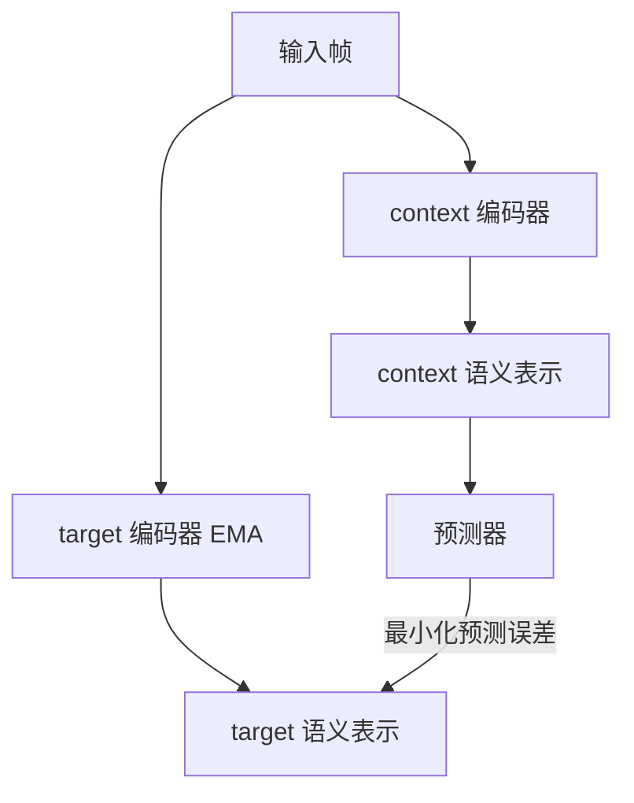

# Part A（续）：JEPA 与 RWM

## 架构四：JEPA（2023，非生成式）

**代表系统**：I-JEPA (2023)、V-JEPA (2024)、V-JEPA 2 (2025)，由 Yann LeCun 主导提出（[LeCun, 2022](https://openreview.net/forum?id=BZ5a1r-kVsf)）

### 核心机制

JEPA（Joint Embedding Predictive Architecture）的核心理念是：**不预测像素，在语义潜空间里预测**。

给定当前观测 $x$，编码器将其映射到语义表示 $s_x$；预测器根据上下文预测目标区域的表示 $s_y$，而非重建像素 $y$：

$$\hat{s}_y = f_\theta(s_x,\, \text{context})$$

像素空间充满了与任务无关的信息：光照变化、纹理细节、阴影方向、传感器噪声。像素级重建模型必须把模型容量花在学习"在这个光照角度下这块皮肤的纹理应该是什么颜色"上，而这对理解"这只手是否握住了杯子"毫无帮助。更根本的问题是：均方误差会让模型输出模糊的"平均图像"；GAN 可以生成清晰图像，但引入了训练不稳定性。JEPA 的回答是：**根本不进入像素空间，直接在语义层面预测**。

### context encoder + predictor + target encoder 三件套

训练目标是最小化预测器输出与目标表示之间的 L2 距离：

$$\mathcal{L}_{\text{JEPA}} = \|\text{predictor}(s_x) - s_y\|^2$$

> **📖 stop-gradient 与 EMA**：`stop_gradient(s_y)` 表示对 $s_y$ 的计算不参与反向传播，梯度在此被截断。EMA 更新规则为 $\xi \leftarrow \tau \xi + (1-\tau) \theta$，其中 $\tau \approx 0.996$，使 target encoder 以极慢的速度"跟随"context encoder 更新。如果不加约束，模型可能发现"把所有输入都映射到同一个向量"是最小化损失的捷径（**表示坍缩**）。EMA + stop-gradient 的组合通过让两个编码器异步更新，破坏了产生坍缩的对称性。

Meta 在 2025 年发布 V-JEPA 2 时，明确把它定位为"**迈向 AGI 的世界模型组件**"，而不是视频生成器。V-JEPA 2 能在给定动作序列的情况下，在语义空间预测未来的视觉表示，不是生成逼真的视频，而是理解"如果我这样移动手臂，物体会在哪里"。

**学习范式**：观察型为主。训练数据是视频序列，不需要动作标签。JEPA 不参与"谁能生成更逼真的视频"的竞争，它的目标是"谁能更好地理解物理世界"。

**适用场景**：视觉表示预训练、语义相似性任务、数据高效的下游分类/检索；未来有望成为通用世界模型基础。

**局限**：不产生可视化输出；评估指标非直观；基于 JEPA 表示做 MPC 或 actor-critic 仍是开放问题。

---

## 架构五：Robotic World Model（RWM），机器人控制的硬问题

**代表系统**：Self-Forcing (NeurIPS 2025)、RWM-U (ICLR 2026, ETH Zurich)、DreamDojo (NVIDIA, 2025)

前四个架构族的主要战场是"生成质量"或"游戏智能"。机器人控制领域有一类更"硬"的问题，核心不是"能不能生成逼真的图像"，而是"能不能训练出真实可部署的 policy"。

### 两个核心问题

**问题一：long-horizon rollout 不发散**

训练时，模型每步都以**真实状态**作为输入（teacher forcing）；推理时，模型必须以**自己的预测**作为输入（autoregressive rollout），误差开始积累，轨迹迅速偏离真实。这个训练与推理之间的分布差距导致长程 rollout 产生物理上不可能的状态。

**问题二：policy exploitation**

Policy 会主动寻找并利用模型的错误，发现某些动作序列在世界模型里能产生虚假的高奖励，但在真实环境里这些动作毫无意义甚至有害。

**Self-Forcing**（NeurIPS 2025）的思路是在训练时就"模拟"推理时的误差积累：不总是喂给模型真实状态，而是有时候喂给它自己上一步的预测，并在**多个步骤**上同时计算与真实状态的损失。这是 **scheduled sampling**（计划采样，一种训练技巧：训练初期以高概率使用真实历史帧，随训练进行逐步提高使用模型自身预测帧的概率，使模型逐渐适应推理时的自回归模式）的系统化版本，在扩散世界模型设定下得到完整验证：Self-Forcing 能将 50 步 rollout 的累积误差降低到 teacher forcing 的约 1/3。

**RWM-U**（Uncertainty-Aware Robotic World Model，ICLR 2026，ETH Zurich, Krause, Hutter）专门为**离线 MBRL**（Offline Model-Based RL）设计：不依赖在线环境交互，只从固定的历史数据集中学习世界模型，再在世界模型内部训练 policy。纯离线设置在真实机器人上特别有价值：在线交互代价高昂且存在安全风险。

RWM-U 的核心机制是**集成不确定性估计**（ensemble uncertainty estimation，同时训练多个独立的模型，用它们预测结果的分歧程度来量化不确定性：预测一致说明该区域数据充足，分歧大说明数据稀少）：同时训练 $N$ 个独立初始化的自回归世界模型，用预测的**集成方差**（ensemble variance，多个模型对同一输入预测结果的统计方差）量化认知不确定性，并在整个展开轨迹上时序一致地传播这个不确定性。Policy 优化时对高不确定性区域施加惩罚，使用 **PPO**（Proximal Policy Optimization，近端策略优化，一种通过限制每次参数更新幅度来保持训练稳定的在线策略梯度算法）而非 off-policy 算法（更稳定）：

$$\text{policy 奖励} = \text{任务奖励} - \lambda \times \text{uncertainty}$$

通过惩罚高不确定性区域，引导 policy 保持在模型可靠的状态分布内。作者在四足机器人和仿人机器人（quadruped & humanoid）的操作和运动任务上验证了该框架，策略性能持续超越无不确定性感知的基线，且用少量真实机器人数据补充离线数据集后能进一步超越纯仿真在线基线。

> **📖 认知不确定性**（epistemic uncertainty）：来自模型"见过的数据不够多"，在训练数据覆盖充分的区域，多个独立模型会给出相近的预测（方差小）；在训练数据稀少的区域，各模型会给出分歧较大的预测（方差大）。这与来自环境本身随机性的偶然不确定性（aleatoric uncertainty）不同，前者可以通过更多数据减小，后者不能。

**[DreamDojo](https://arxiv.org/abs/2602.06949)**（NVIDIA et al., 2025）从另一个角度解决数据匮乏问题：与其等待机器人数据积累，不如直接从**大规模人类第一视角视频**中学习。

**数据**：DreamDojo-HV 包含 43,827 小时第一视角人类操作视频，跨越家居、工业、零售、教育等 16 类场景，涵盖 6,015 种技能和超过 100 万个场景，比此前最大的世界模型训练数据集多出约 96 倍的技能种类和 2,000 倍的场景数量。关键在于：**人类视频不需要任何动作标注**。

**技术核心：潜在动作模型（LAM）**

<figure>

<figcaption>LAM 的信息瓶颈设计：编码器接收相邻两帧 (f^t, f^{t+1})，将帧间变化压缩为低维连续向量 â_t（潜在动作）；解码器以 â_t 和 f^t 为条件重建 f^{t+1}。右侧展示了跨具身检索结果：不同场景中人手和机械手执行相同类型动作时，LAM 产生的潜在向量高度相似。</figcaption>
</figure>

人类视频没有关节角度或力矩标注。DreamDojo 引入 **LAM**（Latent Action Model，潜在动作模型），用一个 VAE 结构从连续帧对 $(f^t, f^{t+1})$ 中自监督地提取**连续潜在动作** $\hat{a}_t$。训练目标是重建损失加 KL 散度正则：

$$\mathcal{L}^{pred} = \mathbb{E}_{q(\hat{a}|f^{t:t+1})} \log p(f^{t+1}|\hat{a}, f^t) - \beta\, D_{KL}(q(\hat{a}|f^{t:t+1}) \| p(\hat{a}))$$

信息瓶颈迫使模型只保留描述"帧间发生了什么动作"的最少信息，过滤掉光照、纹理等无关变量。论文实验表明，不同具身（人手、机械手）执行相同类型动作时，LAM 产生的潜在向量高度相似，使得这个空间可以作为跨形态的统一动作表征。预训练时，世界模型以分块的 $\hat{a}_t$ 为条件预测未来帧；后训练时，用少量带有真实机器人关节标注的数据对齐 latent action 到目标动作空间，完成形态跨越。

**蒸馏**：预训练的 Teacher 模型使用双向注意力机制，推理速度慢。DreamDojo 沿用 Self-Forcing 的两阶段蒸馏框架，将 Teacher 蒸馏为使用因果注意力的 Student 模型，推理步数从 50 步压缩到 4 步，最终在 640×480 分辨率下达到 10.81 FPS，满足实时遥操作的要求。蒸馏第二阶段让 Student 以自身前一步输出为上下文（而非 Teacher 的输出），对齐训练与推理时的输入分布，有效抑制长程 rollout 的误差积累。

**策略评估替代真机测试**：DreamDojo 的一个关键结论是，世界模型内部的策略成功率与真实机器人上的成功率呈高度线性相关（Pearson r = 0.995），因此可以先在世界模型内部大批量筛选策略，淘汰劣质候选，只将最优策略送上真机验证，大幅压缩真实机器人测试次数。配合 MPC 规划，相比均匀采样，成功率提升约 30 个百分点。

**学习范式**：观察型预训练（人类视频，无动作标注）+ 少量目标数据后训练；蒸馏阶段引入 Self-Forcing 减少自回归误差积累。

**适用场景**：高频机器人控制（关节空间 MPC、灵巧操作）、离线数据充足但在线交互代价高昂的场景、需要在上真机前先大批量筛选策略的部署流程。

