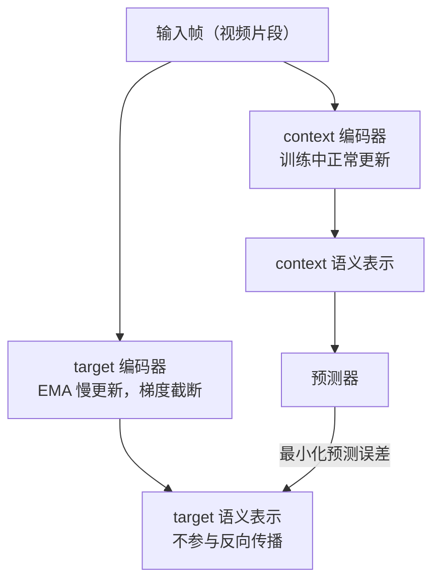

# Part A（续）：JEPA 与 RWM

## 架构四：JEPA（2023，非生成式）

**代表系统**：I-JEPA (2023)、V-JEPA (2024)、V-JEPA 2 (2025)，由 Yann LeCun 主导提出 [见 L01 参考文献 [4]]

### 核心机制

JEPA（Joint Embedding Predictive Architecture）的核心理念是：**不预测像素，在语义潜空间里预测**。

给定当前观测 $x$，编码器将其映射到语义表示 $s_x$；预测器根据上下文预测目标区域的表示 $s_y$，而非重建像素 $y$：

$$\hat{s}_y = f_\theta(s_x,\, \text{context})$$

像素空间充满了与任务无关的信息：光照变化、纹理细节、阴影方向、传感器噪声。像素级重建模型必须把模型容量花在学习"在这个光照角度下这块皮肤的纹理应该是什么颜色"上，而这对理解"这只手是否握住了杯子"毫无帮助。更根本的问题是：均方误差会让模型输出模糊的"平均图像"；GAN 可以生成清晰图像，但引入了训练不稳定性。JEPA 的回答是：**根本不进入像素空间，直接在语义层面预测**。

### context encoder + predictor + target encoder 三件套

训练目标是最小化预测器输出与目标表示之间的 L2 距离：

$$\mathcal{L}_{\text{JEPA}} = \|\text{predictor}(s_x) - s_y\|^2$$

> **📖 stop-gradient 与 EMA**：`stop_gradient(s_y)` 表示对 $s_y$ 的计算不参与反向传播，梯度在此被截断。EMA 更新规则为 $\xi \leftarrow \tau \xi + (1-\tau) \theta$，其中 $\tau \approx 0.996$，使 target encoder 以极慢的速度"跟随"context encoder 更新。如果不加约束，模型可能发现"把所有输入都映射到同一个向量"是最小化损失的捷径（**表示坍缩**）。EMA + stop-gradient 的组合通过让两个编码器异步更新，破坏了产生坍缩的对称性。

Meta 在 2025 年发布 V-JEPA 2 时，明确把它定位为"**迈向 AGI 的世界模型组件**"，而不是视频生成器。V-JEPA 2 能在给定动作序列的情况下，在语义空间预测未来的视觉表示，不是生成逼真的视频，而是理解"如果我这样移动手臂，物体会在哪里"。

**学习范式**：观察型为主。训练数据是视频序列，不需要动作标签。JEPA 不参与"谁能生成更逼真的视频"的竞争，它的目标是"谁能更好地理解物理世界"。

**适用场景**：视觉表示预训练、语义相似性任务、数据高效的下游分类/检索；未来有望成为通用世界模型基础。

**局限**：不产生可视化输出；评估指标非直观；基于 JEPA 表示做 MPC 或 actor-critic 仍是开放问题。

---

## 架构五：Robotic World Model（RWM），机器人控制的硬问题

**代表系统**：Self-Forcing (NeurIPS 2025)、RWM-U (ICLR 2026, ETH Zurich)

前四个架构族的主要战场是"生成质量"或"游戏智能"。机器人控制领域有一类更"硬"的问题，核心不是"能不能生成逼真的图像"，而是"能不能训练出真实可部署的 policy"。

### 两个核心问题

**问题一：long-horizon rollout 不发散**

训练时，模型每步都以**真实状态**作为输入（teacher forcing）；推理时，模型必须以**自己的预测**作为输入（autoregressive rollout），误差开始积累，轨迹迅速偏离真实。这个训练与推理之间的分布差距导致长程 rollout 产生物理上不可能的状态。

**问题二：policy exploitation**

Policy 会主动寻找并利用模型的错误，发现某些动作序列在世界模型里能产生虚假的高奖励，但在真实环境里这些动作毫无意义甚至有害。

**Self-Forcing**（NeurIPS 2025）的思路是在训练时就"模拟"推理时的误差积累：不总是喂给模型真实状态，而是有时候喂给它自己上一步的预测，并在**多个步骤**上同时计算与真实状态的损失。这是 scheduled sampling 的系统化版本，在扩散世界模型设定下得到完整验证：Self-Forcing 能将 50 步 rollout 的累积误差降低到 teacher forcing 的约 1/3。

**RWM-U**（Uncertainty-Aware Robotic World Model，ICLR 2026，ETH Zurich, Krause, Hutter）专门为**离线 MBRL**（Offline Model-Based RL）设计：不依赖在线环境交互，只从固定的历史数据集中学习世界模型，再在世界模型内部训练 policy。纯离线设置在真实机器人上特别有价值：在线交互代价高昂且存在安全风险。

RWM-U 的核心机制是**集成不确定性估计**：同时训练 $N$ 个独立初始化的自回归世界模型，用预测的**集成方差**量化认知不确定性，并在整个展开轨迹上时序一致地传播这个不确定性。Policy 优化时对高不确定性区域施加惩罚，使用 PPO 而非 off-policy 算法（更稳定）：

$$\text{policy 奖励} = \text{任务奖励} - \lambda \times \text{uncertainty}$$

通过惩罚高不确定性区域，引导 policy 保持在模型可靠的状态分布内。作者在四足机器人和仿人机器人（quadruped & humanoid）的操作和运动任务上验证了该框架，策略性能持续超越无不确定性感知的基线，且用少量真实机器人数据补充离线数据集后能进一步超越纯仿真在线基线。

> **📖 认知不确定性**（epistemic uncertainty）：来自模型"见过的数据不够多"，在训练数据覆盖充分的区域，多个独立模型会给出相近的预测（方差小）；在训练数据稀少的区域，各模型会给出分歧较大的预测（方差大）。这与来自环境本身随机性的偶然不确定性（aleatoric uncertainty）不同，前者可以通过更多数据减小，后者不能。

**学习范式**：离线交互型（RWM-U 从固定数据集学习，不依赖在线采样）；Self-Forcing 是训练时引入自预测反馈的交互型训练改进。

**适用场景**：高频机器人控制（关节空间 MPC、灵巧操作）、对 sim-to-real 迁移要求严格的任务、离线数据充足但在线交互代价高昂的场景。

