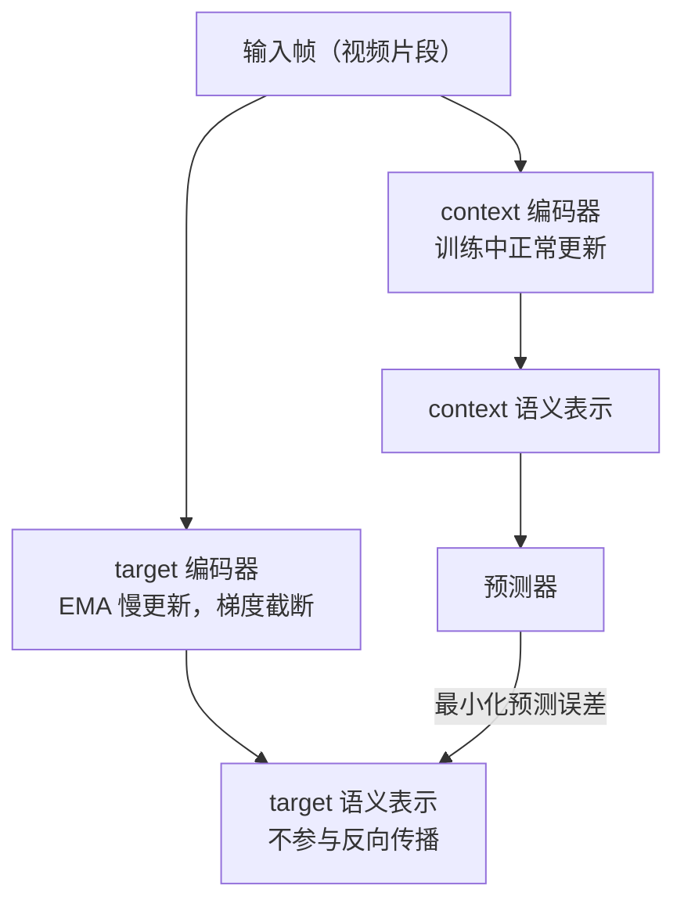
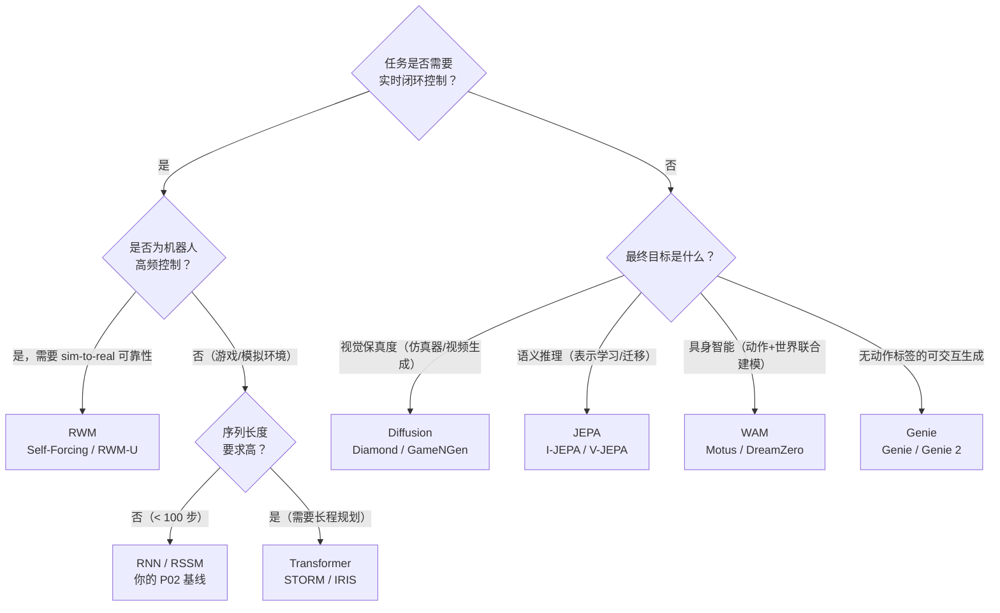

# Part A（续）：JEPA、RWM 与 WAM

## 架构四：JEPA（2023，非生成式）

**代表系统**：I-JEPA (2023)、V-JEPA (2024)、V-JEPA 2 (2025)，由 Yann LeCun 主导提出 [见 L01 参考文献 [4]]

### 核心机制

JEPA（Joint Embedding Predictive Architecture）的核心理念是：**不预测像素，在语义潜空间里预测**。

给定当前观测 $x$，编码器将其映射到语义表示 $s_x$；预测器根据上下文预测目标区域的表示 $s_y$，而非重建像素 $y$：

$$\hat{s}_y = f_\theta(s_x,\, \text{context})$$

像素空间充满了与任务无关的信息：光照变化、纹理细节、阴影方向、传感器噪声。像素级重建模型必须把模型容量花在学习"在这个光照角度下这块皮肤的纹理应该是什么颜色"上，而这对理解"这只手是否握住了杯子"毫无帮助。更根本的问题是：均方误差会让模型输出模糊的"平均图像"；GAN 可以生成清晰图像，但引入了训练不稳定性。JEPA 的回答是：**根本不进入像素空间，直接在语义层面预测**。

### context encoder + predictor + target encoder 三件套

训练目标是最小化预测器输出与目标表示之间的 L2 距离：

$$\mathcal{L}_{\text{JEPA}} = \|\text{predictor}(s_x) - s_y\|^2$$

> **📖 stop-gradient 与 EMA**：`stop_gradient(s_y)` 表示对 $s_y$ 的计算不参与反向传播，梯度在此被截断。EMA 更新规则为 $\xi \leftarrow \tau \xi + (1-\tau) \theta$，其中 $\tau \approx 0.996$，使 target encoder 以极慢的速度"跟随"context encoder 更新。如果不加约束，模型可能发现"把所有输入都映射到同一个向量"是最小化损失的捷径（**表示坍缩**）。EMA + stop-gradient 的组合通过让两个编码器异步更新，破坏了产生坍缩的对称性。

Meta 在 2025 年发布 V-JEPA 2 时，明确把它定位为"**迈向 AGI 的世界模型组件**"，而不是视频生成器。V-JEPA 2 能在给定动作序列的情况下，在语义空间预测未来的视觉表示，不是生成逼真的视频，而是理解"如果我这样移动手臂，物体会在哪里"。

**学习范式**：观察型为主。训练数据是视频序列，不需要动作标签。JEPA 不参与"谁能生成更逼真的视频"的竞争，它的目标是"谁能更好地理解物理世界"。

**适用场景**：视觉表示预训练、语义相似性任务、数据高效的下游分类/检索；未来有望成为通用世界模型基础。

**局限**：不产生可视化输出；评估指标非直观；基于 JEPA 表示做 MPC 或 actor-critic 仍是开放问题。

---

## 架构五：Robotic World Model（RWM），机器人控制的硬问题

**代表系统**：Self-Forcing (2024)、RWM-U (2025)

前四个架构族的主要战场是"生成质量"或"游戏智能"。机器人控制领域有一类更"硬"的问题，核心不是"能不能生成逼真的图像"，而是"能不能训练出真实可部署的 policy"。

### 两个核心问题

**问题一：long-horizon rollout 不发散**

训练时，模型每步都以**真实状态**作为输入（teacher forcing）；推理时，模型必须以**自己的预测**作为输入（autoregressive rollout），误差开始积累，轨迹迅速偏离真实。这个训练与推理之间的分布差距导致长程 rollout 产生物理上不可能的状态。

**问题二：policy exploitation**

Policy 会主动寻找并利用模型的错误，发现某些动作序列在世界模型里能产生虚假的高奖励，但在真实环境里这些动作毫无意义甚至有害。

**Self-Forcing** 的思路是在训练时就"模拟"推理时的误差积累：不总是喂给模型真实状态，而是有时候喂给它自己上一步的预测，并在**多个步骤**上同时计算与真实状态的损失。实验结果表明，Self-Forcing 能将 50 步 rollout 的累积误差降低到 teacher forcing 的约 1/3。

**RWM-U**（Uncertainty-Aware Robotic World Model）训练一个**模型集成（ensemble）**：同时训练 N 个独立初始化的世界模型，用它们预测的**方差**作为不确定性的估计。Policy 优化时对高不确定性区域施加惩罚：

$$\text{policy 奖励} = \text{任务奖励} - \lambda \times \text{uncertainty}$$

通过惩罚高不确定性区域，引导 policy 保持在模型可靠的状态分布内。

> **📖 认知不确定性**（epistemic uncertainty）：来自模型"见过的数据不够多"，在训练数据覆盖充分的区域，多个独立模型会给出相近的预测（方差小）；在训练数据稀少的区域，各模型会给出分歧较大的预测（方差大）。这与来自环境本身随机性的偶然不确定性（aleatoric uncertainty）不同，前者可以通过更多数据减小，后者不能。

**学习范式**：交互型，但重点是解决交互型范式固有的长程漂移和 policy exploitation 问题。

**适用场景**：高频机器人控制（关节空间 MPC、灵巧操作）、对 sim-to-real 迁移要求严格的任务。

---

## Genie：从视频隐式发现动作

**代表系统**：Genie (Google DeepMind, 2024)、Genie 2 (2024)

前五个架构族都有一个共同假设：训练数据要么包含动作标签（交互型），要么完全不需要动作（观察型）。Genie 打破了这个二分法：**从无标注互联网视频中，自动发现隐式的 latent action。**

训练数据是大量人类玩游戏、操作物体的视频片段，没有任何动作标签。Genie 同时训练两个模块：视频 tokenizer 将帧序列压缩为离散 token，latent action model 在相邻帧之间推断出一个离散的 latent action code。推理时，用户可以指定一个 latent action，模型据此生成下一帧，整个过程完全可交互。

> **📖 latent action**：不是键盘上的"向左"或关节空间的力矩，而是一个纯粹从视频帧差异中归纳出的离散编码。它捕捉的是"相邻帧之间发生了什么类型的变化"，而非具体的物理动作。两段视频如果场景变化模式相似（如"某物体向右移动"），它们的 latent action code 就应该相同，无论实际拍摄的是游戏还是机器人操作。

Genie 的意义在于把"动作标注"这个瓶颈绕开了：互联网上有海量视频，但几乎没有配套的机器人动作标签。Genie 2 进一步扩展到 3D 场景，能在给定单张图像后生成完整的可交互 3D 世界。

**学习范式**：介于观察型和交互型之间。训练只用视频（观察型），但推理时支持动作条件生成（交互型）。这个思路直接启发了后来的 WAM 系列。

**局限**：latent action 是自动归纳的，不与真实物理动作对齐，无法直接用于机器人控制。从 latent action 到真实 policy 仍需额外的对齐步骤。

---

## 架构六：从 World Model 到 World Action Model（WAM）

**代表系统**：Motus (2025)、DreamDojo (2025)、DreamZero / WAM (2025-2026)

Genie 证明了"从视频隐式发现动作表征"这条路可行。WAM 系列接过这个思路，进一步追问：世界模型和策略模型，真的需要是两个分开的模块吗？

| 范式 | 输入 | 输出 |
|------|------|------|
| 世界模型 | 观测 + 动作 | 未来观测或状态 |
| VLA | 观测 + 语言指令 | 动作 |
| WAM | 观测 + 语言指令 | 未来观测 + 动作 |

传统的 World Model 以动作为输入、预测未来状态，是 policy 旁边的一个 simulator。VLA 绕过了世界模型，直接从视觉和语言指令预测动作，是一个端到端的 reactive policy。WAM 试图同时做两件事：预测世界的未来状态，同时预测应该采取的动作。世界的视觉演化成为动作学习的 dense supervision，而不只是一个辅助任务。

**Motus** 引入了 **latent action** 的概念：从异构视频数据（包括大量没有动作标签的人类视频）中自动抽取动作表征。大规模无标注视频预训练，再用少量有机器人动作标签的数据对齐。

**DreamDojo** 专注于接触丰富的灵巧操作（contact-rich dexterous tasks），用 **continuous latent actions** 从纯视频里学到"有效的动作表征"，再用少量机器人演示数据 fine-tune。

**DreamZero / WAM 系列**用预训练的 **video diffusion backbone** 同时预测未来世界状态和机器人动作，用视频序列作为 dense supervision：

| 范式 | 监督信号 | 损失 |
|------|---------|------|
| VLA | 观测序列 → 动作序列 | 仅动作损失 |
| WAM | 观测序列 → 未来帧序列 + 动作序列 | 视频重建损失 + 动作损失，相互增强 |

**学习范式**：第四范式，联合学习。视频和动作是同一个物理过程的两个侧面。WAM 利用视频的 dense physical supervision，让 policy 学习物理运动和动作后果，而不只是做 action regression。

**这批论文揭示的新趋势**：world model 不再只是 policy 旁边的 simulator，而是 policy 本身的一部分。传统 model-based RL 框架里，world model 和 policy 是两个分离的模块。WAM 系列正在打破这个分离，训练一个同时建模世界动态和决策逻辑的**统一模型**。

---

## 对比总结表

| 架构族 | 学习范式 | 核心优势 | 主要劣势 | 典型适用场景 |
|--------|----------|----------|----------|--------------|
| **RNN / RSSM** | 交互型 | 计算开销低、延迟小 | 长时记忆弱、生成质量有限 | 在线 RL、实时控制 |
| **Transformer** | 交互/观察 | 长程依赖强、并行训练快 | 计算量随序列二次增长 | 复杂游戏、多步规划 |
| **Diffusion** | 观察/交互 | 视觉真实度极高 | 推理慢、难实时控制 | 离线仿真、视频生成 |
| **JEPA** | 观察型 | 鲁棒高效、忽略无关噪声 | 无像素输出、控制应用尚不成熟 | 语义表示预训练 |
| **RWM** | 交互型 | 长程 rollout 稳定、policy 不漂移 | 计算开销高（集成） | 机器人高频控制、sim-to-real |
| **Genie** | 观察→交互 | 无需动作标签即可支持交互生成 | latent action 与真实动作不对齐 | 可交互视频生成、数据预训练 |
| **WAM** | 联合学习 | 世界预测与动作规划联合优化 | 架构复杂、数据需求大 | 具身智能、灵巧操作 |

## 如何选择架构？

**实践建议**：从 RNN/RSSM 起步，P02 已经帮你走完这一步。遇到瓶颈再升级：长序列预测精度持续下跌、或任务需要跨多步因果推理，再考虑切换 Transformer。Diffusion 留给离线场景。JEPA 控制接口尚不成熟，但表示学习任务已有实质结果，值得跟踪。有大量无标注视频但缺乏动作标签时，Genie 的 latent action 发现机制是目前最直接的切入点，但要做真实控制还需要对齐步骤。做真实机器人，Self-Forcing 和 ensemble uncertainty 这类工程手段比换架构更重要，先把长程稳定性解决掉。
