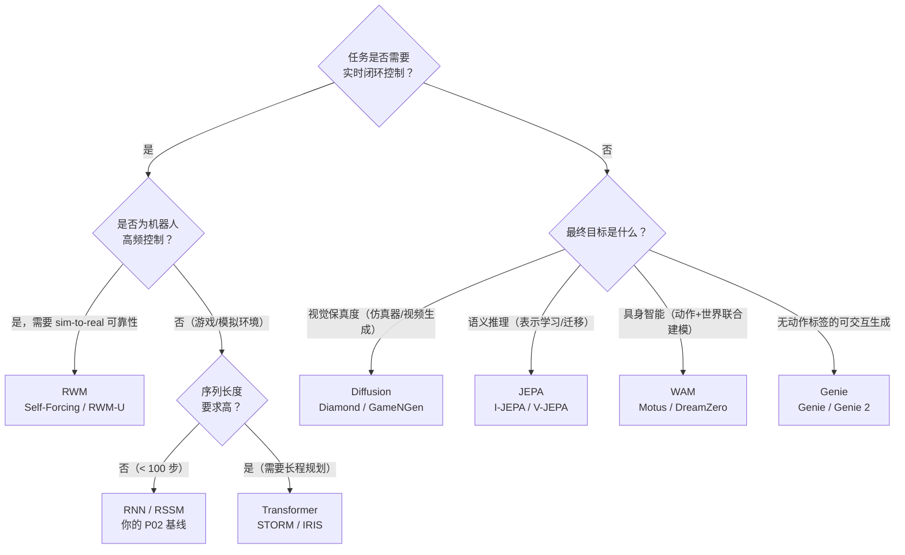

# Part A（续二）：Genie、WAM 与架构选型

## Genie：从视频隐式发现动作

**代表系统**：Genie (Google DeepMind, 2024)、Genie 2 (2024)

前五个架构族都有一个共同假设：训练数据要么包含动作标签（交互型），要么完全不需要动作（观察型）。Genie 打破了这个二分法：**从无标注互联网视频中，自动发现隐式的 latent action。**

训练数据是大量人类玩游戏、操作物体的视频片段，没有任何动作标签。Genie 同时训练三个模块：视频 tokenizer（ST-ViT）将帧序列压缩为时空离散 token；latent action model（LAM）从相邻帧对中推断离散的 latent action code；dynamics model 以 latent action 为条件预测下一帧 token 序列。推理时，用户可以指定一个 latent action，模型据此生成下一帧，整个过程完全可交互。

> **📖 latent action**：不是键盘上的"向左"或关节空间的力矩，而是一个纯粹从视频帧差异中归纳出的离散编码。它捕捉的是"相邻帧之间发生了什么类型的变化"，而非具体的物理动作。两段视频如果场景变化模式相似（如"某物体向右移动"），它们的 latent action code 就应该相同，无论实际拍摄的是游戏还是机器人操作。

Genie 在 1.6 万小时的平台游戏视频上训练（无动作标注），11B 参数，论文以 $\Delta_t\text{PSNR}$（推理时 PSNR 相对于 teacher forcing 基线的下降量）衡量生成质量衰减速度，作为 latent action 对齐程度的代理指标。Genie 的意义在于把"动作标注"这个瓶颈绕开了：互联网上有海量视频，但几乎没有配套的机器人动作标签。Genie 2 进一步扩展到 3D 场景，能在给定单张图像后生成完整的可交互 3D 世界。Hafner 等人于 2025 年发布的可扩展世界模型（arXiv 2512.13030）在 Minecraft 上验证了类似思路，通过"shortcut forcing"训练目标和高效 Transformer 架构，首次从离线数据出发在 Minecraft 中获得钻石（无需与环境交互），其中大量视频知识来自无动作标注的网络视频预训练。

**学习范式**：介于观察型和交互型之间。训练只用视频（观察型），但推理时支持动作条件生成（交互型）。这个思路直接启发了后来的 WAM 系列。

**局限**：latent action 是自动归纳的，不与真实物理动作对齐，无法直接用于机器人控制。从 latent action 到真实 policy 仍需额外的对齐步骤。

---

## 架构六：从 World Model 到 World Action Model（WAM）

**代表系统**：Motus (CVPR 2026, Tsinghua)、DreamZero / WAM (NVIDIA 2026)

Genie 证明了"从视频隐式发现动作表征"这条路可行。WAM 系列接过这个思路，进一步追问：世界模型和策略模型，真的需要是两个分开的模块吗？

| 范式 | 输入 | 输出 |
|------|------|------|
| 世界模型 | 观测 + 动作 | 未来观测或状态 |
| VLA | 观测 + 语言指令 | 动作 |
| WAM | 观测 + 语言指令 | 未来观测 + 动作 |

传统的 World Model 以动作为输入、预测未来状态，是 policy 旁边的一个 simulator。VLA 绕过了世界模型，直接从视觉和语言指令预测动作，是一个端到端的 reactive policy。WAM 试图同时做两件事：预测世界的未来状态，同时预测应该采取的动作。世界的视觉演化成为动作学习的 dense supervision，而不只是一个辅助任务。

**Motus**（CVPR 2026，清华大学）引入了统一的 **latent action** 表征：从异构视频数据（包括大量没有动作标签的人类视频和机器人演示）中自动抽取连续 latent action，再用少量有机器人真实动作标签的数据对齐。Motus 的核心贡献是把"从无标注视频中发现 latent action"和"用少量对齐数据迁移到真实控制"两个步骤整合进一个统一框架，在灵巧操作和运动任务上验证了跨具身迁移能力。

**DreamZero / WAM 系列**（NVIDIA 2026）用预训练的 **video generation backbone** 同时预测未来世界状态和机器人动作，用视频序列作为 dense supervision。NVIDIA 的 WAM（World Action Models）论文明确提出"WAM 是 zero-shot policy"，预训练的视频生成模型可以直接作为策略推理引擎，无需额外 RL 微调：

| 范式 | 监督信号 | 损失 |
|------|---------|------|
| VLA | 观测序列 → 动作序列 | 仅动作损失 |
| WAM | 观测序列 → 未来帧序列 + 动作序列 | 视频重建损失 + 动作损失，相互增强 |

**学习范式**：第四范式，联合学习。视频和动作是同一个物理过程的两个侧面。WAM 利用视频的 dense physical supervision，让 policy 学习物理运动和动作后果，而不只是做 action regression。

**这批论文揭示的新趋势**：world model 不再只是 policy 旁边的 simulator，而是 policy 本身的一部分。传统 model-based RL 框架里，world model 和 policy 是两个分离的模块。WAM 系列正在打破这个分离，训练一个同时建模世界动态和决策逻辑的**统一模型**。Cosmos（NVIDIA 2025）则走得更远：作为通用物理 AI 基础模型，它在海量真实世界视频上预训练，然后针对自动驾驶、机器人等下游任务微调，把 world model 的概念从"单任务模拟器"推向"通用物理世界基础设施"。

---

## 对比总结表

| 架构族 | 学习范式 | 核心优势 | 主要劣势 | 典型适用场景 |
|--------|----------|----------|----------|--------------|
| **RNN / RSSM** | 交互型 | 计算开销低、延迟小 | 长时记忆弱、生成质量有限 | 在线 RL、实时控制 |
| **Transformer** | 交互/观察 | 长程依赖强、并行训练快 | 计算量随序列二次增长 | 复杂游戏、多步规划 |
| **Diffusion** | 观察/交互 | 视觉真实度极高 | 推理慢、难实时控制 | 离线仿真、视频生成 |
| **JEPA** | 观察型 | 鲁棒高效、忽略无关噪声 | 无像素输出、控制应用尚不成熟 | 语义表示预训练 |
| **RWM** | 交互型 | 长程 rollout 稳定、policy 不漂移 | 计算开销高（集成） | 机器人高频控制、sim-to-real |
| **Genie** | 观察→交互 | 无需动作标签即可支持交互生成 | latent action 与真实动作不对齐 | 可交互视频生成、数据预训练 |
| **WAM** | 联合学习 | 世界预测与动作规划联合优化 | 架构复杂、数据需求大 | 具身智能、灵巧操作 |

## 如何选择架构？

**实践建议**：从 RNN/RSSM 起步，P02 已经帮你走完这一步。遇到瓶颈再升级：长序列预测精度持续下跌、或任务需要跨多步因果推理，再考虑切换 Transformer。Diffusion 留给离线场景。JEPA 控制接口尚不成熟，但表示学习任务已有实质结果，值得跟踪。有大量无标注视频但缺乏动作标签时，Genie 的 latent action 发现机制是目前最直接的切入点，但要做真实控制还需要对齐步骤。做真实机器人，Self-Forcing 和 ensemble uncertainty 这类工程手段比换架构更重要，先把长程稳定性解决掉。
