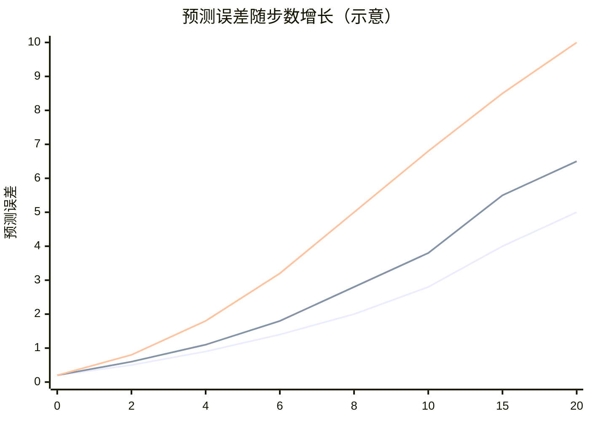

# STORM、扩散世界模型与通用失效模式

## STORM（Transformer 动力学）

*你在 P05 把 P03 Dreamer 的 GRU 动力学头替换成了 Transformer，并做了消融对比实验。*

STORM 把世界模型建模为序列预测问题，用 Transformer 自回归地预测下一个离散 token（量化后的潜在表示）。

### Teacher Forcing 与 Free-Running 的差距

这是 STORM（以及所有自回归序列模型作为世界模型时）面临的根本性挑战，在讨论具体指标前必须理解。

**Teacher forcing（训练时）**：每一步都用真实的历史 token 作为输入，预测下一个 token。误差不会累积，因为每步的输入都是"正确答案"。

**Free-running（测试时）**：没有真实 token 可用，必须用自己上一步的预测作为下一步的输入。一旦某步预测错了，错误就会传播并放大，这就是 STORM 长程预测崩溃的根本原因。

两者的误差分布本质上不同：teacher forcing 的误差是 `i.i.d.` 的（每步独立），free-running 的误差是自相关的（雪球效应）。这意味着仅靠 teacher forcing 损失训练出来的模型，在 free-running 预测时会系统性地低估自身的长程误差。

**缓解策略**：Scheduled Sampling（在训练时以递增概率用模型自身预测替换真实 token）或 DAGGER 式的数据集聚合，都能缩小两者差距，但不能完全消除。

### Token 预测损失（Token Prediction Loss）

标准的交叉熵损失，衡量 Transformer 预测下一 token 的概率分布与真实 token 的差距：

$$\mathcal{L}_{\text{token}} = -\sum_t \log P(\text{token}_{t+1} \mid \text{token}_{1:t},\, \text{action}_{1:t})$$

这是 STORM 训练的主要优化目标，也是最直接的动力学质量指标。

**诊断规则**：Token 损失收敛过慢 → 序列长度过长导致注意力机制难以捕捉关键依赖，可尝试缩短上下文窗口或引入相对位置编码（RoPE 或 ALiBi）。

### 长时域 PSNR（Long-horizon PSNR）与 FVD

**峰值信噪比（PSNR，Peak Signal-to-Noise Ratio）**衡量预测帧与真实帧之间的像素级重建质量：

$$\text{PSNR} = 10 \cdot \log_{10}\!\left(\frac{\text{MAX}^2}{\text{MSE}}\right)$$

> **📖 PSNR 各项含义**：**MAX** 是像素值的最大可能值，对于归一化到 $[0, 1]$ 的图像，MAX = 1；对于 8-bit 图像（像素值 0–255），MAX = 255。**MSE**（Mean Squared Error，均方误差）是预测帧与真实帧对应像素差的平方均值，越小越好。取 $\log_{10}$ 并乘以 10 是为了将结果转换为分贝（dB）单位，使数值更直观：PSNR > 30 dB 通常认为重建质量良好，< 20 dB 则肉眼可见明显失真。数值越高越好。

**关键点**：在 5 步、10 步、20 步预测处分别计算 PSNR，绘制"PSNR vs 预测步数"曲线。曲线下降速度直接反映了模型的长时域预测能力。

**诊断规则**：PSNR 在 5 步后快速下跌（如从 28dB 骤降至 18dB）→ 潜在漂移（见下节），Transformer 在长序列上的自回归误差累积效应显著。

**PSNR vs FVD 的选择**：两者衡量不同的东西，选哪个取决于你的下游任务：

- **PSNR**：逐像素精度，强调"预测的每一帧有多准确"。适合做预测算法调试、消融实验，因为它对局部错误非常敏感，能快速发现模型改变带来的微小差异。
- **FVD（Fréchet Video Distance）**：FID 的视频版本，用 I3D 网络提取时空特征，计算生成视频和真实视频的特征分布距离。它关注序列整体的动态质量，运动是否流畅、时序关系是否合理，而非单帧精度。适合做策略评估（判断 STORM 生成的想象轨迹能否提供有效的训练信号）。

**实践建议**：同时报告两个指标。PSNR 下降但 FVD 稳定，说明逐帧细节变差但整体动态仍然合理；PSNR 稳定但 FVD 上升，说明帧质量没降但序列的时序一致性出了问题。

---

## 扩散世界模型（Diamond）

扩散世界模型直接在像素空间生成视频帧，具有极高的视觉保真度。但这类模型有独特的失效模式：物理世界的内在规律很难仅从生成概率中涌现出来。

### FVD（Fréchet Video Distance）

FVD 是评估扩散世界模型生成质量的标准指标。计算方法：

$$\text{FVD} = \|\mu_{\text{real}} - \mu_{\text{gen}}\|^2 + \text{Tr}\!\left(\Sigma_{\text{real}} + \Sigma_{\text{gen}} - 2(\Sigma_{\text{real}} \Sigma_{\text{gen}})^{1/2}\right)$$

与 FID 的公式形式相同，区别在于特征提取器：
- FID 使用 Inception-v3，提取单帧的空间特征
- FVD 使用 **I3D**（Inflated 3D ConvNet，膨胀 3D 卷积网络）：将标准 2D 卷积核"膨胀"为 3D 卷积核（在时间维度上也做卷积），从而同时捕捉空间纹理和时序运动模式。I3D 在动作识别数据集（如 Kinetics）上预训练，其特征空间能区分"静止的猫"和"奔跑的猫"，这正是评估视频质量所需要的。

这意味着 FVD 对"序列是否动起来了"非常敏感，即使每帧静态质量很高，如果运动模式不自然（如物体抖动、跳帧、速度不一致），FVD 也会给出高分（差）。**数值越低越好**。

### 物理一致性（Physics Consistency）

包含两个子维度：

- **3D 空间连贯性**：当摄像机移动时，场景中的物体是否保持正确的深度关系？桌子不应该因为视角变换而"穿越"到椅子后面。
- **物体永久性（Object Permanence）**：一个物体被遮挡后，再次出现时是否仍在合理位置？婴儿在 8 个月大时才习得这种认知，扩散模型常常在这里失败。

**自动化评估方案（更具体的实现）**：

可以构建一个基于现成视觉模型的评估流水线：

1. 用 **DepthAnything**（或 MiDaS）对每帧估计深度图
2. 用 **DINO**（或 SAM）追踪场景中关键物体的 patch 位置
3. 在相机运动前后，检测同一物体的深度排列关系是否保持一致（如"球在桌子前面"在多帧中应始终成立）
4. 计算深度关系违规率（Depth Violation Rate）：在随机采样的物体对中，有多少比例在相机运动后深度关系发生了不合理的颠倒

**诊断规则**：深度违规率高 → 模型没有建立 3D 场景理解，只是在进行纹理插值。根本解法是引入 3D 表示（NeRF、3DGS）或使用带有几何约束的训练损失。

### 动作条件保真度（Action Fidelity）

给定动作序列（如"向右移动 2 米"），生成视频中对应的像素运动向量是否符合预期？

> **📖 光流（optical flow）**：描述图像中每个像素在相邻两帧之间的运动向量场，即"这个像素从帧 $t$ 移动到帧 $t+1$ 的位移是多少（$\Delta x, \Delta y$）"。光流可以用 RAFT、FlowFormer 等算法自动计算。在世界模型评估中，用光流代替逐像素比较，可以抽象掉纹理细节，专注于"运动是否正确"这一核心问题。

$$\text{ActionFidelity} = 1 - \frac{\|\text{flow}_{\text{generated}} - \text{flow}_{\text{expected}}\|_1}{\|\text{flow}_{\text{expected}}\|_1}$$

其中 `flow` 是光流向量场（每个像素的 $(\Delta x, \Delta y)$ 位移），`||·||₁` 是 L1 范数（各元素绝对值之和）。数值越高越好（理想情况为 1.0）。

**诊断规则**：物体凭空消失或突然移位 → 物体永久性丧失；生成的运动方向与动作不符 → 动作条件注入不足，可增大动作嵌入维度或在去噪网络的每一层都注入动作信息（而不仅仅是在第一层）。

---

## 通用失效模式：潜在漂移（Horizon Drift）

无论使用哪种架构，**所有世界模型都有一个共同的敌人：潜在漂移**。

### 什么是潜在漂移？

世界模型在 1 步预测时表现良好，但当你要求它滚动预测 10 步、20 步时，每一步的微小误差会**逐步累积**，最终预测结果与真实轨迹完全脱轨。

### 误差随时域增长的曲线

不同架构的漂移速度：
- **STORM（Transformer）**：短期精度高，但自回归误差累积最快，20 步后质量通常最差
- **TD-MPC（潜在 MPC）**：通过一致性损失抑制了部分漂移，中等水平
- **Dreamer（RSSM）**：随机状态提供了一定的正则化效果，漂移相对温和但存在

### 缓解策略

1. **短时域训练**：仅用 1–5 步的预测损失训练模型，避免梯度在长序列中爆炸或消失
2. **目标网络（Target Network）**：类似 DQN，用延迟更新的慢速网络提供稳定的监督信号，防止动力学函数追逐移动靶标
3. **数据增强**：在真实环境中定期收集新数据重置潜在空间，避免模型在自产生的"梦境数据"上产生自我强化的偏差
